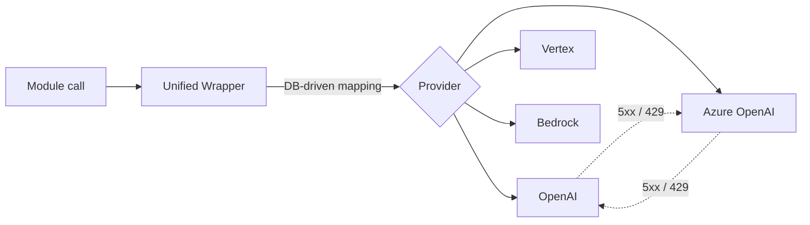
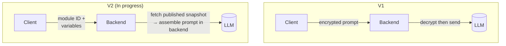
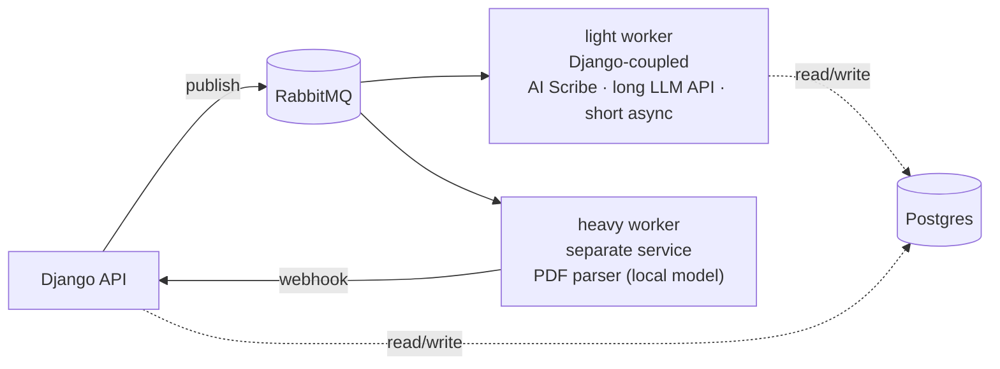
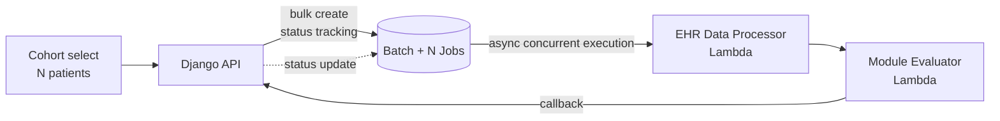
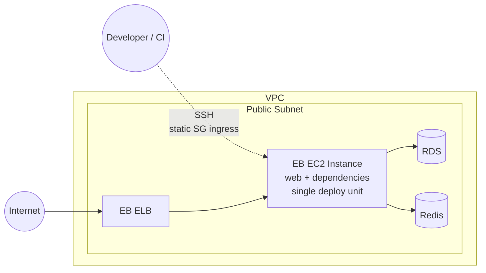
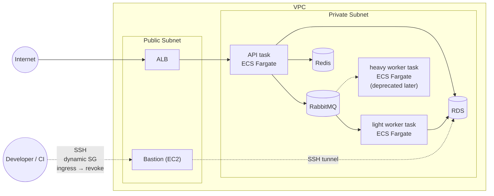

# Junhyeok Roh — Portfolio

Senior Software Engineer

- 📧 texasroh@gmail.com
- 🔗 github.com/texasroh
- 📝 texasroh.blogspot.com

---

## Summary

> Backend engineer at the healthcare SaaS **Avo MD** for 3 years.
> Designed and operated three pillars: a **multi-provider LLM platform**, **async work infrastructure**, and **patient cohort evaluation (backend Module Evaluator)**.

---

## Table of Contents

### Deep Dives

1. **Production LLM Platform**
   Multi-provider abstraction + per-service fallback /
   Prompt security V1→V2 + diff monitoring

2. **Async Infrastructure — Celery + AI Model Workers**
   **heavy worker** + **light worker** (sibling workers) / RabbitMQ + ECS Fargate / Whisper speech→text pipeline

3. **Patient Cohort Evaluation — Backend Module Evaluator + Automated Async Multi-execution**
   Module definitions evaluated in the backend (Python) / designed to match frontend results /
   Batch + N Jobs status tracking + Lambda orchestration / batch cohort processing

4. **EB → ECS Fargate Migration**
   Move to service-level operation / automated CI/CD pipeline

### Appendix

**Additional Backend Work** — Auth (Firebase + Django) integration, N+1 resolution, indexing & query optimization

---

# Deep Dives

## 1. Production LLM Platform

### 1.1 Context

- **Clinical domain** — LLM directly supports clinician workflows (guideline answers, AI Scribe note generation, etc.) — an outage at an external provider must not stop patient care.
- A single direct call to OpenAI → any single-provider outage became an SPOF for the whole service.
- Different services had different needs — some prioritized **the latest models**, others prioritized **stability and latency**.
- Prompts themselves are internal assets → must not leak to clients or the network.

### 1.2 Multi-Provider Abstraction + Fallback

**Four providers behind a single interface**

| Provider     | Role                            |
| ------------ | ------------------------------- |
| OpenAI       | Latest-model coverage           |
| Azure OpenAI | Stability · region pinning     |
| Gemini       | Selected use cases              |
| Bedrock      | Selected use cases              |

- Model mapping lives in a DB column → **swapping models needs no deploy**.
- An explicit **OpenAI ↔ Azure cross-provider fallback chain** absorbs failures that a single provider's SDK retry cannot handle.

### 1.3 Prompt Security V1 → V2 — Move Assembly to Backend

|                   | V1                              | V2 (In progress)                   |
| ----------------- | ------------------------------- | ---------------------------------- |
| Assembly location | Client                          | **Backend**                        |
| Payload sent      | Encrypted prompt body           | Module identifier + variables only |
| Module transform  | Frontend JS                     | **Backend Python**                 |
| Asset exposure    | Plaintext prompt on the network | **Prompt never leaves the backend** |

- Uses a snapshot from publish time → can roll back to a past published version even if the module is later edited.

**Diff monitoring**

- For every request, build both V1 and V2 prompts → log the diff.
- **Fail-open**: a monitoring failure does not block production traffic.
- Gradual traffic ramp + diff monitoring in progress.

### 1.4 Outcomes & Insights

- **Automatic failure isolation** — even when a provider goes down, the clinician receives a response without noticing.
- **Zero-deploy model swap** — adding a new model requires only a DB record + traffic-share adjustment.
- **Prompt asset exposure removed** — on V2-routed traffic the prompt body never crosses the network boundary.
- **Gradual migration** — fail-open diff monitoring + gradual ramp keep a major structural change moving without incident.

---

## 2. Async Infrastructure — Celery + AI Model Workers

### 2.1 Context

- Heavy workloads (clinical-guideline PDF parsing, speech→text) mixed into the synchronous API caused **response delays and timeouts** — workloads were CPU-, memory-, and time-intensive.
- Workload profiles differ too much — coupling large AI-model inference with short DB tasks in one worker means a spike on either side paralyzes the other.
- A lost task means a missed patient data point. **At-least-once delivery and worker fault recovery were baseline requirements**.

### 2.2 Details

- Split into two sibling workers: **heavy worker** (separate repo · heavy dependencies · large container) and **light worker** (long LLM API calls · memory-heavy · short DB work).
- Fault-recovery settings ensure that a worker crash or restart redelivers messages to another worker (at-least-once).
- AI Scribe absorbs long audio by chunking + parallel Whisper calls; multi-provider fallback also applied to the Whisper API.

### 2.3 Outcomes & Insights

- **Stable API response times** — heavy work is isolated in the worker tier, so the API stays focused on user requests.
- **Failure isolation** — an AI-model dependency spike doesn't propagate to the Django API. Workers scale independently.
- **Zero task loss** — even if a worker crashes or restarts, the message is redelivered to another worker.

### 2.4 My Contribution

- **heavy worker** — built solo (separate repo, from initial setup through operations).
- **light worker** — **designed the initial structure and flow solo**; post-MVP improvements were collaborative.

## 3. Patient Cohort Evaluation — Backend Module Evaluator + Automated Async Multi-execution

### 3.1 Context

- Before: clinicians manually entered data **one patient at a time** to check module results.
- Clinical modules only ran in the frontend (JS) → automation and batch processing were impossible.
- New requirement: select a cohort from the EHR system (e.g., 50 diabetic patients) → backend pulls EHR data and **evaluates all N patients automatically and in parallel**.
- Two problems to solve: (1) an engine that runs modules **with identical results in the backend**, (2) **cohort-level async multi-execution** orchestration.

### 3.2 Details

**Module Evaluator — evaluating in the backend without client dependency**

- Built a new engine that evaluates module definitions (JSON tree) in Python.
- Reproduces every node type — card variables, trigger chains, nested conditional text, EHR-data reference nodes, and more.
- **Designed to match the frontend (JS) results** — any divergence between the builder preview and the actual patient outcome could become a patient-safety incident.
- The same module-tree → text conversion is shared with V2 prompt assembly in [[1. Production LLM Platform]].

**Core flow — Automated async multi-evaluation**

- One Job per patient → a Batch ties N Jobs together for status tracking.
- Two-stage Lambda split: **EHR data processing** (external IO isolation + normalization) and **module evaluation**, each independently deployable, scalable, and retryable.
- Bursty traffic (0 ↔ hundreds of N) → Lambda auto-scales. EHR-side outages do not propagate to the main API.
- Failure isolation: per-Job status tracking + timeouts + partial retry.

### 3.3 Outcomes & Insights

- **Manual → automated** — one cohort selection evaluates N patients in parallel.
- **Client dependency removed** — modules now produce identical results in the frontend or anywhere in the backend.
- **External-failure isolation** — EHR API outages are absorbed inside Lambdas; the Django API is unaffected.
- **Module → cohort-analysis tool** — the same module serves both single-patient care and N-patient cohort analysis.

### 3.4 My Contribution

- **Sole design and implementation of the core flow**: Django-side Batch/Job state machine, async invoker, Lambda orchestration, and the entire Module Evaluator engine (Python).
- **Teammate's area (explicit boundary)**: Lambda-internal core business logic (per-EHR-provider normalization, test fixtures, etc.) was another teammate's work.

## 4. EB → ECS Fargate Migration

### 4.1 Context

- **Scalability**: API and workers have very different load curves, but EB only supports bundled scaling → a prerequisite for splitting off the worker tier ([[2. Async Infrastructure]]).
- **Consistency**: environment configuration was buried in the console, decoupled from IaC, making container-level reproducibility and rollback difficult.
- **Security**: EB exposed workloads in the **public subnet** → wide external attack surface. Internal-resource access also relied on static ingress. **In a domain handling PHI (Protected Health Information), minimizing exposed surface is a compliance requirement**.

### 4.2 Before / After

**Before — Elastic Beanstalk**

**After — ECS Fargate**

**CI/CD Pipeline**

- Automated GitHub Actions–based build / deploy / rollback pipeline.

### 4.3 Outcomes & Insights

- **Scalability · Independent scaling per workload** — the API and workers each have their own task definition, scaling and operating to match the workload profile. Foundation for the worker-tier split ([[2. Async Infrastructure]]).
- **Consistency · Immutable Infrastructure** — task definition + container image tag deliver identical, reproducible deploys and rollbacks anywhere.
- **Security · Private Subnet isolation + Zero Standing Access** — workloads moved into the Private Subnet to remove external exposure. Bastion dynamic SG (ingress → revoke) keeps even admin access at zero standing permission.

---

# Appendix — Additional Backend Work

| Area                                         | Details                                                                                  |
| -------------------------------------------- | ---------------------------------------------------------------------------------------- |
| **Auth — Firebase + Django integration**     | Firebase OAuth → Django mapping, OAuth migration, duplicate-email handling               |
| **N+1 resolution**                           | Removed N+1 queries on hot paths (main page, admin views, etc.)                          |
| **Indexing · query optimization**            | Added composite/single indexes; combined prefetch + only/defer to cut response time      |
