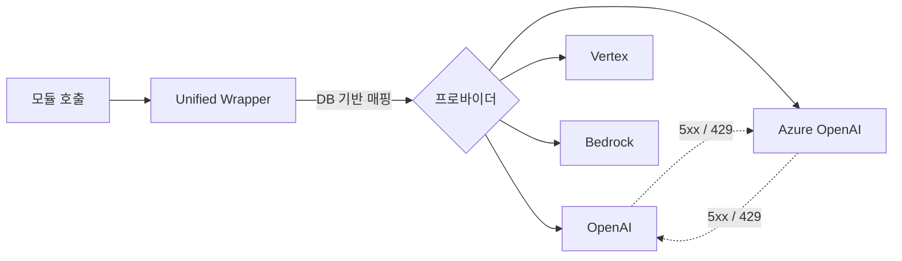
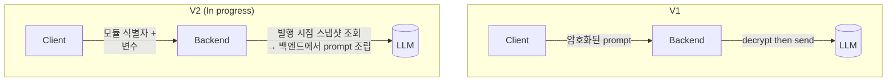
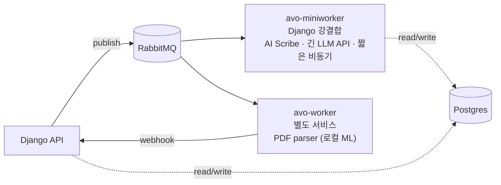
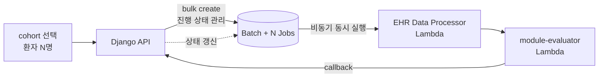
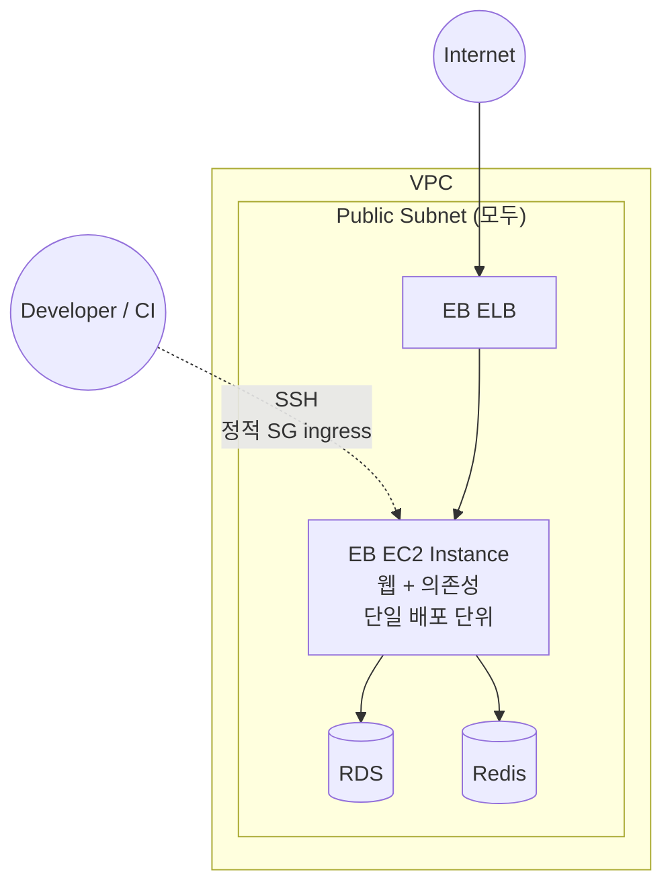
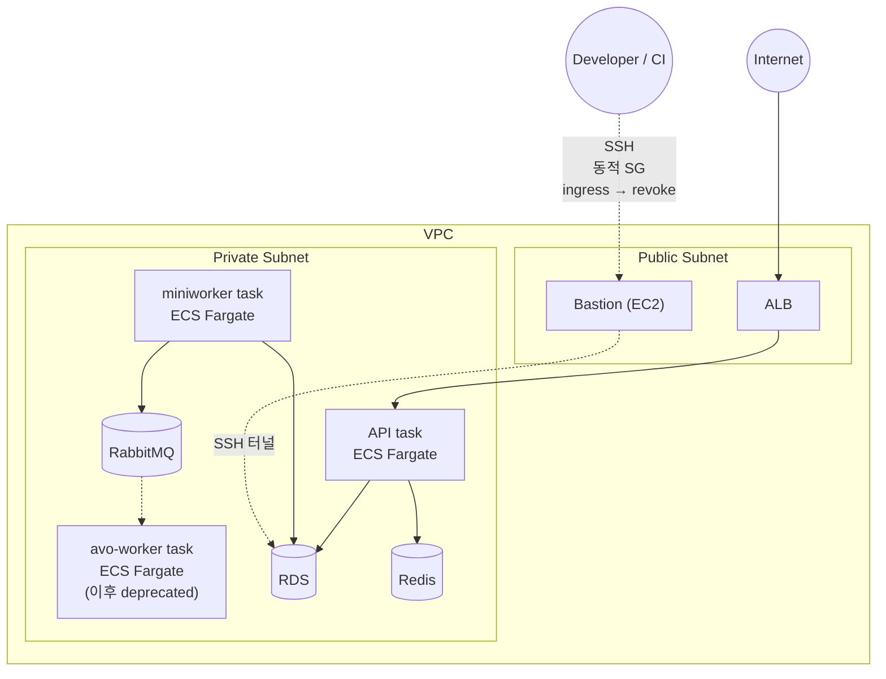

# 노준혁 포트폴리오

Senior Software Engineer

- 📧 texasroh@gmail.com
- 🔗 github.com/texasroh
- 📝 texasroh.blogspot.com

---

## 한 줄 요약

> 의료 SaaS **Avo MD**에서 3년간 백엔드를 담당.
> **멀티 프로바이더 LLM 플랫폼**, **비동기 작업 인프라**, **환자 cohort 평가(백엔드 Module Evaluator)** 세 축을 직접 설계·운영.

---

## 목차

### 본문 (Deep Dive)

1. **프로덕션 LLM 플랫폼**
   멀티 프로바이더 추상화 + 서비스별 fallback /
   Prompt 보안 V1→V2 + diff 모니터링

2. **비동기 작업 인프라 — Celery + ML 워커**
   `avo-worker` + `avo-miniworker` 두 형제 워커 구조 / RabbitMQ + ECS Fargate / Whisper 음성→텍스트 파이프라인

3. **환자 cohort 평가 — 백엔드 Module Evaluator + 자동 비동기 다중 실행**
   모듈 정의를 백엔드(Python)에서 평가 / 프론트엔드 결과와 일치하도록 설계 /
   Batch + N Jobs 진행 상태 관리 + Lambda orchestration / 환자 cohort 일괄 처리

4. **EB → ECS Fargate 마이그레이션**
   서비스 단위 운영으로 전환 / 자동 CI/CD 파이프라인 구축

### 부록

**기타 백엔드 기여** — Auth(Firebase+Django) 통합, N+1, 인덱싱·쿼리 최적화, 검색

---

# 본문

## 1. 프로덕션 LLM 플랫폼

### 1.1 진행 배경

- **임상 도메인** — LLM이 의료진의 가이드라인 답변·AI Scribe 노트 작성 등 임상 워크플로를 직접 보조 → 외부 프로바이더 장애가 진료를 멈추게 해선 안 됨.
- 단일 OpenAI 직접 호출 → 프로바이더 한 곳의 장애가 그대로 서비스 중단 (SPOF).
- 서비스마다 요구가 달라짐 — 어떤 서비스는 **최신 모델**을, 어떤 서비스는 **안정성·레이턴시**를 우선.
- prompt 자체가 영업 자산 → 클라이언트·네트워크 노출을 막아야 함.

### 1.2 멀티 프로바이더 추상화 + 폴백

**4 프로바이더를 하나의 인터페이스 뒤에**

| 프로바이더   | 역할                    |
| ------------ | ----------------------- |
| OpenAI       | 최신 모델 대응          |
| Azure OpenAI | 안정성 · region pinning |
| Gemini       | 일부 케이스             |
| Bedrock      | 일부 케이스             |

- 모델 매핑은 DB 컬럼 한 줄 → **모델 교체에 deploy 불필요**.
- **OpenAI ↔ Azure 간 cross-provider 폴백 체인**을 명시적으로 구성. 단일 프로바이더 SDK 재시도만으로 못 막는 장애를 흡수.

### 1.3 Prompt 보안 V1 → V2 — 조립 위치를 백엔드로

|               | V1                          | V2 (In progress)                |
| ------------- | --------------------------- | ------------------------------- |
| 조립 위치     | 클라이언트                  | **백엔드**                      |
| 전송 페이로드 | 암호화된 prompt 본문        | 모듈 식별자 + 변수만            |
| 모듈 변환     | 프론트엔드 JS               | **백엔드 Python**               |
| 자산 노출     | 네트워크에 평문 prompt 존재 | **prompt가 네트워크에 안 나옴** |

- 발행 시점 prompt 스냅샷을 사용 → 모듈이 수정돼도 과거 발행본으로 롤백 가능.
- 모듈 변환·prompt 조립을 백엔드로 가져오면서 같은 변환 자산을 cohort 평가 챕터의 Module Evaluator도 공유. (관련: [[3. 환자 cohort 평가 — 백엔드 Module Evaluator]])

**diff 모니터링**

- 매 요청마다 V1·V2 prompt를 둘 다 빌드 → diff 로깅.
- 모니터링 실패가 production을 막지 않는 **fail-open** 구조.
- 점진 트래픽 분배 + diff 모니터링 진행 중.

### 1.4 성과 및 인사이트

- **장애 자동 격리** — 한 프로바이더가 죽어도 의료진이 인지하지 못한 채 응답이 전달됨.
- **모델 교체 deploy zero** — 새 모델 도입은 DB 레코드 + 트래픽 비율 조정만으로.
- **자산 노출 면 제거** — V2 적용 트래픽에서 prompt 본문이 네트워크 경계를 넘지 않음.
- **무중단 회귀 전환** — fail-open diff 모니터링 + 점진 분배로 큰 구조 변경을 incident 없이 진행 중.

---

## 2. 비동기 작업 인프라 — Celery + ML 워커

### 2.1 진행 배경

- 임상 가이드라인 PDF 파싱, 음성→텍스트 변환 같은 **CPU·시간이 무거운 작업**이 동기 API에 섞이면서 응답 지연·타임아웃을 유발.
- 작업 성격이 너무 다름 — 큰 ML 추론과 짧은 DB 작업이 한 워커에 묶이면 한쪽 폭주가 다른 쪽을 마비.
- 임상 도메인 — 작업 유실은 곧 환자 데이터 누락. at-least-once 보장과 워커 장애 복원이 기본 요구사항.

### 2.2 상세 내용

- 두 형제 워커로 분리: **ML 워커**(별도 레포 · 큰 의존성 · 무거운 컨테이너)와 **Django 비동기 워커**(긴 llm api 호출 · 메모리 부담 큼 · 짧은 DB 작업).
- 워커 장애 복원 설정으로 워커가 죽거나 재시작해도 메시지는 다른 워커로 재배달 (at-least-once).
- AI Scribe 음성 처리는 긴 오디오를 청크 분할 + 병렬 Whisper 호출로 흡수, Whisper API도 멀티 프로바이더 폴백 적용. (관련: [[1. 프로덕션 LLM 플랫폼]])

### 2.3 성과 및 인사이트

- **API 응답 시간 안정** — 무거운 작업이 워커 티어에 격리되어 API는 사용자 요청 처리에만 집중.
- **장애 격리** — ML 의존성 폭주가 Django API에 전파되지 않음. 워커 단위 독립 스케일링.
- **작업 유실 0** — 워커가 죽거나 재시작해도 메시지가 다른 워커로 재배달.

### 2.4 기여도

- **avo-worker** — 단독 구축 (별도 레포 초기 셋업부터 운영까지).
- **avo-miniworker** — **초기 구조·흐름 단독 설계**, MVP 이후 고도화는 팀 협업.

## 3. 환자 cohort 평가 — 백엔드 Module Evaluator + 자동 비동기 다중 실행

### 3.1 진행 배경

- 기존: 의료진이 환자 **한 명씩 수기로** 모듈에 입력하고 결과 확인.
- 임상 모듈은 프론트엔드(JS)에서만 돌아감 → 자동화·일괄 처리 불가능.
- 신규 요구: EHR 시스템에서 cohort 선택 (예: 당뇨 환자 50명) → 백엔드가 EHR 데이터를 가져와 **N명을 자동으로 동시 평가**.
- 해결할 두 문제: (1) 모듈을 **백엔드에서 동일 결과**로 돌리는 엔진 (2) **cohort 단위 비동기 다중 실행** orchestration.

### 3.2 상세 내용

**Module Evaluator — 클라이언트 의존 없이 백엔드에서 평가**

- 모듈 정의(JSON 트리)를 Python으로 평가하는 엔진 신규 구축.
- 카드 변수, 트리거 체인, 중첩 조건부 문구, EHR 데이터 참조 노드 처리 등 모든 노드 타입을 재현.
- 프론트엔드(JS) 평가 결과와 **일치하도록 설계** — 빌더 미리보기와 실제 환자 결과가 갈라지면 의료 안전 사고로 직결.
- 같은 모듈 트리 → 텍스트 변환 자산을 [[1. 프로덕션 LLM 플랫폼]]의 V2 prompt 조립과 공유.

**핵심 흐름 — 자동 비동기 다중 평가**

- 환자 1명당 한 Job → Batch가 N개의 Job을 묶어 상태 추적.
- Lambda 단계 분리: **EHR 데이터 처리**(외부 IO 격리 + 정규화) · **모듈 평가**. 단계별 독립 배포·스케일·재시도.
- 폭주성 트래픽(0 ↔ 수백 N) → Lambda로 자동 스케일. EHR 외부 장애가 메인 API에 전파되지 않음.
- 실패 격리: Job 단위 진행 상태 관리 + timeout + 부분 재시도.

### 3.3 성과 및 인사이트

- **수기 → 자동** — cohort 한 번 선택으로 N명이 동시에 평가됨.
- **클라이언트 의존 제거** — 모듈이 프론트엔드뿐 아니라 백엔드 어디서든 동일 결과로 실행.
- **외부 장애 격리** — EHR API 장애가 Lambda에서 소진, Django API는 영향 없음.
- **모듈 → cohort 분석 도구로 확장** — 같은 모듈이 1명 진료, N명 cohort 분석에 동시 활용.

### 3.4 기여도

- **핵심 흐름 단독 설계·구현**: Django 측 Batch/Job 상태 머신, 비동기 invoker, Lambda orchestration, Module Evaluator 엔진(Python) 전부.
- **팀원 영역 (분리 명시)**: Lambda 내부 코어 비즈니스 로직(EHR 프로바이더별 정규화, 테스트 fixture 등)은 다른 팀원 작업.

## 4. EB → ECS Fargate 마이그레이션

### 4.1 진행 배경

- **확장성**: API와 워커는 부하 곡선이 다른데 EB는 묶음 스케일만 가능 → 워커 티어 분리([[2. 비동기 작업 인프라]])의 전제 조건.
- **일관성**: 환경 구성이 콘솔에 묻혀 IaC와 분리, 컨테이너 단위 재현·롤백이 어려움.
- **보안성**: EB는 워크로드가 **public subnet에 노출** → 외부 접근 면 큼. 내부 자원 접근에도 정적 ingress 의존. **환자 데이터(PHI, 개인 의료 정보)를 다루는 도메인에서 노출 면 최소화는 컴플라이언스 요구**.

### 4.2 Before / After

**Before — Elastic Beanstalk**

**After — ECS Fargate**

**CI/CD 파이프라인**

- GitHub Actions 기반 자동 빌드·배포·롤백 파이프라인 구축.

### 4.3 성과 및 인사이트

- **확장성 · 워크로드별 독립 스케일** — API와 워커가 각각 task definition으로 분리되어 워크로드 특성에 맞게 독립 스케일·운영. 워커 티어 분리([[2. 비동기 작업 인프라]])의 기반.
- **일관성 · Immutable Infrastructure** — Task definition + 컨테이너 이미지 태그로 어디서 돌든 동일하게 배포·롤백.
- **보안성 · Private Subnet 격리 + Zero Standing Access** — 워크로드를 **Private Subnet**으로 이동해 외부 노출 면 제거. Bastion 동적 SG(ingress → revoke)로 관리 접근도 평시 권한 0.

---

# 부록 — 기타 백엔드 기여

| 영역                              | 내용                                                                                                                                |
| --------------------------------- | ----------------------------------------------------------------------------------------------------------------------------------- |
| **Auth — Firebase + Django 통합** | Firebase OAuth → Django 매핑, OAuth 마이그레이션, duplicate email 처리                                                              |
| **N+1 해결**                      | 메인 페이지, 관리자 화면 등 hot path의 N+1 쿼리 제거                                                                                |
| **인덱싱 · 쿼리 최적화**          | 복합/단일 인덱스 추가, prefetch + only/defer 조합으로 응답 시간 단축                                                                |
| **검색**                          | Fuzzy search 개선, publish history 백필의 race condition 처리                                                                       |
