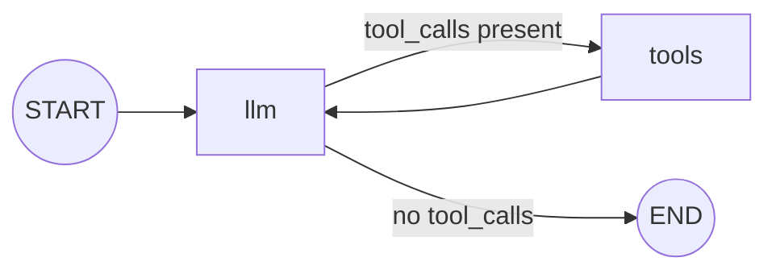

**LangGraph isn't an upgrade from LCEL.** For chain-shaped work, LCEL stays shorter. LangGraph starts earning its keep the moment **cycles / fan-in joins / shared state** enter the picture. This post marks that boundary with the smallest graph I can write.

> **LangGraph Series**
> 1. **Your First Graph — Only Where LCEL Falls Short** ← this post
> 2. [State Design — Schema and Merge Rule](/en/blog/langgraph-state-design/)
> 2.5. [MessagesState Isn't a Special State](/en/blog/langgraph-messages-state/)
> 3. [Send — Dynamic Fan-out Edges Can't Draw](/en/blog/langgraph-send/)
> 4. [An Interrupt Doesn't Pause the Graph](/en/blog/langgraph-human-in-the-loop/)
> 5. [A Checkpoint Isn't Only for Pausing](/en/blog/langgraph-checkpointer/)
> 6. [The Checkpointer Doesn't Cross Threads](/en/blog/langgraph-long-term-memory/)
> 7. [create_react_agent Is Not Magic](/en/blog/langgraph-react-agent/)
> 8. [Multi-Agent Doesn't Mean Agents Talk to Each Other](/en/blog/langgraph-multi-agent/)
> 8.5. [A Subgraph Can Share State, or Isolate It](/en/blog/langgraph-subgraph-state/)

> Versions: based on `langgraph >= 0.2, < 0.3`.

## What LCEL looks like

```python
chain = prompt | llm | parser
chain.invoke({"question": "What's your refund policy?"})
```

Runnables joined with `|` into a straight-line pipeline. The output of each stage feeds the next, and the final stage yields the result. **The majority of real LLM calls fit this shape**, and as long as they do, there's no reason to move to LangGraph.

The story changes the moment branches, cycles, or shared state get involved.

## LangGraph is three things

One way to summarize LCEL: "Runnables joined with `|` into a DAG." LangGraph unfolds that one level further into a **state machine**.

Three components, that's it:

| Concept | What it is | In LCEL? |
|---|---|---|
| **State** | A dict shared across the whole graph. Schema is `TypedDict` / Pydantic | None. Just `input → output` |
| **Node** | A `state → partial state` function | Roughly a `Runnable` |
| **Edge** | A transition between nodes. Unconditional / conditional / cyclic | Only the straight-line `\|` |

The crux is one line. **LangGraph puts state at the center of the graph.** Because every node reads and writes the same dict, fan-in joins and cycles both fall out naturally. LCEL has no slot for that.

## The smallest graph

"If the user's question is FAQ-y, answer briefly; otherwise, analyze it and answer in depth." A conditional-routing example that fits on one screen.

```python
# langgraph>=0.2,<0.3
from typing import TypedDict, Literal
from langgraph.graph import StateGraph, START, END


class State(TypedDict):
    question: str
    route: Literal["faq", "deep"] | None
    answer: str | None


def classify(state: State) -> dict:
    q = state["question"].lower()
    route = "faq" if ("refund" in q or "hours" in q) else "deep"
    return {"route": route}                    # return only partial state

def answer_faq(state: State) -> dict:
    return {"answer": f"[FAQ] short answer to: {state['question']}"}

def answer_deep(state: State) -> dict:
    return {"answer": f"[DEEP] analysis of: {state['question']}"}

def pick_branch(state: State) -> Literal["faq", "deep"]:
    return state["route"]                      # return the next node key


graph = StateGraph(State)
graph.add_node("classify", classify)
graph.add_node("faq", answer_faq)
graph.add_node("deep", answer_deep)

graph.add_edge(START, "classify")
graph.add_conditional_edges("classify", pick_branch, {"faq": "faq", "deep": "deep"})
graph.add_edge("faq", END)
graph.add_edge("deep", END)

app = graph.compile()
app.invoke({"question": "What's your refund policy?", "route": None, "answer": None})
```

90% of LangGraph is in this example. Five things to call out.

### 1) Nodes return a partial dict

`return {"route": "faq"}` returns **only the keys you're changing**. You don't rebuild the full state. LangGraph merges it for you. (The merge rule is called a *reducer*. Concurrent-write conflicts, append vs overwrite — I plan to dig into those later.)

### 2) `START` / `END` are sentinels

Not actual nodes — just constants marking entry and exit. `add_edge(START, "x")` means "x is the first node".

### 3) The conditional-edge router returns a key

`pick_branch` takes `state` and returns a string key. The third argument to `add_conditional_edges` maps that key to a node name. The router handles the domain logic (*where do we go?*), the edge declaration handles topology (*which node does that key correspond to?*). Two responsibilities, separated.

### 4) `compile()` returns a Runnable

`compile()` validates the graph (unreachable nodes, paths that never terminate) and turns it into a Runnable that's LCEL-compatible. So `app.invoke / .stream / .batch` work exactly like any LCEL chain.

**Meaning LangGraph and LCEL aren't rivals.** A node inside the graph can itself be an LCEL chain, and a single slot in a wider LCEL pipeline can be a LangGraph graph.

### 5) Graphs serialize to a diagram

```python
print(app.get_graph().draw_mermaid())
```

Out drops Mermaid text. Getting code-review and blog diagrams for free is a real edge LCEL doesn't have.

## The same branch in LCEL?

LCEL has its own branching tool: `RunnableBranch`.

```python
from langchain_core.runnables import RunnableBranch, RunnableLambda

faq = RunnableLambda(lambda q: f"[FAQ] short answer to: {q}")
deep = RunnableLambda(lambda q: f"[DEEP] analysis of: {q}")

chain = RunnableBranch(
    (lambda q: "refund" in q or "hours" in q, faq),
    deep,   # default
)

chain.invoke("What's your refund policy?")
```

Far shorter. **For one-shot one-way branching, LCEL wins.** No reason to reach for a graph.

The trouble starts with what comes *after* the branch. The most common, most painful case for LCEL is an **agent loop**.

## Where the graph actually earns its keep: the agent loop

The LLM calls a tool, gets the result, comes back to the LLM, decides whether to call another tool or stop. Try this in LCEL and you end up hand-rolling a while loop.

```python
def run_agent(question: str) -> str:
    messages = [HumanMessage(question)]
    while True:
        response = (prompt | llm.bind_tools(tools)).invoke({"messages": messages})
        messages.append(response)
        if not response.tool_calls:
            return response.content
        for tc in response.tool_calls:
            result = execute_tool(tc)
            messages.append(ToolMessage(result, tool_call_id=tc["id"]))
```

It works. But this `run_agent` function is **no longer a Runnable**. Only the LLM call inside is LCEL — the loop, the termination check, the tool dispatch are all just plain Python. Everything LCEL hands a Runnable for free drops out with it.

- **Streaming breaks.** To get token-level streaming, you have to yield from inside the function yourself.
- **Tracing fragments.** LangSmith / OTel spans get logged per LCEL call but aren't stitched into a single flow without extra plumbing.
- **No resumption.** If the loop dies on iteration 4, it restarts from scratch. The accumulated messages were only in memory, so they're gone.
- **You hand-roll the runaway guard.** Need a `max_iter`? Add it yourself.

The same flow as a LangGraph graph:

```python
from langgraph.graph import StateGraph, START, END, MessagesState
from langgraph.prebuilt import ToolNode

def call_llm(state: MessagesState) -> dict:
    return {"messages": [llm.bind_tools(tools).invoke(state["messages"])]}

def should_continue(state: MessagesState) -> Literal["tools", "end"]:
    return "tools" if state["messages"][-1].tool_calls else "end"

graph = StateGraph(MessagesState)
graph.add_node("llm", call_llm)
graph.add_node("tools", ToolNode(tools))
graph.add_edge(START, "llm")
graph.add_conditional_edges("llm", should_continue, {"tools": "tools", "end": END})
graph.add_edge("tools", "llm")          # this is where the cycle closes

app = graph.compile()
```

Render it and the cycle is obvious at a glance:



That last `tools → llm` arrow is the **cycle** LCEL's DAG can't draw. As long as the LLM keeps producing tool calls, the loop keeps running.

The line count is similar. What's different is **everything you get for free**.

- `app.stream(...)` — per-node streaming works out of the box. Token-level streaming is just `stream_mode="messages"`.
- Each node call shows up as its own span in LangSmith / OTel. The Nth iteration of the agent loop is individually traceable.
- `compile(checkpointer=...)` saves state between every node. Die on iteration 4? Resume from iteration 4. (This is the real heart of LangGraph — I plan to study it properly next.)
- `recursion_limit` makes runaway protection a graph option, not your problem.

The difference between the hand-rolled while loop and the graph really comes down to **whether the infrastructure lives in your code or the framework provides it**. So LangGraph doesn't replace LCEL — **you reach for it only where LCEL gets awkward.**

### Other cases where the graph wins

Two more for the same reason:

- **Fan-in after a branch**: when two branches need to flow into the same downstream node. LCEL needs you to hand-write the merge logic. With LangGraph, just connect both nodes to the same next node — two `add_edge` calls, done.
- **Shared accumulating state**: when multiple nodes need to append messages cooperatively, LCEL has you thread the dict through every step. LangGraph's reducer does the merge.

If any of these flows show up, LangGraph reads cleaner. Otherwise, LCEL is shorter.

## When to just stick with LCEL

Cases where adopting LangGraph *now* isn't worth it:

- **Straight-line pipeline**: `prompt → llm → parser`. One line of LCEL.
- **One or two nodes**: you're paying for the graph abstraction with nothing to spend it on.
- **No meaningful state**: one-shot call, no need to resume or trace. Skip it.
- **The whole team is on LCEL**: bringing in a new dep and a new mental model just for one graph node is its own cost.

## Caveats

- **The API moves fast.** Even between 0.2.x and 0.3, signatures shift slightly. Always pin a version in learning code.
- **You *can* return a whole-state dict from a node**, but it obscures how the reducer works. Stick with the partial-dict convention to keep things debuggable.
- **Take the state schema seriously from day one.** Bolting on ad-hoc keys like `question`, `answer` later makes it murky which nodes depend on what. Centralize the schema in `TypedDict` or Pydantic — it pays off in debugging.
- **Without LangSmith / logging, graphs go dark.** Once you're past four nodes, it's hard to see who returned what. Wire tracing in from the start.

## Short checklist

- Straight chain → LCEL. Branches, cycles, or shared state? Consider LangGraph.
- Nodes are `state → partial dict`. Don't rebuild the full state.
- `compile()` gives you a `Runnable`. Drop it as one slot into an LCEL chain — **the two tools live together.**
- `app.get_graph().draw_mermaid()` gives you a diagram for free.
- Pin a langgraph version in any learning code.

## Wrap-up

LangGraph easily gives the impression that it's the thing you should be using for everything, but it really only earns the cost where LCEL gets awkward. Straight-line chains stay shorter and clearer in LCEL. Graphs are the tool for **flows that don't fit a chain** — fan-ins, cycles, shared state.
