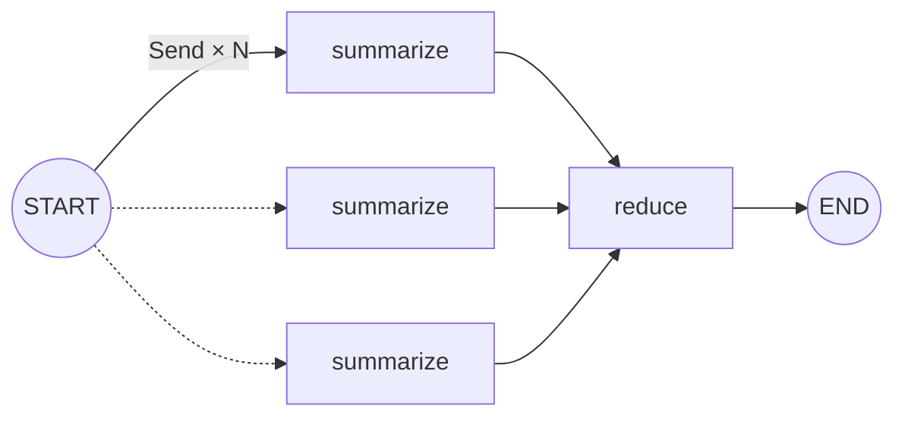

**There's a ceiling on what static edges can branch over.** Plain edge or conditional edge, the *set* of reachable nodes has to be fixed at build time. But when the branch count is a **runtime value** — "summarize each of N documents" — edges can't draw it. `Send` fills that gap: **dynamic fan-out**. (It's often mislabeled a "parallel-execution tool," but parallelism works fine without Send via static edges — what sets Send apart is that it's *dynamic*.)

> **LangGraph Series**
>
> 1. [Your First Graph — Only Where LCEL Falls Short](/en/blog/langgraph-first-graph/)
> 2. [State Design — Schema and Merge Rule](/en/blog/langgraph-state-design/)
> 3. **Send — Dynamic Fan-out Edges Can't Draw** ← this post
> 4. An Interrupt Doesn't Pause the Graph

> Versions: based on `langgraph >= 0.2, < 0.3`.

## Branching done with edges is always "static"

In [Part 1](/en/blog/langgraph-first-graph/) we saw edges as the tool for making branches. Branches made with edges — plain or conditional — share one trait: **the set of reachable nodes is fixed at build time.**

```python
# (1) multiple plain edges — always fire both (parallel)
graph.add_edge("classify", "summarize")
graph.add_edge("classify", "translate")

# (2) conditional edge — pick among candidates at runtime (return a list → several in parallel)
graph.add_conditional_edges("classify", pick_branch, {"faq": "faq", "deep": "deep"})
```

(1) always fires both; (2) picks among candidates based on state — **both can run in parallel too.** So "parallel = Send" is wrong. Parallelism is common with static edges.

The difference is only *how you pick* — in both cases **the reachable nodes are hard-coded.** Where you can go is fully known at compile time. Most branching has this static shape, and as long as it does, edges are enough.

The problem is when the *number* of branches is decided at runtime — that's where static edges run out.

## Where edges break down: dynamic fan-out

Say documents come in and you want to **summarize each one separately**, then merge them in one pass. The document count differs on every call. Could be 3, could be 50.

Try to draw this with static edges and you hit a wall.

- How many summarize nodes should you pre-create? You don't know the count.
- Receive them in one node and loop inside it — and [Part 1's while-loop problem](/en/blog/langgraph-first-graph/) comes right back. Sequential execution, with streaming / observability / checkpointing all crammed into a single node.

As long as `pick_branch` returns one node *name* (or a list of names), you can't leave the static topology. **You have to *generate* the branches at runtime.** That's `Send`.

## Send = a node plus the state to hand it

```python
from langgraph.constants import Send

def fan_out(state):
    return [Send("summarize", {"doc": d}) for d in state["docs"]]
```

`Send("summarize", {"doc": d})` is the instruction *"run the `summarize` node once with this payload."* When the router returns a **list of Sends** instead of a node name, LangGraph spins up that many nodes **in parallel**. The branch count is `len(state["docs"])` — a runtime value.

Two things differ from static edges.

1. **The branch count comes from the data.** It isn't pinned at build time.
2. **Each branch gets its own state.** Not the whole shared state — just `{"doc": d}`.

## The full map-reduce graph

```python
# langgraph>=0.2,<0.3
import operator
from typing import TypedDict, Annotated
from langgraph.graph import StateGraph, START, END
from langgraph.constants import Send


class State(TypedDict):
    docs: list[str]
    summaries: Annotated[list[str], operator.add]   # N branches write the same key at once → reducer required
    final: str | None


class WorkerState(TypedDict):     # what the worker receives is NOT the main state
    doc: str


def fan_out(state: State):
    # Generate branches at runtime — one summarize per document.
    return [Send("summarize", {"doc": d}) for d in state["docs"]]

def summarize(state: WorkerState) -> dict:
    return {"summaries": [f"summary of {state['doc']}"]}   # delta only

def reduce(state: State) -> dict:
    return {"final": "\n".join(state["summaries"])}


graph = StateGraph(State)
graph.add_node("summarize", summarize)
graph.add_node("reduce", reduce)

graph.add_conditional_edges(START, fan_out, ["summarize"])   # router returns a Send list
graph.add_edge("summarize", "reduce")                        # fan-in: once, after all finish
graph.add_edge("reduce", END)

app = graph.compile()
app.invoke({"docs": ["a.txt", "b.txt", "c.txt"], "summaries": [], "final": None})
```

Draw it and the fan-out / fan-in is obvious at a glance.



The dashed arrows mean branches *whose count you don't know until runtime*. A static diagram can't draw this "N copies" — which is exactly why Send exists.

Five things to call out in this code.

### 1) The router returns Sends, not a node name

Same slot — the router on `add_conditional_edges`. But instead of a *string* like `"summarize"`, it returns a *list of* `Send(...)` objects. The third argument `["summarize"]` is just a "reachable nodes" hint for drawing the graph; the actual branch count is set by the list length.

### 2) The worker receives a payload, not the main state

`summarize`'s input is `WorkerState`, not `State` — it's the `{"doc": d}` you put in the `Send`. Each worker sees only its slice. It doesn't know what the other documents are, or what `final` is. This **input asymmetry** trips people up at first: it receives a payload, but returns main-state keys.

### 3) Writing the same key concurrently requires a reducer

The N `summarize` nodes **write `summaries` at the same time, in the same superstep.** That's the situation from [Part 2](/en/blog/langgraph-state-design/) — without a reducer, one clobbers the other or you get `InvalidUpdateError`. Here `Annotated[list[str], operator.add]` concatenates them. **Send runs on top of Part 2's reducers.**

But this is the rule *when multiple branches write the same key at once*. As in the "heterogeneous parallel" pattern below, if branches write *different* keys there's no conflict, so no reducer is needed. The only thing to check when drawing a fan-out is one question — **"is there a key that N branches write together?"** Put a reducer on that key only.

### 4) Connect with a plain edge and the next node runs exactly once

A single `summarize → reduce` edge means LangGraph **waits for every Send branch to finish**, then runs `reduce`. Even though N ran in parallel, the next node runs not N times but **exactly once** — on the merged state. You don't hand-write the join.

The easy mistake is thinking **this is thanks to `reduce` being a "reduce" node** — it isn't. As long as you connect with a plain edge (`add_edge`), the next node — *any* node — runs once. The per-branch payload (`{"doc": d}`) that Send created lives only while that worker runs; the moment the superstep ends and writes merge into the main state, **the branch's identity dissolves.** So a plain edge doesn't carry the parallelism onward.

> To keep the parallelism going into the next node, you don't use a plain edge — you **fire Send again.** You have to redraw the fan-out at each step to keep the N branches alive.

### 5) Parallelism isn't what sets Send apart — "dynamic" is

It's true the N workers run concurrently in the same superstep. But as the intro showed, **parallelism works without Send** — draw several plain edges, or have a conditional edge return a list, and you get parallel execution. So "Send = parallel" can't distinguish it from that static parallelism. The difference isn't *whether it's parallel* but **whether the topology is pinned at build time or generated at runtime.** (That parallelism turns into a latency win when each branch is slow, like an LLM call, is a bonus.) The three methods laid out in one table — next section.

## Static edges vs Send

Line up the three ways to make branches and the difference is sharp.

| Branching method   | Branch selection              | Per-branch state | Topology |
| ------------------ | ----------------------------- | ---------------- | -------- |
| plain edge ×N      | always all                    | shared state     | static   |
| conditional edge   | pick a subset at runtime      | shared state     | static   |
| **Send**           | **generated at runtime** (count·payload) | **per-branch payload** | **dynamic** |

All three are parallel — **parallelism is not the distinguishing trait.** Top to bottom, *what you can decide at runtime* grows: plain edges have no choice at all (all of them), conditional edges pick from a static set of candidates, and Send creates the branches themselves. **The one thing static edges (plain·conditional) can't draw is "runtime generation" — that's where Send lives.**

## Patterns you build with Send

Send does one thing — **it generates (node, input) dispatches at runtime.** On top of that one thing, the uses branch out.

### map-reduce — same node × N

This post's example. Fan N inputs out to the *same* worker, process each, and merge with a reducer. For "the same operation over many inputs" — document summarization, chunk embedding, per-item extraction.

```python
return [Send("summarize", {"doc": d}) for d in state["docs"]]
```

### Heterogeneous parallel — to different nodes

Send doesn't only spin up the *same* node. Each branch can go to a **different** node, running heterogeneous work in parallel. Some inputs to the summarize node, others to translate — the node mix and count are decided at runtime.

```python
def route(state):
    sends = []
    for item in state["items"]:
        target = "summarize" if item["kind"] == "doc" else "translate"
        sends.append(Send(target, item))
    return sends
```

### Conditional fan-out — only a subset

Make branches only from what *matches a condition*, not everything. Filter + map.

```python
return [Send("review", {"case": c}) for c in state["cases"] if c["risk"] == "high"]
```

All three share one root — branches aren't hard-coded; they're *made* from runtime data. **map-reduce is just the "same node" special case** of that; Send itself is broader.

## When not to use Send

- **A small, build-time-fixed set of branches**: if it's `faq` / `deep` pick-one, a conditional edge is shorter and clearer.
- **No fan-out result to merge**: for plain routing, the map-reduce abstraction is overkill.
- **Pure compute with no need for observability/checkpointing**: a plain `[summarize(d) for d in docs]` is shorter. Send's value is that *each branch becomes a graph node you can trace and restart* — when you don't need that, the list comprehension wins.

## Things to watch

- **When multiple branches write the same key and there's no reducer, it breaks silently.** Only the last one survives, or you get an error. The moment you draw a fan-out, memorize that a "key N branches write together" needs a reducer. (Doesn't apply if each branch writes a different key.)
- **The merge order can be jumbled.** When N branches write the same key at once, the order the reducer combines those writes isn't guaranteed — there's no guarantee `summaries` stacks up in `docs` order (a, b, c). It drifts more when branches take different times, like LLM calls. If order matters, carry an index in the payload (`Send("summarize", {"i": i, "doc": d})`) and sort by index in the reduce node.
- **Fan-out eats `recursion_limit` too.** Each branch consumes a superstep. With hundreds of branches you may need to raise the limit.
- **The import path is version-sensitive.** On 0.2.x it's `from langgraph.constants import Send`. Later in the line it's also exposed via `langgraph.types`, so double-check when you bump versions.

## Wrap-up

Send punches through the ceiling of a "static graph topology." Where static edges hard-code *where you can go*, Send *makes those branches from runtime data.* Whether it's map-reduce or heterogeneous parallel work, the moment the branches it makes converge on a shared key, [Part 2's reducers](/en/blog/langgraph-state-design/) reappear — which is why control flow and state design in LangGraph aren't two separate topics.
