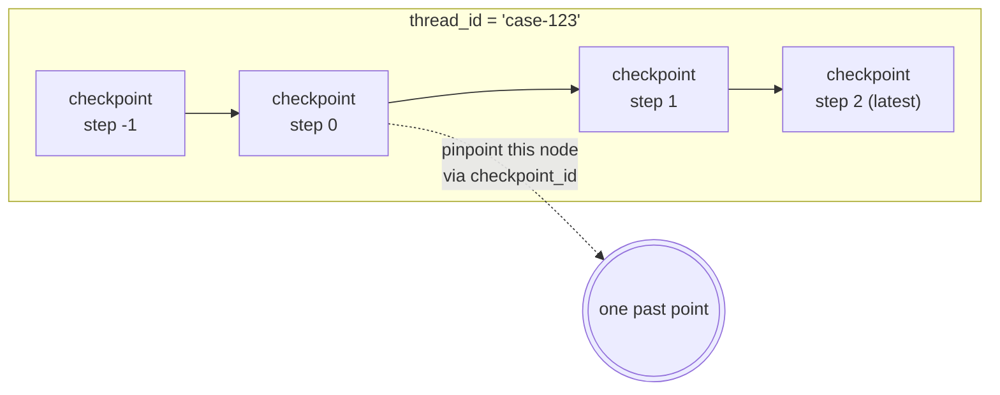
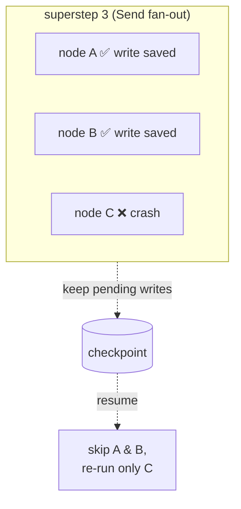

**Part 4's interrupt worked because of the checkpointer.** But a checkpoint isn't written *only when you pause* — one is written at **every superstep**. Pause or not, the graph saves its own state after every step it takes. The interrupt was just the one moment that save became *visible*. The checkpointer isn't a "tool for waiting on humans" — it's the **persistence layer** under the entire graph run.

> **LangGraph Series**
> 1. [Your First Graph — Only Where LCEL Falls Short](/en/blog/langgraph-first-graph/)
> 2. [State Design — Schema and Merge Rule](/en/blog/langgraph-state-design/)
> 3. [Send — Dynamic Fan-out Edges Can't Draw](/en/blog/langgraph-send/)
> 4. [An Interrupt Doesn't Pause the Graph](/en/blog/langgraph-human-in-the-loop/)
> 5. **A Checkpoint Isn't Only for Pausing** ← this post
> 6. [The Checkpointer Doesn't Cross Threads](/en/blog/langgraph-long-term-memory/)

> Versions: based on `langgraph >= 0.2, < 0.3`. The checkpointer was split into separate packages — `langgraph-checkpoint` (core, `MemorySaver`), `langgraph-checkpoint-sqlite`, `langgraph-checkpoint-postgres`. Import paths shift between versions, so check yours before relying on them.

## Checkpoints get written even when nothing pauses

Part 4 said "interrupt = save a checkpoint + exit." It's easy to read that as *"a checkpoint is what happens when you pause"* — but it's the other way around. Pausing doesn't create the checkpoint; **the graph is already writing a checkpoint at every step**, and an interrupt just exits instead of taking the next one.

LangGraph saves one checkpoint at the end of each **superstep** (the set of nodes that run together — with a `Send` fan-out from Part 3, several nodes are one superstep). The same is true for a plain graph with no interrupt anywhere.

```python
from typing import TypedDict
from langgraph.graph import StateGraph, START, END
from langgraph.checkpoint.memory import MemorySaver


class State(TypedDict):
    draft: str
    reviewed: bool


def propose(state: State) -> dict:
    return {"draft": "Prescription suggestion: Amoxicillin 500mg"}

def review(state: State) -> dict:
    return {"reviewed": True}


graph = StateGraph(State)
graph.add_node("propose", propose)
graph.add_node("review", review)
graph.add_edge(START, "propose")
graph.add_edge("propose", "review")
graph.add_edge("review", END)

app = graph.compile(checkpointer=MemorySaver())   # no interrupt

config = {"configurable": {"thread_id": "case-123"}}
app.invoke({"draft": "", "reviewed": False}, config)
```

This graph runs straight through without ever pausing. Yet once it's done, you can pull out *the checkpoints it passed through*.

```python
for snap in app.get_state_history(config):
    print(snap.metadata["step"], snap.next, snap.values)

# 2 ()            {'draft': 'Prescription suggestion: Amoxicillin 500mg', 'reviewed': True}
# 1 ('review',)   {'draft': 'Prescription suggestion: Amoxicillin 500mg', 'reviewed': False}
# 0 ('propose',)  {'draft': '', 'reviewed': False}
# -1 ('__start__',) {'draft': '', 'reviewed': False}
```

Four checkpoints piled up even though nothing ever paused (including the input step at `step=-1`). **An interrupt was only ever the act of *cutting out of this sequence partway through* — the sequence itself is always built.** Accept just that one fact and the rest falls into place naturally: memory, restart, and time-travel are all just different ways of using "this checkpoint that gets written at every step."

## The checkpointer is an interface — Memory / Sqlite / Postgres differ only in durability

`MemorySaver`, `SqliteSaver`, and `PostgresSaver` are **implementations of the same interface (`BaseCheckpointSaver`)**. Not a single line of graph code changes — only what you pass to `compile(checkpointer=...)`.

```python
# dev: process memory (gone on restart)
from langgraph.checkpoint.memory import MemorySaver
app = graph.compile(checkpointer=MemorySaver())

# local file: survives the process dying
from langgraph.checkpoint.sqlite import SqliteSaver
with SqliteSaver.from_conn_string("checkpoints.sqlite") as cp:
    app = graph.compile(checkpointer=cp)

# production: many processes share one DB
from langgraph.checkpoint.postgres import PostgresSaver
with PostgresSaver.from_conn_string("postgresql://...") as cp:
    cp.setup()                       # create tables, first run only
    app = graph.compile(checkpointer=cp)
```

What the interface demands comes down to four operations.

| Method | What it does |
|---|---|
| `put` | Store one checkpoint along with its config and metadata |
| `put_writes` | Store the intermediate writes nodes produced, attached to a checkpoint (pending writes) |
| `get_tuple` | Fetch one checkpoint by config (checkpoint + config + metadata + pending writes) |
| `list` | List checkpoints matching a config and filter |

> The only difference is **durability and sharing scope**. `MemorySaver` lives only in that process's memory, so it evaporates on restart. `SqliteSaver` persists to a file and survives the process dying on one machine. `PostgresSaver` lets many workers and many servers share the same checkpoints — the real web-server case, where the process that took the request and the process that resumes it can be different.

## What's actually inside a checkpoint

What you pull out with `get_state(config)` is a `StateSnapshot`. Here's what the caller sees.

```python
snap = app.get_state(config)
snap.values         # the state at that point (channel values) — what you look at most
snap.next           # tuple of node names to run next. () means it's done
snap.config         # the config pointing at this checkpoint (includes thread_id + checkpoint_id)
snap.metadata       # {'source': ..., 'step': ..., 'writes': ..., 'parents': ...}
snap.parent_config  # the config of the previous checkpoint — the pointer that links the sequence
snap.tasks          # the tasks queued to run next (with error info, if any failed)
```

Look only at `snap.values` and it reads like "a state snapshot," but a checkpoint actually holds more. The core fields stored internally:

| Field | What it does |
|---|---|
| `channel_values` | The state exposed as `snap.values`. The core payload |
| `channel_versions` / `versions_seen` | The version of each channel, plus *which node has seen which version* — the basis on which LangGraph computes `snap.next` (the node to run next) |
| `pending_sends` | The queue of `Send`s (Part 3) not yet processed |

The key here is `channel_versions` / `versions_seen`. A checkpoint doesn't just store data — it stores **the execution position, "how far we've gotten"** alongside it. That's why a graph can die and come back to life.

On top of that come **pending writes** and **metadata**. The `step` in metadata is the step number you saw above (-1, 0, 1, ...), and `source` says *why* this checkpoint exists.

| `source` | When it's written |
|---|---|
| `"input"` | because invoke was given new input |
| `"loop"` | because the graph advanced one step normally |
| `"update"` | because a human touched it via `update_state` |
| `"fork"` | because a past checkpoint was copied |

Fixing the draft with `update_state` in Part 4 was exactly the act of writing one more checkpoint with `source="update"`.

## thread_id is the sequence, checkpoint_id is one point within it

This is where the two identifiers sort themselves out. Part 4 called `thread_id` just a "session identifier," but more precisely **`thread_id` = one sequence of checkpoints**. What points at a *specific single point* within that sequence is the `checkpoint_id`.

```python
# pass only thread_id → the "most recent" checkpoint of that sequence
config = {"configurable": {"thread_id": "case-123"}}
app.get_state(config)            # latest state

# pass checkpoint_id too → a "specific past point" of that sequence
config = {"configurable": {"thread_id": "case-123",
                           "checkpoint_id": "1ef..."}}
app.get_state(config)            # the state at that point
```



A thread is a chain of checkpoints growing left to right, each link tied backward by `parent_config`. Invoke without a `checkpoint_id` and you always continue from the *last* link; give a `checkpoint_id` and you grab a *middle* link. That "grab a middle link" is all time-travel is.

## Time-travel: replay from the past, and fork

Pick a past link with `get_state_history`, then invoke again with that link's `config` (the one with `checkpoint_id` baked in), and **it runs again from that point.**

```python
history = list(app.get_state_history(config))   # newest first
past = history[2]                                # two steps back

# re-run from that point = replay
app.invoke(None, past.config)
```

From here the road forks in two.

- **Replay** — re-run from a past point *as is*. Same input, same logic, same path taken again. For reproducing "why did it go to this node back then?" when debugging.
- **Fork** — re-run from a past point with the state *changed*. Edit that link with `update_state` or give different input, and LangGraph doesn't overwrite the original chain — it **grows a new branch**. Because `parent_config` records where it diverges, the original timeline and the new one **coexist**.

```python
# change state at a past link → a new branch diverges from there (fork)
forked = app.update_state(past.config, {"draft": "Alternative suggestion: Cephalexin 500mg"})
app.invoke(None, forked)        # original chain stays; proceed on the new branch
```

Why this is stronger than a plain "undo": it doesn't erase the original. **"Roll this patient case back to step 1, try a different drug, but keep the original record"** becomes a single line on the graph. In clinical and audit contexts, this *non-destructive branching* is especially useful.

## The path back from death: pending writes preserve idempotency

The real worth of "a checkpoint at every step" shows up **when the process dies mid-run**. If the server crashes while running superstep 3, the last committed checkpoint (the end of superstep 2) is sitting there intact. Invoke again with the same `thread_id` and it comes back to life at that point — it does not re-run the graph from the start.

The hard case is when *within a single superstep* some nodes finish and then it dies. Three nodes run in parallel from a `Send` fan-out, two succeed, one blows up. Throw away the two successes and re-run all three, and the two that already called an external API get **called twice**.

LangGraph prevents this with **pending writes**. The writes of a node that succeeded in a superstep are saved separately, attached to the checkpoint, even before that step *fully* closes (`put_writes`). On resume, LangGraph sees "this node already left a write" and **skips re-running it.**



That asymmetry from Part 4 — "a node paused by interrupt re-runs from the top on re-entry, but the sibling nodes that ran alongside it don't" — *is* this pending-writes mechanism. Interrupt or crash, the rule is the same: **preserve the results of nodes that didn't pause / succeeded, and re-run only the node that paused / failed.**

But this is idempotency *between graph steps*, not **inside a single node**. If the node function itself dies partway, that node re-runs whole — so if you trigger external side effects (a charge, a DB write) inside a node, you have to make those idempotent yourself.

## Clinical angle: state is serialized to disk as-is

That covers the mechanism; the first thing that bites when you take this to production is security. **The state in `channel_values` is serialized and stored as-is.** If you put PHI/PII — patient identifiers, symptoms, prescriptions — into state, that means it lands in process memory with `MemorySaver`, and *in plaintext in a DB table* with `PostgresSaver`.

A checkpoint looks like "transient run state," but the moment you use a durable saver it's **effectively another datastore**. So you have to weigh the same things you would for any DB.

- **Encryption at rest** — is DB-level at-rest encryption enough, or do you encrypt sensitive fields at the application level / wrap them with a separate KMS before they ever enter state?
- **Masking / tokenization** — keep only a token in the checkpoint and put the real PHI in a separate secure store. Identifiers in state, the originals outside.
- **Retention policy** — checkpoints aren't deleted automatically. As threads pile up, so does PHI. You have to run expiry/deletion policy yourself, outside the graph.
- **The double edge of time-travel** — keeping every past checkpoint also means *old state you thought you deleted is still queryable*. Great for audit, in direct conflict with the right to be forgotten.

This isn't a problem LangGraph solves for you — it's a **trade-off the designer has to decide**. The checkpointer carries no policy on "where, what, and how long to keep" — keeping everything in plaintext is the default.

## Wrapping up

Part 4 saw interrupt as one feature laid on top of persistence. Part 5's conclusion is that the scope is far wider — **interrupt, thread memory, crash recovery, time-travel, and non-destructive fork aren't separate features; they're different uses of the single mechanism "write a checkpoint at every superstep."** Know the checkpointer as a "tool for waiting on humans" and you've seen half of it; see it as "the persistence layer under graph execution" and all five sort themselves out at once.

So whether to put LangGraph in production really comes down to **"can you accept this persistence layer."** If you can, you just pick and plug in a saver (swap an argument); if you can't, you're on the hook for state serialized at every step, checkpoints that aren't auto-deleted, and plaintext PHI. In the next part (Phase 5) we'll take apart a prebuilt agent like `create_react_agent` that sits on top of all this — to see *what graph it actually is*.
