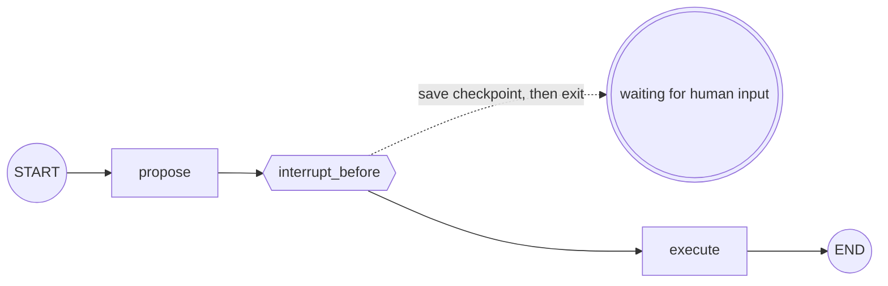

**Waiting for human input in LangGraph isn't about "halting a running process."** `interrupt` *saves the current state to a checkpoint and exits the graph.* The human input comes later — re-enter with the same `thread_id` and it picks up from where it saved.

> **LangGraph Series**
> 1. [Your First Graph — Only Where LCEL Falls Short](/en/blog/langgraph-first-graph/)
> 2. [State Design — Schema and Merge Rule](/en/blog/langgraph-state-design/)
> 3. [Send — Dynamic Fan-out Edges Can't Draw](/en/blog/langgraph-send/)
> 4. **An Interrupt Doesn't Pause the Graph** ← this post
> 5. [A Checkpoint Isn't Only for Pausing](/en/blog/langgraph-checkpointer/)

> Versions: based on `langgraph >= 0.2, < 0.3`. Dynamic `interrupt()` / `Command` landed late in the 0.2 line, so check your minor version before relying on them.

## The problem: a human has to step in mid-flow

It's common to need human approval partway through a workflow — something like "run this prescription recommendation *after* a clinician confirms it." How do you stop and wait?

Start with the naive idea.

```python
def execute(state):
    answer = input("Proceed? (y/n): ")   # blocks here
    ...
```

This only works **if the process stays alive** the whole time. Inside a web request? The request has to return a response and finish. You can't hold a human's answer — minutes or hours away — hostage to `input()`. And if the server dies in the meantime, the in-flight state vanishes along with memory.

LangGraph solves this differently. **It doesn't pause — it saves and exits.**

## interrupt = save a checkpoint + exit

The core model:

1. At the interrupt point, LangGraph **saves the current state to a checkpoint**.
2. Then it **exits the graph (yields).** `invoke` *returns* — this is not blocking.
3. When the human input arrives later, you **`invoke` again with the same `thread_id`.** LangGraph reads the checkpoint and continues from that point.

So there are two prerequisites — a **checkpointer** (somewhere to save) and a **`thread_id`** (which session's checkpoint). Here we'll just use the dev-only `MemorySaver` to see the concept.

## Approach 1: static interrupt_before / interrupt_after

The simplest form is a compile option: "always stop *right before* this node."

```python
# langgraph>=0.2,<0.3
from typing import TypedDict
from langgraph.graph import StateGraph, START, END
from langgraph.checkpoint.memory import MemorySaver


class State(TypedDict):
    draft: str
    approved: bool


def propose(state: State) -> dict:
    return {"draft": "Rx recommendation: amoxicillin 500mg ..."}

def execute(state: State) -> dict:
    return {"approved": True}


graph = StateGraph(State)
graph.add_node("propose", propose)
graph.add_node("execute", execute)
graph.add_edge(START, "propose")
graph.add_edge("propose", "execute")
graph.add_edge("execute", END)

app = graph.compile(
    checkpointer=MemorySaver(),
    interrupt_before=["execute"],     # stop right before execute
)

config = {"configurable": {"thread_id": "case-123"}}
app.invoke({"draft": "", "approved": False}, config)
# → runs through propose, stops right before execute, and returns
```



Here `invoke` **does not block.** It runs `propose`, saves the state right before `execute` to a checkpoint, and simply *returns*. It isn't stuck waiting for a human — it saves the state and the call ends.

### Inspect the state, edit it, and resume

```python
state = app.get_state(config)
print(state.next)              # ('execute',) — the node that runs next
print(state.values["draft"])   # "Rx recommendation: amoxicillin 500mg ..."

# the reviewer can edit the draft while looking it over
app.update_state(config, {"draft": "Rx recommendation (revised): amoxicillin 250mg ..."})

# resume: pass None in the input slot
app.invoke(None, config)       # picks up from execute
```

`app.invoke(None, config)` — an input of `None` means *"no new input, continue from the checkpoint."* The `thread_id` has to match for it to pick up the same session's checkpoint.

The second `invoke` is a **completely separate call** from the first. Call it from another function, another request, even another server process — as long as the `thread_id` matches and the checkpointer points to the same store, the graph comes back to life at the saved point. Which means it's fine if the process dies after the first `invoke` returns.

## Approach 2: dynamic interrupt()

When you want to stop *conditionally, inside a node*, use `interrupt()`.

```python
from langgraph.types import interrupt, Command

def human_review(state: State) -> dict:
    decision = interrupt({"draft": state["draft"]})   # stop here and send the payload out
    return {"approved": decision == "yes"}

# resume: inject the human's answer with Command(resume=...)
app.invoke(Command(resume="yes"), config)
```

`interrupt({...})` throws the payload you pass it outward and exits the graph (the checkpoint save is the same). When you resume with `Command(resume="yes")`, **that value becomes the return value of `interrupt()`** — in the code above, `decision` becomes `"yes"`.

Following one full round trip from the caller's side:

```python
config = {"configurable": {"thread_id": "case-123"}}

# first call — stops at interrupt() inside human_review
result = app.invoke({"draft": "Rx recommendation: amoxicillin 500mg", "approved": False}, config)

# the payload passed to interrupt() surfaces to the caller under the __interrupt__ key
print(result["__interrupt__"])
# (Interrupt(value={'draft': 'Rx recommendation: amoxicillin 500mg'}, resumable=True, ...),)

draft = result["__interrupt__"][0].value["draft"]
# → show this draft to the human and get an answer (on the web, return the response and stop here)

# second call — inject the answer as the resume value
final = app.invoke(Command(resume="yes"), config)
print(final["approved"])   # True  ← interrupt() returned "yes" → decision == "yes"
```

**The payload goes out (`__interrupt__`), the human's answer comes in (`Command(resume=...)`).** Those two directions are all there is to a dynamic interrupt.

Unlike the static form, you decide *at runtime* — with an `if` — whether to stop at all. Logic like "only ask a human when confidence is low" falls out naturally.

### The dynamic interrupt trap: the node re-runs from the top

Once you stop at `interrupt()` and resume, **that node re-runs from the beginning.** Which means the code *before* the `interrupt()` call runs twice. Put a side effect (an external API call, a DB write) before the interrupt and it fires twice.

```python
def human_review(state: State) -> dict:
    charge_credit_card(state)          # ❌ called twice on resume
    decision = interrupt({...})
    return {"approved": decision == "yes"}
```

Rule: **don't put side-effecting code before `interrupt()`.** Push work like external API calls or DB writes to *after* the human decides — onto the line after `interrupt()`.

### When several stop at once: __interrupt__ is plural by design

With `Send` fan-out (Part 3), several nodes run in parallel, and if two or more of them call `interrupt()`, that single `invoke` comes back carrying **several interrupts at once.** That's why `result["__interrupt__"]` is a tuple — in the example above we used `[0]` only because a single node stopped, leaving one element; the structure itself is always plural.

```python
# 3 documents fanned out to parallel nodes, each calling interrupt()
for itr in result["__interrupt__"]:
    show_to_human(itr.value)        # one per stopped node
```

So what about **the sibling nodes that ran alongside but didn't stop?** They run to completion, and their results aren't discarded — they're kept as "pending writes" in the checkpoint. So on resume those nodes **don't re-run** — the trap above ("the node re-runs from the top") applies *only to the node that stopped*, not to the siblings that ran with it.

That said, the superstep itself **doesn't close until every stopped node is resolved.** The finished nodes' writes get committed — bundled together — into the *next* checkpoint only when that step closes. (So while it's paused, if you read `get_state().values`, the results of the already-finished sibling nodes are reflected there — they just haven't been committed into the next checkpoint yet.)

## What to pass to invoke when resuming

By now we've seen the second `invoke` in two shapes — `invoke(None, config)` and `invoke(Command(resume=...), config)`. It's confusing at first, so here's all of it in one place.

First the big picture. **Re-running a stopped graph ultimately just means "calling `invoke` once more with the same `thread_id`."** When the `thread_id` matches, LangGraph goes "ah, this session was stopped back there" and picks up the saved checkpoint. There's no separate `resume()` function — *you just call `invoke` again.* What changes the behavior is what you put in the first argument (the input slot). Three cases cover it.

**① `None` — "no new input, just continue from where it stopped."**

```python
app.invoke(None, config)
```

Used to resume something stopped by a static `interrupt_before/after`. Putting `None` in the input slot signals *"I have no new input to give; just keep going from what's saved."* LangGraph reads the checkpoint and continues from *the node that runs next* (the one `get_state(config).next` points to). With no new input, the state is whatever it was when it stopped — or whatever you changed it to with `update_state` in between.

**② `Command(resume=value)` — "plug this value in as `interrupt()`'s return value and continue."**

```python
app.invoke(Command(resume="yes"), config)
```

Used to resume something stopped by a dynamic `interrupt()`. The value you pass becomes the *return value* of the suspended `interrupt(...)` call, flowing back into the node. If `None` is "just keep going," this is the channel for "carrying the human's answer into the graph." So when the human input has to affect the node's logic (approve → run, reject → stop, that kind of branch), it's `Command`, not `None`.

> **`Command` has more fields than `resume`.** `update` (modify state at the same time — the same thing `update_state` does), `goto` (name the next node), `graph` (which graph to send to). As resume input, `resume` is the lead, and if you want to answer *and* tweak state at once, you can combine them: `Command(resume="yes", update={"reviewer": "dr_kim"})`. `goto`/`graph` are for flow routing rather than resuming an interrupt — a different concern — used to drive branching directly from a node's *return value*.

**③ A plain input dict — this is "a new run," not "resuming."**

```python
app.invoke({"draft": "...something entirely new..."}, config)
```

This trips people up the most. Pass a *real input value* that's neither `None` nor `Command`, and it means **start a new run**, not "continue from where it stopped." The graph runs again from `START` — except, since the `thread_id` is the same, it doesn't throw away the previous state; it *accumulates on top of it.* This is how a chatbot continuing a conversation on the same session passes a new message each turn. How it merges with the prior state follows Part 2's reducer rules exactly — keys with a reducer (like `messages`) accumulate (append), while the rest overwrite only the keys you passed and leave the untouched keys as they were. **If you meant to continue from where it stopped, this is the wrong call** — it'll re-run from the top, against your intent.

In one line: **to continue, use `None` (static) or `Command(resume=...)` (dynamic); to start fresh, an input dict.** What you hand the same `invoke` decides "resume vs. new turn."

## The two approaches side by side

| | Static `interrupt_before/after` | Dynamic `interrupt()` |
|---|---|---|
| Where it goes | `compile()` option | inside node code |
| Conditional stop | per-node (always) | decided at runtime with `if` |
| Injecting input | `update_state()` | `Command(resume=...)` |
| Node re-run | no | **from the top** |
| Best for | "always review before this step" | "only ask a human in these cases" |

## Seeing it through the "pause = checkpoint" model

Once this model clicks, the rest falls into place.

- **"Stopped" means one `invoke` finished.** There's no process sitting around waiting.
- **Resuming is a new `invoke`.** The `thread_id` acts as the session identifier.
- That's why this pattern **fits a web server so naturally.** Request 1: `invoke` → return the interrupt payload → show the draft to the user. (The process responds and ends.) Request 2 (after the human approves): `invoke(None or Command, config)` → it finishes the run. What has to stay alive between the two requests isn't the *process* — it's the *checkpoint*.

## Things to watch

- **Without a checkpointer, interrupt is meaningless.** No place to save means no point to resume from. Give `interrupt_before` but leave out the checkpointer and it breaks.
- **`MemorySaver` dies with the process.** If you want real restartability (redeploys, recovery after a crash), you have to move to `SqliteSaver` / `PostgresSaver`.
- **`update_state` goes through reducers too.** The merge rules from [Part 2](/en/blog/langgraph-state-design/) apply here as well. Touch a reducer-backed key like `messages` via `update_state` and it *appends* rather than overwrites. If you expected an overwrite, the values pile up in surprising ways.
- **Side effects before a dynamic interrupt re-run** — the trap from above. Always account for the node re-entering.

## Wrapping up

Human-in-the-loop looks like a control-flow tool, but what sits underneath it is **persistence**. The reason interrupt works at all is that the graph can save its state to a checkpoint between every node and, when needed, start again from there — "pausing" is just another name for that save-exit-re-enter cycle.
