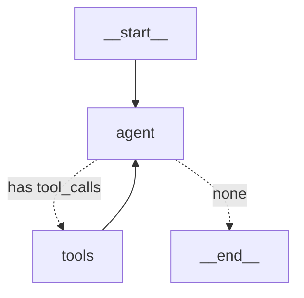

**Across six parts we built graphs by hand, node and edge.** And yet an agent runs with a single line: `create_react_agent(model, tools)`. So what was all that hand-work for? It's the other way around — **that one line contains everything we studied in Parts 1–6.** Prebuilt isn't something new; it's a familiar graph, wrapped. Unwrap it and you can see the line between "where prebuilt is enough" and "where you have to drop down and build it yourself."

> **LangGraph Series**
> 1. [Your First Graph — Only Where LCEL Falls Short](/en/blog/langgraph-first-graph/)
> 2. [State Design — Schema and Merge Rule](/en/blog/langgraph-state-design/)
> 2.5. [MessagesState Isn't a Special State](/en/blog/langgraph-messages-state/)
> 3. [Send — Dynamic Fan-out Edges Can't Draw](/en/blog/langgraph-send/)
> 4. [An Interrupt Doesn't Pause the Graph](/en/blog/langgraph-human-in-the-loop/)
> 5. [A Checkpoint Isn't Only for Pausing](/en/blog/langgraph-checkpointer/)
> 6. [The Checkpointer Doesn't Cross Threads](/en/blog/langgraph-long-term-memory/)
> 7. **create_react_agent Is Not Magic** ← this post
> 8. [Multi-Agent Doesn't Mean Agents Talk to Each Other](/en/blog/langgraph-multi-agent/)
> 8.5. [A Subgraph Can Share State, or Isolate It](/en/blog/langgraph-subgraph-state/)

> Versions: based on `langgraph >= 0.2, < 0.3`. `create_react_agent` lives in `langgraph.prebuilt`, and this area changes argument names often between versions — the system-prompt injection argument alone has gone `messages_modifier` → `state_modifier` → `prompt`. Check the signature in your own environment.

## Unfold the one-line agent into a graph

A ReAct agent isn't actually a new concept. It's a loop: **call the model → if the model calls a tool, run it → feed the result back to the model → repeat until the model stops calling tools.** This is the same shape that already showed up when we talked about cycles in Part 1 and conditional branching in Part 3.

First, build it in one line.

```python
from langgraph.prebuilt import create_react_agent
from langchain_anthropic import ChatAnthropic

def lookup_allergy(patient_id: str) -> str:
    """Look up a patient's allergy record."""
    return "penicillin allergy on record"

model = ChatAnthropic(model="claude-haiku-4-5-20251001")
agent = create_react_agent(model, tools=[lookup_allergy])
```

Now crack it open. `agent` is an ordinary `compile()`d graph, so you can draw it exactly as in Part 1.

```python
print(agent.get_graph().draw_mermaid())
```



Exactly two nodes: `agent` (the model call) and `tools` (a `ToolNode`). The dashed lines out of `agent` are a **conditional edge** — to `tools` if the model called a tool, to `__end__` otherwise. `tools` always loops back to `agent` when it's done. **That's the cycle.** The whole structure we described in Part 3 as "cycle + conditional branch + `recursion_limit`" is in there. The only difference is that this time I didn't draw it myself.

By hand, it comes out like this.

```python
from langgraph.graph import StateGraph, START, END, MessagesState
from langgraph.prebuilt import ToolNode, tools_condition

def call_model(state: MessagesState) -> dict:
    return {"messages": [model.bind_tools(tools).invoke(state["messages"])]}

g = StateGraph(MessagesState)
g.add_node("agent", call_model)
g.add_node("tools", ToolNode(tools))
g.add_edge(START, "agent")
g.add_conditional_edges("agent", tools_condition)  # "tools" if tool_calls, else END
g.add_edge("tools", "agent")
app = g.compile()
```

The graph `create_react_agent` builds internally is essentially this. `tools_condition` is a router function LangGraph provides out of the box: **if the last message has `tool_calls` attached, it returns `"tools"`; otherwise it returns `END`.** Same shape as the branch function we wrote by hand in Part 3.

## ToolNode runs on top of a reducer

One premise first — so the `last.tool_calls` in the code below doesn't come out of nowhere. **`messages` isn't a list of strings but a list of message *objects* (`HumanMessage`/`AIMessage`/`ToolMessage`), and the model's decision to call a tool is stored in `AIMessage.tool_calls`.** That's why you can pull `state["messages"][-1].tool_calls`. The nature of this message channel, along with `add_messages` and `MessagesState`, is laid out separately in [Part 2.5](/en/blog/langgraph-messages-state/) — here I just use the result.

Even if `ToolNode` looks like magic, what it does is simple.

1. Pull `tool_calls` from the **last `AIMessage`** in state
2. Find the Python function whose name matches, unpack the args, and call it
3. Wrap the result in a **`ToolMessage` with the `tool_call_id`** and put it back into state

Words make it abstract, so write the node function by hand instead of using `ToolNode` and you get exactly this shape.

```python
from langchain_core.messages import ToolMessage

tools_by_name = {t.name: t for t in tools}

def my_tool_node(state: MessagesState) -> dict:
    last = state["messages"][-1]          # 1. the last AIMessage
    results = []
    for call in last.tool_calls:          #    iterate its tool_calls
        tool = tools_by_name[call["name"]]   # 2. find the function by name
        output = tool.invoke(call["args"])   #    unpack the args and call
        results.append(                       # 3. wrap the result in a ToolMessage
            ToolMessage(
                content=str(output),
                tool_call_id=call["id"],      #    tie it to which call it answers, via id
            )
        )
    return {"messages": results}          # return a list → the reducer appends
```

What `ToolNode(tools)` does internally is essentially this. The real implementation has more flesh — running tools in parallel, catching exceptions, handling both sync and async — but the **skeleton is "pull tool_calls from the last message, call the functions, and return them as ToolMessages,"** and that's all. In the end it's no different from the ordinary node functions we've been writing since Part 2.

Here Part 2 reappears. `MessagesState`'s `messages` is a key with the `Annotated[list, add_messages]` reducer. `ToolNode` doesn't *overwrite* messages — it **appends**, and `add_messages` handles the merge. So `ToolNode` isn't a new mechanism; it's just **a node running on top of Part 2's reducer.** One ToolMessage per tool call piles into the conversation through the reducer.

### What ToolNode requires isn't the name "messages"

So does the state key *have* to be named `"messages"`? No. Look at the hand-written code again and what `ToolNode` actually requires is just two things: **(a) a channel that's a list of message objects, and (b) an append reducer on it.** The name is irrelevant. With `MessagesState` it just happens to line up as `"messages"`, and you can change the key name with `messages_key`.

```python
from typing import Annotated, TypedDict
from langgraph.graph.message import add_messages

class State(TypedDict):
    conversation: Annotated[list, add_messages]   # append reducer required
    patient_id: str                                # domain keys can sit alongside

# tell ToolNode "look at conversation, not messages"
tool_node = ToolNode(tools, messages_key="conversation")
#   → pulls tool_calls from state["conversation"][-1]
#   → returns in the form {"conversation": [ToolMessage(...)]}
```

The thing to watch is the reducer. If that key has no `add_messages` (or equivalent append reducer) and is a plain `list`, the ToolMessage that `ToolNode` returns **clobbers the whole prior conversation.** So the point isn't "the name `messages`" but **"a message channel with an append reducer"** — even when you mix domain keys (`patient_id`, etc.) into a custom Part 6-style state, as long as one message channel satisfies this condition, you can plug `ToolNode` straight in.

> The same goes for `create_react_agent` itself. Its default state is `messages`-centric, but pass a custom `state_schema` and it runs the same way on the message channel inside it — being prebuilt doesn't bind it to the name `messages`.

`ToolNode` also handles exceptions thrown by tools, within the message boundary.

```python
ToolNode(tools, handle_tool_errors=True)  # default is True
```

When `handle_tool_errors` is on, even if a tool function raises, the graph doesn't die — instead a `ToolMessage` carrying the error content is created and returned to the model. The model sees, *inside the conversation*, that "that tool failed" and tries something else. This is why a ReAct loop is somewhat resilient to tool failures.

> That said, it's double-edged. In a clinical domain, the most dangerous scenario when a lookup tool fails is "the model papering over it with its own reasoning." If a failure genuinely should stop things, it's safer to turn `handle_tool_errors` off or make the branch explicit inside the tool — the first sign that prebuilt's friendly defaults can be poison in a domain.

## The checkpointer drops in with a single argument

The persistence we laid down in Parts 4 and 5 rides on top of prebuilt unchanged too.

```python
from langgraph.checkpoint.memory import MemorySaver

agent = create_react_agent(model, tools, checkpointer=MemorySaver())

cfg = {"configurable": {"thread_id": "patient-42"}}
agent.invoke({"messages": [("user", "I'm allergic to penicillin")]}, cfg)
agent.invoke({"messages": [("user", "recommend something for a headache")]}, cfg)
#   same thread_id, so the second call picks up the first conversation.
```

Pass just the `checkpointer=` argument and "a checkpoint is written every superstep" from Part 5 applies to the prebuilt agent just the same. Thread, resume, and time-travel all work identically to a hand-built graph, and Part 6's `Store` attaches the same way via the `store=` argument. **Prebuilt doesn't change the persistence layer we've been using. It just lays an agent↔tools loop on top of it.**

That's the crux. `create_react_agent` didn't invent nodes/edges/reducers/checkpointers anew — it **pre-assembled the very parts we handled over six parts into one most-common shape (the agent↔tools loop).**

## Where prebuilt is enough, where you have to build it yourself

Once you know prebuilt is not a new mechanism but an *assembly*, the criterion for whether to drop down to a hand-built graph narrows to one thing: **is the graph I want the agent↔tools loop itself, or do I need something more around that loop?**

**Where prebuilt is enough:**

- The standard ReAct flow — the model picks tools, and answers when it's done — is all you need
- It's fine to leave the order of tool calls to the model's judgment
- Even an approval gate attaches inside prebuilt with `interrupt_before=["tools"]` — "human confirmation before a tool runs" is Part 4's interrupt working as-is

**Where you have to drop down to a hand-built graph:**

- **When there are fixed steps before and after the loop** — e.g. input validation → agent → enforce output schema → logging. This isn't an agent↔tools loop but *a larger graph that holds that loop as a single node*.
- **When state doesn't end at a message list** — `create_react_agent`'s default state is `messages`-centric. To carry domain objects (patient context, accumulated scores, stage flags) as first-class state keys, it's right to write the schema yourself, as in Part 2.
- **When branching is policy, not the model's judgment** — when you need *deterministic routing* like "this tool only after a permission check" or "hand off to a human if this condition holds," you draw the conditional edge yourself. `tools_condition` alone won't do it.
- **When routing across multiple models** — swapping models by question difficulty/cost can't be done with a single agent node; you need a separate model-selection node. (This is the seed of the multi-provider routing we'll cover later.)

The line in one sentence: **prebuilt gives you the "tool loop" for free, but it doesn't give you the "workflow around the tool loop."** The moment you need the latter is when you drop down to a hand-built graph.

## Wrapping up

`create_react_agent` is not magic. Unfold it with `.get_graph()` and you see, right there, the cycle and conditional branch from Parts 1 and 3, the reducer from Part 2, and the checkpointer from Parts 4 and 5. **That's why prebuilt becomes debuggable once you use it after understanding the foundation** — if the loop won't stop, you look at `recursion_limit`; if tool results aren't coming in, at ToolMessage and the reducer; if the conversation doesn't carry over, at `thread_id`. Start from one line without knowing the foundation and that line is a black box — but we've already had our hands all over its insides.

In [Part 8](/en/blog/langgraph-multi-agent/) we wire *several* of these agents together. If one agent is a node, how do you bundle multiple agents into one graph (Supervisor / Swarm), and how do you pass state on a handoff — that's where Part 6's long-term memory comes back into play.
