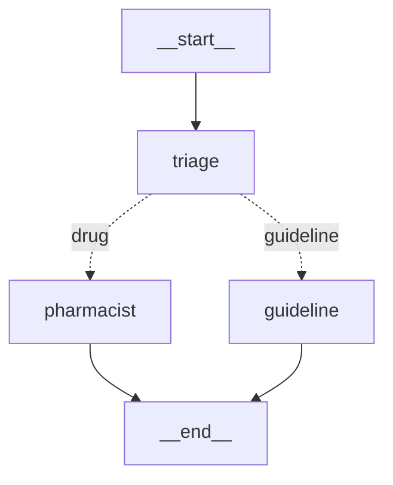
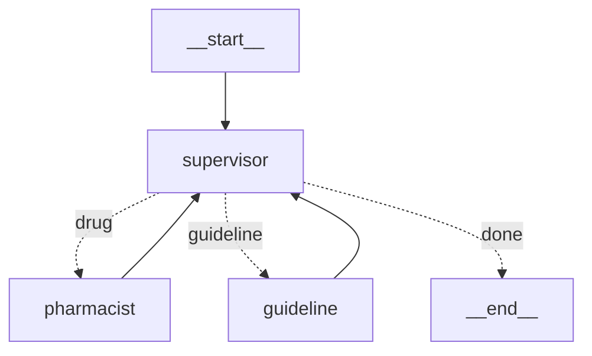
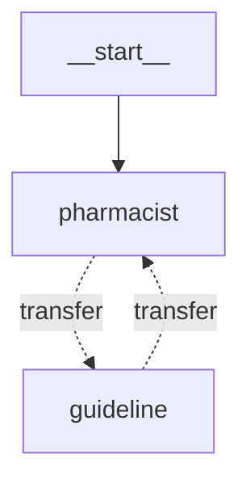

**Part 7 looked at a single agent as a node.** So what do you get when you wire several agents together? The common picture here is "a distributed system of independent agents passing messages around" — actor-model style, each one running and firing requests at the others. **LangGraph doesn't work that way.** It's still one graph, the agents are nodes inside it, and the nodes don't communicate — they **hand off control and share the same state**. And the tool for that "handoff" isn't something new to memorize: it's a single `Command`.

> **LangGraph Series**
> 1. [Your First Graph — Only Where LCEL Falls Short](/en/blog/langgraph-first-graph/)
> 2. [State Design — Schema and Merge Rule](/en/blog/langgraph-state-design/)
> 2.5. [MessagesState Isn't a Special State](/en/blog/langgraph-messages-state/)
> 3. [Send — Dynamic Fan-out Edges Can't Draw](/en/blog/langgraph-send/)
> 4. [An Interrupt Doesn't Pause the Graph](/en/blog/langgraph-human-in-the-loop/)
> 5. [A Checkpoint Isn't Only for Pausing](/en/blog/langgraph-checkpointer/)
> 6. [The Checkpointer Doesn't Cross Threads](/en/blog/langgraph-long-term-memory/)
> 7. [create_react_agent Is Not Magic](/en/blog/langgraph-react-agent/)
> 8. **Multi-Agent Doesn't Mean Agents Talk to Each Other** ← this post
> 8.5. [A Subgraph Can Share State, or Isolate It](/en/blog/langgraph-subgraph-state/)

> Versions: based on `langgraph >= 0.2, < 0.3`. `Command` lives in `langgraph.types` and landed mid-0.2. The pattern for injecting state/tool_call_id into a handoff tool — `InjectedState` (`langgraph.prebuilt`) and `InjectedToolCallId` (`langchain_core.tools`) — is the 0.2.x form; the 1.0 line switched to `ToolRuntime`, so check the signature in your own environment. `langgraph-supervisor` and `langgraph-swarm` are packages separate from the core.

## It's Still One Graph

First, the common misconception. "Multi-agent" makes it easy to picture "agent A calls agent B like a function and gets an answer back." But LangGraph isn't that kind of *call* structure — wire two agents together and they're just **two nodes in one graph**.



Both `pharmacist` and `guideline` are the agent↔tools loop from Part 7 — that is, **a node with another graph (a subgraph) inside it**. From the outer graph's point of view, each is just one node. So multi-agent isn't "several graphs appearing"; it's **a graph whose nodes are themselves graphs**. This is where Part 1's "a compiled graph is a runnable" pays off — you can drop a compiled agent straight into `add_node`.

Assembling that diagram in code looks like this. There's no new API at all — Part 1's `StateGraph`, Part 3's conditional branch, and Part 7's `create_react_agent` are the whole toolbox.

```python
from langgraph.graph import StateGraph, START, END, MessagesState
from langgraph.prebuilt import create_react_agent

# the two agents from Part 7 — each a compiled graph, i.e. a runnable
pharmacist = create_react_agent(model, tools=[lookup_drug])
guideline  = create_react_agent(model, tools=[search_guideline])

def triage(state: MessagesState) -> dict:
    return {}                       # only reads the question, touches no state

def route(state: MessagesState) -> str:
    last = state["messages"][-1].content
    return "pharmacist" if "drug" in last else "guideline"   # only decides where to send

parent = StateGraph(MessagesState)
parent.add_node("triage", triage)
parent.add_node("pharmacist", pharmacist)   # ← drop the compiled agent straight in as a node
parent.add_node("guideline", guideline)
parent.add_edge(START, "triage")
parent.add_conditional_edges("triage", route)   # the static branch from Part 3
parent.add_edge("pharmacist", END)
parent.add_edge("guideline", END)
app = parent.compile()
```

The key is the one line `add_node("pharmacist", pharmacist)` — **an agent (a compiled graph) goes in as a node of the outer graph as-is.** And because inner and outer share `MessagesState`, the conversation `triage` received is carried straight on by `pharmacist`. That's the entire foundation of multi-agent.

Once you see that, only two questions remain. (1) how does a node **decide who goes next**, and (2) how does it **pass state across** on the way. The `triage` above solved (1) with a *static branch drawn up front from the outside* — the Part 3 way. But to let an agent decide *on its own*, mid-work, "this should go to the pharmacist," a static edge won't do; you need a tool where **the node picks its destination while it's running**. That's the `Command` in the next section.

## A Handoff Is Just a Command

Part 3 showed two kinds of branching. A **conditional edge** (`add_conditional_edges`) fixes the topology *at compile time*, and **Send** *fans out* from one node into several. A handoff is a third way — **a node (or a tool inside it) picks its next destination *while running*, updating state right there at the same time.** Expressed as one object, that's `Command`.

```python
from typing import Annotated
from langchain_core.tools import tool, InjectedToolCallId
from langchain_core.messages import ToolMessage
from langgraph.types import Command

@tool
def transfer_to_pharmacist(
    tool_call_id: Annotated[str, InjectedToolCallId],
) -> Command:
    """Hand off to the pharmacist agent for medication questions."""
    return Command(
        goto="pharmacist",          # (1) pick the next node at runtime
        update={                    # (2) state to merge on the way over
            "messages": [ToolMessage("Handed off to pharmacist", tool_call_id=tool_call_id)],
        },
        graph=Command.PARENT,       # (3) resolve this node name in the parent graph
    )
```

`Command` really takes three arguments.

| Argument | Role | Analogy |
| --- | --- | --- |
| `goto` | name of the next node to run (or a `Send`/list) | "you're next" |
| `update` | state to merge on the way out — goes through the reducer, same as a node returning a `dict` | "take this with you" |
| `graph` | which graph to resolve `goto` in — current graph if omitted, parent graph if `Command.PARENT` | "which map to look on" |

`Command` does just two things — **routes control with `goto` and merges state with `update`, in one shot**. When a node returns a `dict`, only state updates and an edge decides where to go next; when it returns a `Command`, **the node itself says "you're next" and sends the update along with it.** A handoff is nothing more or less than that.

So who calls this tool? There's no special registration — **a handoff tool just goes into an agent's `tools` list like any other tool.**

```python
guideline = create_react_agent(
    model,
    tools=[search_guideline, transfer_to_pharmacist],  # ← right next to the regular tools
)
```

As Part 7 showed, `create_react_agent` does `model.bind_tools(tools)` internally, so the rest flows like this:

- **Call**: the model sees `transfer_to_pharmacist` exactly like any tool and, on a medication question, calls it *just like calling another tool*.
- **Execute**: `ToolNode` runs it, with one difference — a normal tool's return value gets wrapped in a `ToolMessage`, but **a returned `Command` is not wrapped; it's interpreted as control flow (`goto`) + state (`update`)**. That's why the tool puts a `ToolMessage` in `update` *itself* to keep the pairing. In short, **a handoff = "a plain tool whose return type is `Command`"**.
- **`graph=Command.PARENT`**: the tool is called *inside* the `pharmacist` agent (a subgraph), but the node to go to lives *outside* (the parent) → "resolve this `goto` in the parent graph." Forget it and the node won't be found and it blows up — the single most common first error in multi-agent handoffs.
- **Shared channel (Part 2)**: `update`'s `messages` is just appended via `add_messages`. The two **share the same `messages` channel**, and the handoff only leaves behind a "switched here" `ToolMessage`. It's not *passing* messages back and forth — it's *inheriting* shared state. That's the real meaning of "doesn't talk to each other."
- **Execution is just a superstep transition (Part 5)**: `Command(goto="X")` is merely moving from one superstep to the next, identical in execution to a static edge (the only difference is that "who's next" was decided at runtime). With a checkpointer attached, a checkpoint is written at the handoff point too, so the state right after the switch (the swarm's `active_agent`, etc.) is saved at that boundary.

## Supervisor and Swarm Are Just Topology Differences

If the handoff mechanism is one thing, then the "architectures" people name in multi-agent come down to wiring differences over **who is allowed to hand off to whom**. Two are enough.

**Supervisor** — put one router node in the center, and every handoff goes through it.



The `supervisor` is really the router hand-written in Part 3 — a node that looks at the current conversation and picks "next is pharmacist" / "next is guideline" / "done now." Agents *always return to the supervisor* when they finish, and it decides the next dispatch again. The agents don't know about each other. The upside is clarity — every routing decision sits in one place and shows up in traces. The cost is one extra supervisor LLM call per hop.

**Swarm** — drop the supervisor, and let agents hand off directly to each other.



Each agent carries `transfer_to_*` handoff tools, so it hands control straight to a peer with no node in between. Fewer calls, faster. But one problem appears — **when the next user input arrives, who should receive it?** Whoever was active last. So a swarm keeps a key like `active_agent` in state to record "who's holding it right now," and for that value to **survive across turns, Part 5's checkpointer becomes mandatory**. A swarm without a checkpointer resets to the first agent on every input — a swarm's multi-turn behavior only holds up on top of a checkpointer (Part 6).

Both structures have prebuilts — `create_supervisor` in `langgraph-supervisor`, `create_swarm`/`create_handoff_tool` in `langgraph-swarm`. But it's the same as Part 7 — **not a new mechanism, just a wrapper around the hand-written `Command` handoff and router node above.**

## What to Pass at a Handoff, and What Not To

Question (2) — how to pass state — trips people up more often in practice, because **what you put in** a handoff tool's `update` defines the context the next agent sees.

First, let's be precise about "pass." As the previous section showed, the two agents in our example **share the same `messages` channel**. So strictly speaking the handoff doesn't *hand over* anything — the next agent simply **reads** what the previous agent piled into the channel. That's why the default behavior is "the next agent sees the entire history up to that point." Words are abstract, so let's look at what actually accumulates in the shared `messages` channel when the pharmacist → guideline handoff happens in a swarm.

```python
[
    HumanMessage("Recommend something for a headache. I'm pregnant."),

    # ── pharmacist agent starts working here ──
    AIMessage(tool_calls=[{"name": "lookup_drug", "args": {...}, "id": "call_1"}]),
    ToolMessage("Acetaminophen: relatively safe in pregnancy", tool_call_id="call_1"),

    # pharmacist decides "dosing guidance isn't my job" → calls the handoff tool
    AIMessage(tool_calls=[{"name": "transfer_to_guideline", "args": {}, "id": "call_2"}]),
    ToolMessage("Handed off to guideline agent", tool_call_id="call_2"),   # ← (A) the ToolMessage announcing the switch

    # ── guideline agent takes over here ──
    AIMessage(tool_calls=[{"name": "search_guideline", "args": {...}, "id": "call_3"}]),
    # ...
]
```

**(A) is that `ToolMessage` the handoff leaves behind.** Why must it exist — because the `transfer_to_guideline` right above it is a *tool call* with `id="call_2"`. Once the model calls a tool, a `ToolMessage` answering that `tool_call_id` must follow (the message-pairing rule from Part 2.5). Without it you get a broken history — "called call_2 but no answer" — and the next model call blows up. So the handoff tool, *on its way to handing off control*, also builds this one `ToolMessage` to keep the pairing.

And the trap is right there in the list too. The moment the guideline agent takes over, **its context already contains the result of `call_1` (`lookup_drug`) — the pharmacist's tool call that it never made.** It looks harmless at two messages, but as agents multiply and each calls several tools, the channel swells with other agents' tool-call leftovers, tokens grow, and the model gets confused by "tool results I never asked for." That's the price of the full-history default.

So you have to make the next agent see *less*. Here's a common trap — **as long as the channel is shared, just *adding* a summary to the handoff `update` doesn't work.** An append is only an add, so raw messages like `call_1` stay in the channel and the next agent still sees them. There are three ways to *actually* cut down what the next agent sees:

- **Isolate — don't share the channel at all.** If the pollution comes from *sharing*, then instead of dropping the compiled agent in as a node, **wrap it in a function node** and map the input and output yourself.

  ```python
  def call_guideline(state: ParentState) -> dict:
      summary = "Pregnant; acetaminophen confirmed safe. Needs dosing guidance."
      result = guideline.invoke({"messages": [HumanMessage(summary)]})  # sees only the isolated input
      return {"answer": result["messages"][-1].content}                # returns only what bubbles up
  ```

  Now guideline can't see the parent's raw history (`call_1` etc.) at all, only the summary we fed it. **This is where "pass only a summary" holds literally true.** (The difference between the *shared* way — dropping a compiled agent straight in — and the *isolated* way — wrapping it in a function — i.e. what auto-propagates and what doesn't, is dug into separately in [Part 8.5](/en/blog/langgraph-subgraph-state/).)
- **Keep sharing but prune.** Keep the channel shared, but before handing off, pull the raw tool messages out of the channel with `RemoveMessage`. `add_messages` handles id-based *deletion* too (the same reducer from Part 2.5), so you can add a summary and erase the leftovers at once.
- **Move what shouldn't be in the conversation to the Store.** Part 6's `Store` is exactly the place. Things several agents must share but that *don't need to be conversation history* — user context, accumulated scores, permission flags — shouldn't be handed off via `messages`; put them in the Store and have each agent read them in a node. Keep the handoff payload light; put shared facts in the Store. Part 6's short-term (this conversation) vs long-term (this user) split comes back, in multi-agent, as "what to pass via the conversation vs what to share on the side channel."

> This is also a security matter. Letting an upstream agent's sensitive info (credentials, personal data, internal permission flags, etc.) flow uncritically as full history to every downstream agent runs straight against least-privilege. A handoff `update` is a boundary you should *curate explicitly, not leave to the default* — like Part 7's `handle_tool_errors`, a prebuilt's helpful default becomes a hazard as-is in a sensitive domain.

## So When Do You Go Multi-Agent

Finally, the boundary line. Multi-agent looks impressive, but **most of the time the answer is "not yet."** Take a problem solvable with Part 7's single agent + several tools and build it multi-agent, and LLM calls multiply per hop so cost and latency grow multiplicatively, while routing leans on another layer of model judgment, making debugging harder.

Multi-agent earns its keep when:

- **The tool/prompt sets clearly split by domain** — when medication consultation and guideline search use entirely different tools and system prompts, splitting them and routing is better for model accuracy than cramming 20 tools into one agent.
- **You want to evaluate or swap each agent independently** — only with split boundaries can you change one agent's prompt or model without shaking the rest.

And which of the two is simple. **If routing decisions must be observed and controlled in one place, Supervisor** (the default for regulated domains where audit/approval gates matter); **if cutting call count and letting agents pass freely among themselves feels natural, Swarm.** When in doubt, start with Supervisor — every decision lands on one node, so debugging is overwhelmingly easier.

## Wrap-up

Multi-agent isn't a distributed system of agents talking to each other. **The graph is one, the agents are nodes, and a handoff is just a single `Command(goto, update)` expressing "you're next + take this state with you"** — that's all. Supervisor and Swarm differ only in how that handoff is wired over who-can-reach-whom, not in mechanism. So once again the only new things to learn were `Command` and `graph=Command.PARENT`; the rest is Part 2's reducer, Part 3's routing, Part 5's checkpointer, and Part 6's Store showing up again in new spots.

One line to close the series — **everything that looks new in LangGraph is, in the end, a different assembly of the same parts: nodes, edges, state, checkpointer.** Prebuilt agents, multi-agent — once you know the floor, you can unfold them and debug.
