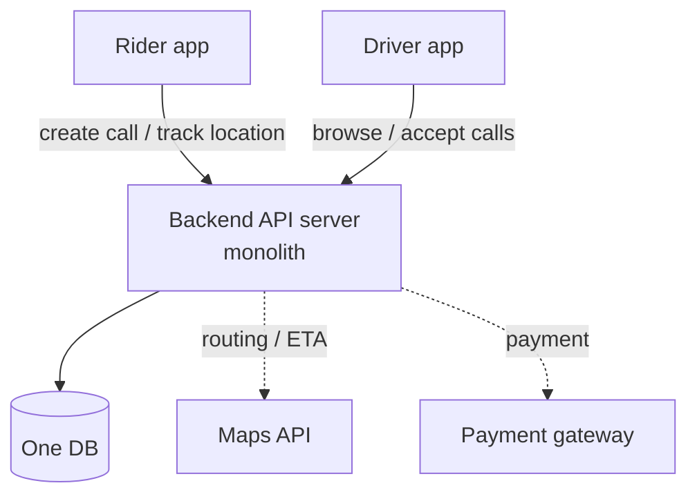

**How would you build an Uber-like dispatch system?** When you hear "millions of cars moving in real time," it's tempting to picture an elaborate distributed system from the start. But it surely didn't begin that way. Most services' first version runs on one server and one database. This series starts from that simple picture and fixes whatever creaks, one spot at a time, as traffic grows. Part 1 just draws the whole dispatch service as simply as possible.

> This is a design exercise — reasoning about "how it was probably built" from publicly known conventions, not any one company's actual implementation. Throughout this series, "dispatch" means a **first-come-first-served model** (like KakaoT's general call): the system doesn't pick the single best driver and hand the ride to them (*auto-dispatch*); instead, one call is shown to many drivers, and whoever accepts first takes it.

## What are we building?

What we're building is simple. A rider calls a taxi from an app, and a nearby driver picks up that call and comes to get them. Fare calculation and payment hang off that, and during the trip the rider watches the car move on a map — but the skeleton is "call → someone accepts → gets you there."

So the problem the first version has to solve is narrower than it looks. Real-time maps, demand forecasting, dynamic pricing — none of that is the concern at this stage. One call gets created, connects to a driver, and the trip ends. Just that one flow needs to run.

## The cast

What does a service like this need, at minimum? Four things, even counting generously.

| Component | Role |
|---|---|
| Rider app | Create a call; see the assigned driver and car location |
| Driver app | Browse and accept nearby calls; update trip status |
| Backend API server | All call/dispatch/trip logic. **One monolith in Part 1** |
| DB | Stores users, drivers, calls, trips. **One is enough in Part 1** |

Maps (routing/ETA) and payment aren't worth building yourself. Hand them to a maps API and a payment gateway (PG). Early on, anything that isn't the core is better borrowed.

## The life of one call

Follow a single call from birth to death, and roughly it goes like this.

```
1. Rider creates a call with origin/destination   → calls INSERT (status = requested)
2. Driver app browses nearby waiting calls         → calls SELECT (status = requested)
3. Driver accepts                                  → calls UPDATE (driver_id, status = assigned)
4. Pickup → trip starts                            → status = on_trip
5. Arrival → end                                   → status = completed, fare + payment
```

A single `status` column moving requested → assigned → on_trip → completed is the backbone here. A call is one row carrying that status, and both dispatch and the trip are just updates to that row.

Step 2 is the tricky one. How does the driver app learn a new call appeared nearby? The simplest way is polling — every few seconds it asks the server, "any calls near me?" Not elegant, but with only a handful of drivers early on, it works. As traffic grows this is the first place to hurt, but that's a later part's problem.

## The simplest architecture

So Part 1's diagram has only a few boxes.



The [messenger post](/en/blog/messenger-architecture/) made the point that a CRUD app would've ended at three boxes, `Client → API → DB` — and dispatch starts in a similar place. There's nothing fancy here, and in Part 1 that's fine. The goal right now isn't an elegant structure; it's getting one call dispatched and one trip finished, end to end.

## Where this picture creaks

This simple picture breaks one spot at a time as traffic grows. Noting which spot goes first turns into the list of things to cover later.

| As traffic grows | Problem with the simple picture | Later part |
|---|---|---|
| Drivers poll for calls | Mostly empty "nothing new" responses + lag before accepting | Real-time push / connection tier |
| Two drivers accept the same call at once | **Double dispatch** (two taxis for one rider) | First-come single-winner concurrency |
| Need to find "nearby drivers/calls" | A full scan every time = slow | Spatial indexing (geohash, etc.) |
| Show driver location in real time | High-frequency location writes pressure the DB | Location-tracking pipeline |
| Calls, trips, payments all in one DB | Read/write bottleneck | Cache · read replicas · sharding |

Uber probably didn't have this whole table in place on day one either. Push likely got bolted on once polling started to hurt; concurrency got handled only after double-dispatch actually happened; sharding came once the DB genuinely struggled. What it looks like today is probably closer to the result of peeling off one piece at a time, as needed, from a picture that simple.
