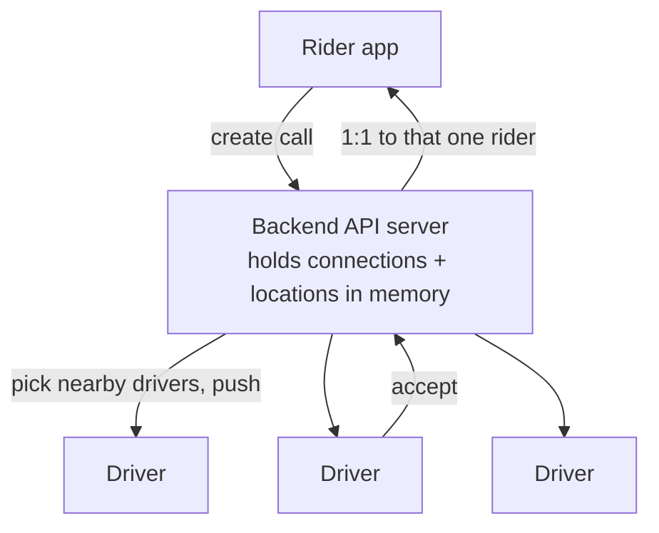

[Part 1](/en/blog/taxi-dispatch-overview/) ended by saying the simple picture runs into trouble first where drivers poll. The driver app asks the server "any calls near me?" every few seconds. But most responses are an empty "nothing new," a rider waits up to a full poll interval (N seconds, worst case) before any driver even sees the call, and the more idle drivers there are, the more useless requests pile onto the server.

So let's try flipping the direction. Instead of the driver asking, the server shoves new calls out first. **Push, not polling.**

> This is a design exercise — reasoning about "how it was probably built" from public conventions, not any one company's actual implementation. Throughout this series, "dispatch" means not *auto-dispatch* but a **first-come-first-served model** (like KakaoT's general call): one call is shown to many drivers, and whoever accepts first takes it.

## Push, not polling

For the server to send first, a connection has to stay open, and REST request-response gives it no way to. So a connection tier — one that holds live connections — appears. WebSocket, a session registry, heartbeat/reconnect, spreading connections across nodes: the usual machinery for managing connections. Not all of it is needed from the start, though — the session registry and node-spreading only show up once one server can't hold all the connections. None of it is new here.

When you hear "push," it's easy to think of FCM/APNs — but that's a different thing. FCM/APNs are for waking a device to show a notification when the app is closed or backgrounded: a best-effort channel routed through Google/Apple infrastructure, so latency is uneven, and it's one-way (server→device). Fine for an alert like "a call popped up nearby," but it can't run the live loop of showing a call to a driver staring at the screen and getting an accept within a second or two. So the live channel is held as its own persistent connection, and FCM/APNs stay as a complement for waking backgrounded drivers.

What's different about dispatch is just one thing: you don't know who you're sending to.

## Polling, SSE, WebSocket — which one

There are three ways for a server to get something down to a client. They split on direction and how the connection is kept.

| Method | Direction | Latency | Server cost · connection | Two-way? | Fit here |
|---|---|---|---|---|---|
| Polling | client→server, repeated | poll interval | many empty requests | ❌ | empty-response flood, latency = poll interval |
| SSE | server→client, one-way | low | one held connection, text only | ❌ (not on one connection; upstream via separate HTTP) | enough if all you do is push new calls down |
| **WebSocket** | bidirectional, persistent | low | per-connection state | ✅ | chosen — accept and location go up the same connection |

SSE streams `text/event-stream` over a single long HTTP response — the standard server→client channel. The catch: it's text-only, so binary has to be base64'd (about 33% bloat), and to send anything *to* the server (a driver accepting, say) you need a separate plain HTTP request.

Look at just pushing new calls down and SSE would do; WebSocket isn't mandatory for push. But the driver's accept (and later the driver's location too) has to go the other way, up to the server, and with WebSocket both directions ride the same connection. SSE only goes down, so going up means adding a second channel. To avoid splitting the transport in two, we use WebSocket. (Uber's early push platform, RAMEN, actually started one-way on SSE and later moved to bidirectional streaming, because it had to keep a separate channel for accepts and acks.)

## Not to a person, to a place

A push with a fixed recipient knows who it's for. User 1 sends to user 2: you look up `user_id → connection` in the session registry and send it down that one connection (1:1). A new-call push doesn't know the driver. With no user_id, you can't route by person — the recipients are "every driver near the pickup."

So you key on a place instead of a person. Rather than pinpointing one user_id, you find the drivers near the pickup and scatter the call to them (1:N). You can't pin the recipient, so you narrow by location.

This doesn't tear up the old way. The 1:1 path — user_id to one person — stays (it's what you use after an accept, to reach that rider); you just hang a "scatter to nearby" path next to it.

| | Push with a known recipient | Dispatch (new-call) push |
|---|---|---|
| Recipient | known (user_id) | unknown (anyone near the pickup) |
| Routing key | user_id → connection | pickup location → nearby drivers |
| Pattern | 1:1 direct | 1:N broadcast |
| Dedup · order | per-recipient seq orders and dedups | same call hits many drivers → dedup is per-driver, per-call; order across drivers is meaningless |

## The simplest way — find nearby drivers in memory

The simplest implementation is this: the server keeps connected drivers, with their current locations, in memory; when a call comes in, it picks the drivers near the pickup and pushes straight to their connections. Even scanning everyone on each call is fine at a few hundred to a few thousand drivers — that's a few thousand distance checks. No cells, no subscriptions, no separate index.

Carving up "nearby" precisely and efficiently — the spatial index (geohash, quadtree, and such) you reach for once there are too many drivers to scan every time — is a separate topic. Here you just measure the distance between the pickup and each driver and take the close ones.

If there's no driver near the pickup, the call sits open until someone accepts. A push isn't sent-and-forgotten: the call is left "open" in that area, so a driver who arrives nearby a little later can still find it by checking around.

## Push flows in two directions

Look at just the new call and it's clean, but push flows in two directions.

Direction 1 is the new call going to nearby drivers (1:N, recipient unknown). Direction 2 is *after* some driver accepts — the dispatch, and the trip events that follow, go to that one fixed rider (1:1, user_id known). Since the recipient is now fixed, it's exactly the 1:1 push from before: find the connection by user_id and send. So "send to a place" holds only for the new call; after an accept, it's back to sending to a person (user_id).

After accepting, the rider also watches the driver's live location. That high-frequency location stream itself isn't covered in this post; here we only settle which connection it goes down — that one rider's connection. In status terms, the requested stretch is Direction 1; the flip to assigned is the first Direction-2 push to the rider, and on_trip → completed flow on Direction 2.

## This isn't a silver bullet

Flipping to push doesn't make things better for free. There's a cost you carry.

- **A persistent connection isn't free.** Holding connections open occupies memory in proportion to their count, and it takes work to cull dead connections and absorb the reconnect surge when a deploy makes everyone reconnect at once. A request you receive, handle, and finish is one thing; a connection is state you keep holding — a different kind of scaling burden.
- **Push doesn't get rid of polling.** Mobile networks drop, so on reconnect you have to pull the calls missed in the meantime — Part 1's polling query, run once at that moment instead of constantly. So as a fallback, polling is still very much needed.
- **Push makes the race worse.** Polling happened to scatter accept attempts in time, since each driver's cycle was offset; push reaches everyone nearby at almost the same instant and erases that gap, so accepts pile onto the same moment and double dispatch (Part 1's table, second row) fires more readily. Push solved latency, not concurrency; that's left as-is.
- **The same call — or one already taken — can show up.** Because push retries so it doesn't drop anything (at-least-once), the same notification can arrive twice, and a driver can see a call another driver already accepted. So the app has to assume a call it sees might be a duplicate or already closed, and filter accordingly. Deciding the single winner when two accept at once is a separate problem; here we only flag that such calls can appear.

## When one server isn't enough — cells and a broker

With one node, it's the same as before: hold every connection in one server's memory and scan for nearby drivers on each call. For one small city, that's enough.

When there are too many drivers, scanning all of them on every call gets heavy. So you pre-divide the map into a grid of cells: a driver subscribes to the cell it's in, and the server sends a call only to the pickup's cell (and its neighbors) — touching just that cell's subscribers instead of scanning everyone. That's when a spatial index (geohash, quadtree) for dividing "nearby" precisely and efficiently becomes necessary.

With more than one connection server, there's another problem. The drivers in one pickup cell are connected across several servers, so the server that created the call doesn't hold all their connections. So you treat the cell as a channel and deliver across nodes through a pub/sub broker: publish the call to the pickup cell's channel, it spreads to the servers holding subscribers for that cell, and each pushes it down its own connections. Even if a push is missed, the call stays open in that area and can be pulled later by polling, so a lightweight pub/sub that doesn't guarantee delivery (e.g. Redis Pub/Sub) is enough.

This is about how to carry connections across nodes — separate from how you split the call data itself for storage (sharding).

## The whole picture

Fold the two directions onto one page and it looks like this. New calls flow to nearby drivers (1:N); after an accept, to that one rider (1:1).

Now every nearby driver gets the same call at the same instant, so double dispatch happens more often.
