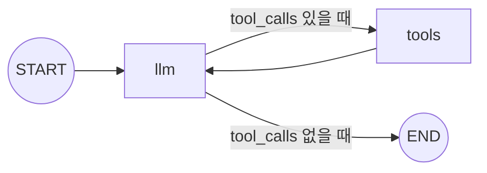

**LangGraph는 LCEL의 상위호환이 아니다.** 체인으로 풀리는 건 LCEL이 더 짧고, LangGraph는 **사이클 / 분기 후 합류 / 공유 상태**가 들어오는 순간부터 의미가 있다. 가장 작은 그래프 하나로 그 경계를 표시해둔다.

> **LangGraph 시리즈**
> 1. **첫 그래프 — LCEL로 안 풀리는 것만 그래프로** ← 현재 글
> 2. [State 설계 — 스키마와 머지 규칙](/ko/blog/langgraph-state-design/)
> 2.5. [MessagesState는 특별한 state가 아니다](/ko/blog/langgraph-messages-state/)
> 3. [Send — edge로 못 그리는 동적 fan-out](/ko/blog/langgraph-send/)
> 4. [인터럽트 — 그래프를 멈추는 게 아니다](/ko/blog/langgraph-human-in-the-loop/)
> 5. [체크포인트는 멈출 때만 찍히는 게 아니다](/ko/blog/langgraph-checkpointer/)
> 6. [checkpointer는 스레드를 넘지 못한다](/ko/blog/langgraph-long-term-memory/)
> 7. [create_react_agent는 마법이 아니다](/ko/blog/langgraph-react-agent/)
> 8. [멀티 에이전트는 에이전트끼리 대화하지 않는다](/ko/blog/langgraph-multi-agent/)
> 8.5. [subgraph는 state를 공유할 수도, 격리할 수도 있다](/ko/blog/langgraph-subgraph-state/)

> 버전: `langgraph >= 0.2, < 0.3` 기준.

## LCEL은 이런 모양이다

```python
chain = prompt | llm | parser
chain.invoke({"question": "환불 정책 알려줘"})
```

Runnable들을 `|` 로 이은 일직선 파이프라인. 앞 단계의 출력이 다음 Runnable의 입력으로 넘어가고, 끝에서 결과가 나온다. **실무 LLM 호출의 대부분이 이 모양**이고, 이 모양인 한 LangGraph로 옮길 이유가 없다.

여기에 분기·사이클·공유 상태가 끼는 순간부터 얘기가 달라진다.

## LangGraph는 3가지 뿐이다

LangChain의 LCEL을 한 줄로 요약하면 "Runnable들을 `|`로 잇는 DAG"다. LangGraph는 거기서 한 단계 풀어서 **상태 머신(state machine)** 으로 만든 것이다.

구성 요소는 3개뿐이다.

| 개념 | 의미 | LCEL에서는? |
|---|---|---|
| **State** | 그래프 전체가 공유하는 dict. 스키마는 `TypedDict` / Pydantic | 없음. `input → output` 으로만 흐름 |
| **Node** | `state → partial state` 함수 하나 | `Runnable` 과 비슷 |
| **Edge** | 노드 간 전이. 무조건 / 조건부 / 사이클 가능 | `\|` 로 직선 연결만 |

핵심 차이는 한 줄이다. **LangGraph는 state를 그래프의 중심에 둔다.** 모든 노드가 같은 dict를 함께 보고 쓰는 구조라, 분기 후 합류도 사이클도 자연스럽게 그려진다. LCEL에는 그런 자리가 없다.

## 가장 작은 그래프

"사용자 질문이 FAQ면 짧게 답하고, 아니면 분석해서 길게 답한다." 한 화면에 들어가는 조건부 라우팅 예제다.

```python
# langgraph>=0.2,<0.3
from typing import TypedDict, Literal
from langgraph.graph import StateGraph, START, END


class State(TypedDict):
    question: str
    route: Literal["faq", "deep"] | None
    answer: str | None


def classify(state: State) -> dict:
    q = state["question"].lower()
    route = "faq" if ("환불" in q or "영업시간" in q) else "deep"
    return {"route": route}                    # partial state만 반환

def answer_faq(state: State) -> dict:
    return {"answer": f"[FAQ] {state['question']} 짧은 답."}

def answer_deep(state: State) -> dict:
    return {"answer": f"[DEEP] {state['question']} 분석 결과..."}

def pick_branch(state: State) -> Literal["faq", "deep"]:
    return state["route"]                      # 다음 노드 키를 반환


graph = StateGraph(State)
graph.add_node("classify", classify)
graph.add_node("faq", answer_faq)
graph.add_node("deep", answer_deep)

graph.add_edge(START, "classify")
graph.add_conditional_edges("classify", pick_branch, {"faq": "faq", "deep": "deep"})
graph.add_edge("faq", END)
graph.add_edge("deep", END)

app = graph.compile()
app.invoke({"question": "환불 정책 알려줘", "route": None, "answer": None})
```

이 코드에 LangGraph의 90%가 들어 있다. 다섯 가지만 짚으면 끝난다.

### 1) 노드는 partial dict를 반환한다

`return {"route": "faq"}` 처럼 **바꿀 키만** 돌려준다. 전체 state를 새로 만들 필요 없다. LangGraph가 알아서 머지한다. (머지 규칙 = reducer. 동시 업데이트 충돌, append vs overwrite 같은 부분은 더 공부할 예정.)

### 2) `START` / `END` 는 sentinel

진짜 노드가 아니라 진입·종료를 가리키는 상수. `add_edge(START, "x")` 가 "x가 첫 노드"라는 뜻이다.

### 3) Conditional edge의 router는 키를 반환한다

`pick_branch` 는 `state` 를 받아 문자열 키를 돌려주고, `add_conditional_edges` 의 세 번째 인자가 그 키를 노드 이름으로 매핑한다. router가 도메인 로직(어디로 갈지)을, edge 정의가 토폴로지(그 키가 어떤 노드인지)를 맡는 분리 구조다.

### 4) `compile()` 의 결과는 결국 Runnable이다

`compile()` 은 그래프를 검증(도달 불가 노드, 끝나지 않는 흐름)한 뒤 LCEL과 호환되는 Runnable로 변환한다. 그래서 `app.invoke / .stream / .batch` 가 LCEL 체인과 동일하게 동작한다.

**즉 LangGraph와 LCEL은 적이 아니다.** 그래프 안에서 노드가 다시 LCEL 체인이어도 되고, 바깥 LCEL 파이프라인 한 칸이 LangGraph 그래프여도 된다.

### 5) 그래프는 그림으로 뽑힌다

```python
print(app.get_graph().draw_mermaid())
```

Mermaid 텍스트가 그대로 떨어진다. 코드 리뷰나 블로그용 다이어그램이 공짜로 나오는 건 LCEL보다 확실히 나은 점이다.

## 같은 분기를 LCEL로 짜면?

LCEL에도 분기 도구는 있다. `RunnableBranch`.

```python
from langchain_core.runnables import RunnableBranch, RunnableLambda

faq = RunnableLambda(lambda q: f"[FAQ] {q} 짧은 답.")
deep = RunnableLambda(lambda q: f"[DEEP] {q} 분석 결과...")

chain = RunnableBranch(
    (lambda q: "환불" in q or "영업시간" in q, faq),
    deep,   # default
)

chain.invoke("환불 정책 알려줘")
```

훨씬 짧다. **단방향 분기 한 번이면 LCEL이 이긴다.** 굳이 그래프 만들 이유가 없다.

문제는 이 분기 다음에 뭐가 더 붙느냐다. 가장 흔하면서 가장 LCEL이 망가지는 자리가 **agent 루프**다.

## 그래프가 진짜 필요해지는 순간: agent 루프

LLM이 도구를 호출하고, 결과를 받아 다시 LLM으로 돌아가서, 도구를 더 부를지 끝낼지 결정한다. 이걸 LCEL로 짜면 결국 손으로 while 루프를 만든다.

```python
def run_agent(question: str) -> str:
    messages = [HumanMessage(question)]
    while True:
        response = (prompt | llm.bind_tools(tools)).invoke({"messages": messages})
        messages.append(response)
        if not response.tool_calls:
            return response.content
        for tc in response.tool_calls:
            result = execute_tool(tc)
            messages.append(ToolMessage(result, tool_call_id=tc["id"]))
```

동작은 한다. 하지만 이 `run_agent` 함수는 **더 이상 Runnable이 아니다.** 안의 LLM 호출 한 번만 LCEL이고, 그걸 감싼 루프·종료 판단·도구 디스패치는 전부 평범한 파이썬이다. 그 결과 LCEL이 Runnable에게 공짜로 주던 것들이 모두 함께 사라진다.

- **스트리밍이 깨진다.** 토큰 단위 스트림을 받으려면 함수 안에서 직접 yield 해야 한다.
- **관측이 끊긴다.** LangSmith / OTel trace가 LCEL 호출마다 따로 찍히고, 한 흐름으로 묶어 보려면 별도 작업이 필요하다.
- **재시작이 안 된다.** 루프 4번째에서 죽으면 처음부터 다시 돈다. 중간 메시지는 메모리에만 있었으니 잃는다.
- **무한 루프 방어를 직접 짠다.** `max_iter` 카운터를 손으로 박아야 한다.

같은 흐름을 LangGraph로 옮기면 이렇게 된다.

```python
from langgraph.graph import StateGraph, START, END, MessagesState
from langgraph.prebuilt import ToolNode

def call_llm(state: MessagesState) -> dict:
    return {"messages": [llm.bind_tools(tools).invoke(state["messages"])]}

def should_continue(state: MessagesState) -> Literal["tools", "end"]:
    return "tools" if state["messages"][-1].tool_calls else "end"

graph = StateGraph(MessagesState)
graph.add_node("llm", call_llm)
graph.add_node("tools", ToolNode(tools))
graph.add_edge(START, "llm")
graph.add_conditional_edges("llm", should_continue, {"tools": "tools", "end": END})
graph.add_edge("tools", "llm")          # 사이클이 여기서 닫힌다

app = graph.compile()
```

이 그래프를 그림으로 뽑으면 사이클이 한눈에 보인다.



마지막 `tools → llm` 화살표 한 줄이 LCEL 의 DAG 로는 못 그리는 그 **사이클**이다. LLM 응답에 도구 호출이 남아 있는 한 이 루프를 계속 돈다.

코드 양은 비슷하다. 차이는 **공짜로 따라오는 것들**이다.

- `app.stream(...)` — 노드 단위 스트림이 그대로 동작한다. 토큰 스트림은 `stream_mode="messages"` 한 옵션이다.
- 각 노드 호출이 LangSmith / OTel에서 별도 span으로 잡힌다. agent 루프의 N번째 반복도 추적 가능하다.
- `compile(checkpointer=...)` 한 줄로 매 노드 사이에 state가 저장된다. 4번째에서 죽었으면 4번째부터 재개된다. (이 부분이 LangGraph의 진짜 핵심이라, 따로 더 공부할 예정.)
- `recursion_limit` 으로 무한 루프 방어가 그래프 옵션이 된다.

손으로 짠 while 루프와 그래프의 차이는 결국 **인프라가 코드 안에 있느냐, 도구가 제공하느냐**다. 그래서 LangGraph는 LCEL을 대체하지 않는다 — **LCEL이 어색해지는 자리에서만 쓴다.**

### 그래프가 더 나은 다른 경우

같은 이유로 두 가지가 더 있다.

- **분기 후 합류**: 분기된 두 흐름이 같은 후처리 단계로 다시 모일 때. LCEL은 두 결과를 합치는 코드를 직접 짜야 한다. LangGraph는 두 노드를 같은 다음 노드로 연결하는 `add_edge` 두 줄이면 끝이다.
- **공유 상태 누적**: 여러 노드가 메시지를 append 하며 협업할 때, LCEL은 매 단계 dict를 명시적으로 만든다. LangGraph는 reducer가 알아서 머지한다.

이런 흐름이 하나라도 끼면 LangGraph가 깔끔하다. 아니면 LCEL이 짧다.

## 이럴 땐 그냥 LCEL

LangGraph를 *지금* 도입할 이유가 없는 경우다.

- **단방향 파이프라인**: `prompt → llm → parser`. LCEL 한 줄.
- **노드가 1\~2개**: 그래프 추상화 비용만 든다.
- **state가 사실상 없다**: 한 번 호출하고 끝, 재시작·관측이 필요 없다면 굳이.
- **팀 전체가 LCEL만 쓴다**: 그래프 한 칸을 위해 새 의존성과 멘탈 모델을 도입하는 건 다른 비용이다.

## 주의할 점

- **버전이 빠르게 바뀐다.** `langgraph` 는 0.2.x 와 0.3 사이에서도 API 시그니처가 살짝씩 다르다. 학습용 코드엔 항상 버전을 박아둔다.
- **노드가 dict를 통째로 반환해도 동작은 한다**, 하지만 그건 reducer 동작을 이해하기 어렵게 만든다. partial dict 관습을 따르는 게 안전하다.
- **State 스키마는 처음부터 진지하게 잡는다.** `question`, `answer` 같은 ad-hoc 키를 추가하다 보면, 노드들이 어떤 키에 의존하는지 모호해진다. `TypedDict` 든 Pydantic 이든 한 곳에 모아두는 게 디버깅 비용을 줄인다.
- **LangSmith / 로깅 없이는 그래프가 깜깜이가 된다.** 노드가 4개만 되어도 어디서 뭘 반환했는지가 안 보인다. 처음부터 trace를 같이 켜두는 게 낫다.

## 짧은 체크리스트

- 단방향이면 LCEL. 분기·사이클·공유 상태가 하나라도 끼면 LangGraph 고민.
- 노드는 `state → partial dict`. 전체 state를 새로 만들지 않는다.
- `compile()` 의 결과는 `Runnable`. LCEL 체인에 한 칸으로 끼워 쓸 수 있다 — **두 도구는 같이 산다.**
- `app.get_graph().draw_mermaid()` 로 다이어그램을 공짜로 얻는다.
- 학습용 코드엔 항상 langgraph 버전을 박는다.

## 마무리

LangGraph를 보면 "이걸로 다 짜야 하나" 라는 인상을 받기 쉽지만, 실제로 의미가 생기는 건 LCEL이 어색해지는 지점부터다. 단방향 체인은 여전히 LCEL이 짧고 명확하다. 그래프는 **체인으로 표현이 안 되는 흐름** — 합류, 사이클, 공유 상태 — 을 위한 도구다.
