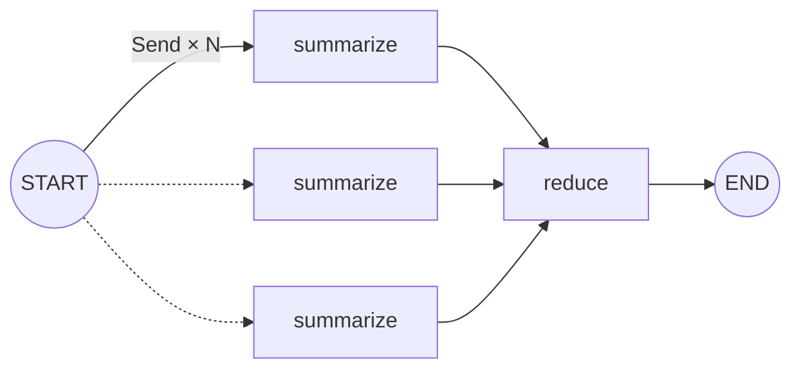

**정적 edge로 그릴 수 있는 분기엔 한계가 있다.** plain edge든 conditional edge든, 갈 수 있는 노드 *집합*이 빌드 타임에 고정돼야 한다. 그런데 "문서 N개를 각각 요약" 처럼 갈래 수가 **런타임 값**이면 edge로는 못 그린다. 그 자리를 메우는 게 **동적 fan-out**, 즉 `Send`다. (흔히 "병렬 실행 도구"로 알지만, 병렬은 Send 없이 정적 분기로도 된다 — Send의 변별점은 *동적*이다.)

> **LangGraph 시리즈**
>
> 1. [첫 그래프 — LCEL로 안 풀리는 것만 그래프로](/ko/blog/langgraph-first-graph/)
> 2. [State 설계 — 스키마와 머지 규칙](/ko/blog/langgraph-state-design/)
> 3. **Send — edge로 못 그리는 동적 fan-out** ← 현재 글
> 4. [인터럽트 — 그래프를 멈추는 게 아니다](/ko/blog/langgraph-human-in-the-loop/)
> 5. [체크포인트는 멈출 때만 찍히는 게 아니다](/ko/blog/langgraph-checkpointer/)
> 6. [checkpointer는 스레드를 넘지 못한다](/ko/blog/langgraph-long-term-memory/)

> 버전: `langgraph >= 0.2, < 0.3` 기준.

## edge로 되는 분기는 전부 "정적"이다

[1편](/ko/blog/langgraph-first-graph/)에서 갈래를 만드는 도구로 edge를 봤다. edge로 만드는 분기는 plain이든 conditional이든 공통점이 하나 있다 — **갈 수 있는 노드 집합이 빌드 타임에 고정**돼 있다.

```python
# (1) plain edge 여러 개 — 무조건 둘 다 띄운다 (병렬)
graph.add_edge("classify", "summarize")
graph.add_edge("classify", "translate")

# (2) conditional edge — 후보 중 런타임에 고른다 (리스트를 돌려주면 여러 개 병렬)
graph.add_conditional_edges("classify", pick_branch, {"faq": "faq", "deep": "deep"})
```

(1)은 언제나 둘 다, (2)는 후보 중 상태 보고 골라서 — **둘 다 병렬로도 된다.** 그러니 "병렬 = Send"가 아니다. 병렬은 정적 edge로도 흔히 나온다.

차이는 *어떻게 고르냐*일 뿐, 둘 다 **갈 수 있는 노드는 코드에 박혀 있다.** 어디로 갈 수 있는지는 컴파일 시점에 다 안다. 대부분의 분기가 이 정적 모양이고, 이 모양인 한 edge면 충분하다.

문제는 갈래 *개수*가 런타임에 정해질 때다 — 그때부터 정적 edge로는 못 적는다.

## edge로 안 되는 자리: 동적 fan-out

문서가 들어오면 **각 문서를 따로 요약**한 다음 한 번에 합치고 싶다고 하자. 문서 개수는 호출할 때마다 다르다. 3개일 수도, 50개일 수도 있다.

이걸 정적 edge로 그리려고 하면 막힌다.

- 요약 노드를 몇 개 만들어둬야 하나? 개수를 모른다.
- 한 노드로 받아 안에서 루프를 돌리면 — [1편의 while 루프 문제](/ko/blog/langgraph-first-graph/#그래프가-진짜-필요해지는-순간-agent-루프)가 그대로 돌아온다. 순차 실행에, 스트리밍·관측·체크포인트가 노드 하나에 뭉개진다.

`pick_branch`가 노드 _이름_ 하나(또는 이름 리스트)를 돌려주는 한, 정적 토폴로지 밖으로는 못 나간다. **갈래를 런타임에 *생성*해야 한다.** 그게 `Send`다.

## Send = 노드 + 그 노드에게 줄 state

```python
from langgraph.constants import Send

def fan_out(state):
    return [Send("summarize", {"doc": d}) for d in state["docs"]]
```

`Send("summarize", {"doc": d})` 는 _"`summarize` 노드를 이 payload로 한 번 돌려라"_ 라는 지시다. 라우터가 노드 이름 대신 **Send 리스트**를 돌려주면, LangGraph는 그 리스트만큼 노드를 **병렬로 띄운다**. 갈래 수 = `len(state["docs"])` — 런타임 값이다.

두 가지가 정적 edge와 다르다.

1. **갈래 수가 데이터에서 나온다.** 빌드 타임에 안 박혀 있다.
2. **각 갈래가 자기 전용 state를 받는다.** 공유 state 전체가 아니라 `{"doc": d}` 만.

## 전체 map-reduce 그래프

```python
# langgraph>=0.2,<0.3
import operator
from typing import TypedDict, Annotated
from langgraph.graph import StateGraph, START, END
from langgraph.constants import Send


class State(TypedDict):
    docs: list[str]
    summaries: Annotated[list[str], operator.add]   # N개가 같은 키에 동시 쓰기 → reducer 필수
    final: str | None


class WorkerState(TypedDict):     # worker가 받는 건 메인 state가 아니다
    doc: str


def fan_out(state: State):
    # 갈래를 런타임에 생성한다. 문서 수만큼 summarize를 띄운다.
    return [Send("summarize", {"doc": d}) for d in state["docs"]]

def summarize(state: WorkerState) -> dict:
    return {"summaries": [f"summary of {state['doc']}"]}   # 추가분만

def reduce(state: State) -> dict:
    return {"final": "\n".join(state["summaries"])}


graph = StateGraph(State)
graph.add_node("summarize", summarize)
graph.add_node("reduce", reduce)

graph.add_conditional_edges(START, fan_out, ["summarize"])   # 라우터가 Send 리스트 반환
graph.add_edge("summarize", "reduce")                        # fan-in: 다 끝나면 한 번
graph.add_edge("reduce", END)

app = graph.compile()
app.invoke({"docs": ["a.txt", "b.txt", "c.txt"], "summaries": [], "final": None})
```

그림으로 뽑으면 fan-out / fan-in이 한눈에 보인다.



점선 화살표는 _런타임에 몇 개가 될지 모르는_ 갈래라는 뜻이다. 정적 다이어그램으로는 이 "N개"를 못 그린다 — 그래서 Send가 필요하다.

이 코드에 짚을 게 다섯 개 있다.

### 1) 라우터가 노드 이름 대신 Send를 돌려준다

자리는 똑같다 — `add_conditional_edges`의 라우터. 다만 `"summarize"` 같은 *문자열*이 아니라 `Send(...)` *객체 리스트*를 돌려준다. 세 번째 인자 `["summarize"]` 는 그래프 그릴 때 쓸 "갈 수 있는 노드" 힌트일 뿐, 실제 갈래 수는 리스트 길이가 정한다.

### 2) worker는 메인 state가 아니라 payload를 받는다

`summarize`의 입력은 `State`가 아니라 `WorkerState` — `Send`에 실어준 `{"doc": d}` 그 자체다. 각 worker는 자기 조각만 본다. 다른 문서가 뭔지, `final`이 뭔지 모른다. 이 **입력 비대칭**이 처음엔 헷갈리는 지점이다: 받는 건 payload, 돌려주는 건 메인 state 키.

### 3) 같은 키에 동시에 쓰면 reducer가 필수다

N개의 `summarize`가 **같은 superstep에 `summaries`를 동시에 쓴다.** [2편](/ko/blog/langgraph-state-design/)에서 본 그 상황 — reducer가 없으면 한쪽이 다른 쪽을 덮어쓰거나 `InvalidUpdateError`가 난다. 여기선 `Annotated[list[str], operator.add]` 로 이어붙인다. **Send는 2편의 reducer 위에서 돈다.**

단, 이건 *여러 갈래가 같은 키에 동시에 쓸 때*의 규칙이다. 앞서 본 "동적 병렬"처럼 갈래마다 *다른* 키를 쓰면 충돌이 없으니 reducer도 필요 없다. fan-out을 그릴 때 따질 건 하나 — **"N개가 같이 쓰는 키가 있나?"** 그 키에만 reducer를 단다.

### 4) 일반 edge로 이으면 다음 노드는 한 번만 실행된다

`summarize → reduce` edge 하나면, LangGraph가 **모든 Send 갈래가 끝날 때까지 기다렸다가** `reduce`를 돌린다. N개가 병렬로 돌았어도 다음 노드는 N번이 아니라 **무조건 1번** — 머지된 state를 본다. 손으로 join을 짤 필요가 없다.

헷갈리기 쉬운 건 **이게 `reduce`라는 이름 덕이 아니라는 점**이다. 일반 edge(`add_edge`)로 잇는 한 그다음 노드는 *어떤* 노드든 한 번만 돈다. Send로 만든 갈래별 payload(`{"doc": d}`)는 그 worker가 도는 동안만 살아 있고, superstep이 끝나 main state로 머지되는 순간 **갈래의 정체가 사라지기** 때문이다. 그래서 그냥 edge로 이으면 병렬은 다음 노드로 이어지지 않는다.

> 병렬을 다음 노드까지 끌고 가고 싶다면 일반 edge가 아니라 **Send를 한 번 더 쏴야 한다.** 매 단계 fan-out을 다시 그려줘야 N갈래가 유지된다.

### 5) 병렬은 Send의 변별점이 아니다 — "동적"이 핵심

N개 worker가 같은 superstep에서 동시에 도는 건 맞다. 하지만 도입부에서 봤듯 **병렬 자체는 Send 없이도 된다** — plain edge를 여러 개 긋거나 conditional edge가 리스트를 돌려줘도 병렬이다. 그러니 "Send = 병렬"이라고 하면 그 정적 병렬과 구분이 안 된다. 차이는 *병렬이냐*가 아니라 **토폴로지가 빌드 타임에 박혀 있느냐, 런타임에 생성되느냐**다. (LLM 호출처럼 갈래마다 오래 걸릴 때 병렬이 곧 지연 시간 이득이 되는 건 덤이고.) 세 방법을 한 표로 세운 정리는 다음 절에.

## 정적 edge vs Send

갈래를 만드는 세 방법을 한 줄로 세우면 차이가 또렷하다.

| 분기 방법        | 갈래 선택                     | 각 갈래 state      | 토폴로지 |
| ---------------- | ----------------------------- | ------------------ | -------- |
| plain edge ×N    | 항상 전부                     | 공유 state         | 정적     |
| conditional edge | 런타임에 부분집합 선택        | 공유 state         | 정적     |
| **Send**         | **런타임에 생성**(수·payload) | **갈래별 payload** | **동적** |

세 방법 다 병렬이다 — **병렬은 변별점이 아니다.** 위에서 아래로 갈수록 *런타임에 정할 수 있는 게* 늘어난다: plain edge는 선택조차 없고(전부), conditional edge는 정적 후보 중 고르고, Send는 갈래 자체를 만들어낸다. **정적 edge(plain·conditional)로 못 그리는 단 하나가 "런타임 생성" — 그 자리가 Send다.**

## Send로 짜는 패턴들

Send가 하는 일은 하나다 — **런타임에 (노드, 입력) 디스패치를 만든다.** 그 한 가지 위에서 쓰임이 여러 갈래로 나뉜다.

### map-reduce — 같은 노드 × N

이 글의 예제. 입력 N개를 *같은* worker로 펼쳐 각각 처리하고 reducer로 합친다. 문서 요약, 청크 임베딩, 항목별 추출처럼 "같은 연산을 여러 입력에" 돌릴 때.

```python
return [Send("summarize", {"doc": d}) for d in state["docs"]]
```

### 동적 병렬 — 서로 다른 노드로

Send는 *같은* 노드만 띄우는 게 아니다. 갈래마다 **다른** 노드로 보내 이질적인 작업을 병렬로 돌릴 수 있다. 입력 성격에 따라 어떤 건 요약 노드로, 어떤 건 번역 노드로 — 노드 조합과 개수가 런타임에 정해진다.

```python
def route(state):
    sends = []
    for item in state["items"]:
        target = "summarize" if item["kind"] == "doc" else "translate"
        sends.append(Send(target, item))
    return sends
```

### 조건부 fan-out — 일부만 골라서

전부가 아니라 *조건에 맞는 것만* 갈래로 만든다. 필터 + map.

```python
return [Send("review", {"case": c}) for c in state["cases"] if c["risk"] == "high"]
```

세 패턴의 뿌리는 같다 — 갈래를 코드에 박지 않고 런타임 데이터로 *만든다.* **map-reduce는 그중 "같은 노드" 특수형**일 뿐, Send 자체는 더 넓다.

## 이럴 땐 Send 안 쓴다

- **갈래가 빌드 타임에 정해진 소수**: `faq` / `deep` 택1이면 conditional edge가 짧고 명확하다.
- **fan-out 결과를 합칠 일이 없다**: 단순 라우팅이면 map-reduce 추상화가 과하다.
- **관측·체크포인트가 필요 없는 순수 계산**: 그냥 `[summarize(d) for d in docs]` 동기 호출이 더 짧다. Send의 값은 *각 갈래가 그래프 노드로서 추적·재시작 가능*해진다는 데 있다 — 그게 필요 없으면 list comprehension이 이긴다.

## 주의할 점

- **여러 갈래가 같은 키에 쓰는데 reducer가 없으면 조용히 깨진다.** 마지막 하나만 남거나 에러다. fan-out을 그리는 순간 "N개가 같이 쓰는 키"엔 reducer가 붙어야 한다고 외워두는 게 낫다. (갈래마다 다른 키를 쓰면 해당 없음.)
- **합쳐지는 순서는 뒤죽박죽일 수 있다.** N개 갈래가 같은 키에 동시에 쓰면 reducer가 그 쓰기들을 합치는 순서는 보장되지 않는다 — `docs` 순서(a, b, c)대로 `summaries`에 쌓인다는 보장이 없다. 특히 LLM 호출처럼 갈래마다 걸리는 시간이 다르면 더 어긋난다. 순서가 중요하면 payload에 인덱스를 실어 보내고(`Send("summarize", {"i": i, "doc": d})`) reduce 노드에서 인덱스로 정렬한다.
- **fan-out도 `recursion_limit`을 먹는다.** 각 갈래가 superstep을 소비한다. 갈래가 수백 개면 limit을 올려야 할 수 있다.
- **import 경로가 버전에 민감하다.** 0.2.x는 `from langgraph.constants import Send`. 이후 라인에서 `langgraph.types` 로도 노출되니, 버전 올릴 때 한 번 확인한다.

## 마무리

Send는 "정적 그래프 토폴로지" 의 천장을 뚫는 도구다. 정적 edge가 *어디로 갈 수 있는지*를 코드에 박아둔다면, Send는 *그 갈래를 런타임 데이터로 만든다.* map-reduce든 이질 작업 병렬이든, 만들어진 갈래들이 같은 키로 모이는 순간 [2편의 reducer](/ko/blog/langgraph-state-design/)가 다시 등장하고 — 그래서 LangGraph의 제어 흐름과 state 설계는 따로 노는 두 주제가 아니다.
