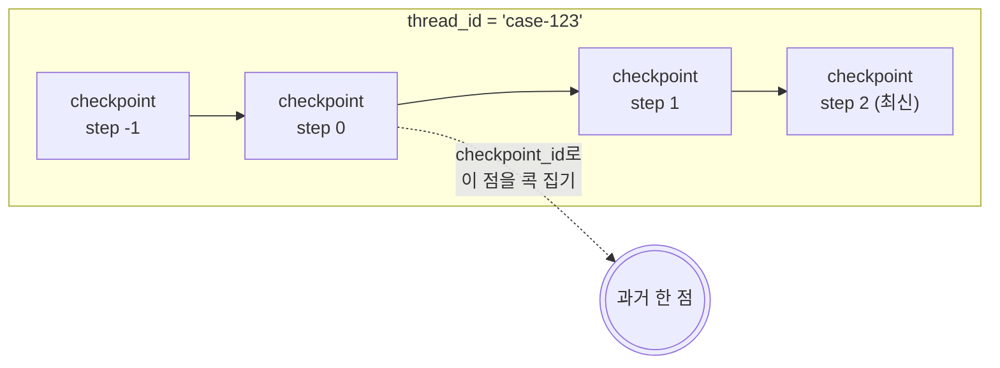
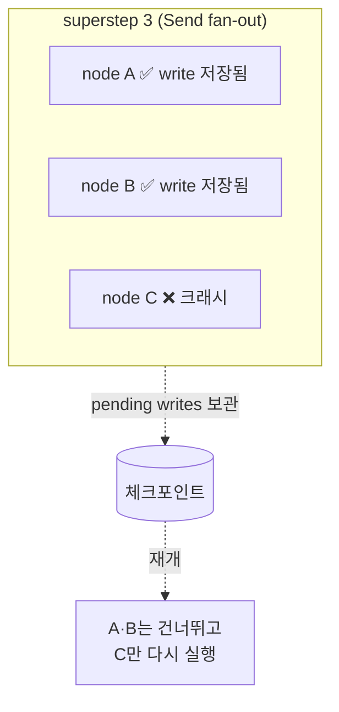

**4편에서 interrupt가 동작한 이유는 checkpointer였다.** 그런데 체크포인트는 *멈출 때만* 찍히는 게 아니다 — **매 superstep마다** 찍힌다. 멈추든 안 멈추든, 그래프는 한 단계 돌 때마다 자기 상태를 저장하고 있다. interrupt는 그 저장이 *눈에 보이는* 한순간일 뿐이었다. checkpointer는 "사람을 기다리는 도구"가 아니라 그래프 실행 전체에 깔린 **persistence layer**다.

> **LangGraph 시리즈**
> 1. [첫 그래프 — LCEL로 안 풀리는 것만 그래프로](/ko/blog/langgraph-first-graph/)
> 2. [State 설계 — 스키마와 머지 규칙](/ko/blog/langgraph-state-design/)
> 3. [Send — edge로 못 그리는 동적 fan-out](/ko/blog/langgraph-send/)
> 4. [인터럽트 — 그래프를 멈추는 게 아니다](/ko/blog/langgraph-human-in-the-loop/)
> 5. **체크포인트는 멈출 때만 찍히는 게 아니다** ← 현재 글

> 버전: `langgraph >= 0.2, < 0.3` 기준. checkpointer는 별도 패키지로 빠졌다 — `langgraph-checkpoint`(코어, `MemorySaver`), `langgraph-checkpoint-sqlite`, `langgraph-checkpoint-postgres`. import 경로가 버전마다 흔들리니 본인 환경에서 확인하고 쓴다.

## 멈추지 않아도 체크포인트는 찍힌다

4편에서 "interrupt = 체크포인트 저장 + 종료"라고 했다. 여기서 자칫 *"체크포인트는 멈출 때 찍히는 것"* 으로 읽기 쉬운데, 거꾸로다. 멈춤이 체크포인트를 만드는 게 아니라, **그래프가 원래 매 단계 체크포인트를 찍고 있고**, interrupt는 그중 한 번 더 진행하지 않고 빠져나간 것뿐이다.

LangGraph는 한 **superstep**(한 번에 도는 노드 묶음 — 3편의 `Send` fan-out이면 여러 노드가 한 superstep)이 끝날 때마다 체크포인트를 하나 저장한다. interrupt가 전혀 없는 평범한 그래프도 마찬가지다.

```python
from typing import TypedDict
from langgraph.graph import StateGraph, START, END
from langgraph.checkpoint.memory import MemorySaver


class State(TypedDict):
    draft: str
    reviewed: bool


def propose(state: State) -> dict:
    return {"draft": "처방 추천: 아목시실린 500mg"}

def review(state: State) -> dict:
    return {"reviewed": True}


graph = StateGraph(State)
graph.add_node("propose", propose)
graph.add_node("review", review)
graph.add_edge(START, "propose")
graph.add_edge("propose", "review")
graph.add_edge("review", END)

app = graph.compile(checkpointer=MemorySaver())   # interrupt 없음

config = {"configurable": {"thread_id": "case-123"}}
app.invoke({"draft": "", "reviewed": False}, config)
```

이 그래프는 한 번도 멈추지 않고 끝까지 돈다. 그런데 끝나고 나서 *지나온 체크포인트들*을 꺼내볼 수 있다.

```python
for snap in app.get_state_history(config):
    print(snap.metadata["step"], snap.next, snap.values)

# 2 ()            {'draft': '처방 추천: 아목시실린 500mg', 'reviewed': True}
# 1 ('review',)   {'draft': '처방 추천: 아목시실린 500mg', 'reviewed': False}
# 0 ('propose',)  {'draft': '', 'reviewed': False}
# -1 ('__start__',) {'draft': '', 'reviewed': False}
```

멈춘 적이 없는데도 체크포인트가 네 개 쌓였다(입력 단계 `step=-1` 포함). **interrupt는 이 시퀀스를 *중간에서 끊고 나오는* 행위였을 뿐, 시퀀스 자체는 늘 만들어진다.** 이 하나만 받아들이면 나머지는 자연스럽게 풀린다 — 메모리, 재시작, time-travel은 전부 "매 단계 찍히는 이 체크포인트"를 다르게 쓰는 것일 뿐이다.

## checkpointer는 인터페이스다 — Memory / Sqlite / Postgres는 내구성만 다르다

`MemorySaver`, `SqliteSaver`, `PostgresSaver`는 **같은 인터페이스(`BaseCheckpointSaver`)의 구현체**다. 그래프 코드는 한 줄도 안 바뀐다 — `compile(checkpointer=...)`에 뭘 넣느냐만 바뀐다.

```python
# 개발: 프로세스 메모리 (재시작하면 사라짐)
from langgraph.checkpoint.memory import MemorySaver
app = graph.compile(checkpointer=MemorySaver())

# 로컬 파일: 프로세스 죽어도 파일에 남음
from langgraph.checkpoint.sqlite import SqliteSaver
with SqliteSaver.from_conn_string("checkpoints.sqlite") as cp:
    app = graph.compile(checkpointer=cp)

# 프로덕션: 여러 프로세스가 같은 DB를 공유
from langgraph.checkpoint.postgres import PostgresSaver
with PostgresSaver.from_conn_string("postgresql://...") as cp:
    cp.setup()                       # 최초 1회 테이블 생성
    app = graph.compile(checkpointer=cp)
```

인터페이스가 요구하는 건 결국 네 가지 동작이다.

| 메서드 | 하는 일 |
|---|---|
| `put` | 체크포인트 하나를 config·metadata와 함께 저장 |
| `put_writes` | 노드들이 만든 중간 write를 체크포인트에 붙여 저장 (pending writes) |
| `get_tuple` | config로 체크포인트 하나를 꺼냄 (checkpoint + config + metadata + pending writes) |
| `list` | config·필터에 맞는 체크포인트들을 나열 |

> 차이는 오직 **내구성과 공유 범위**다. `MemorySaver`는 그 프로세스의 메모리 안에만 있어서 재시작하면 증발한다. `SqliteSaver`는 파일에 남아 한 머신에서 프로세스가 죽어도 살아남는다. `PostgresSaver`는 여러 워커·여러 서버가 같은 체크포인트를 공유한다 — 요청을 받은 프로세스와 재개하는 프로세스가 달라도 되는, 진짜 웹 서버용이다.

## 체크포인트 안에는 뭐가 들었나

`get_state(config)`로 꺼내는 게 `StateSnapshot`이다. 호출자에게 보이는 모습은 이렇다.

```python
snap = app.get_state(config)
snap.values         # 그 시점의 state (channel 값들) — 가장 많이 보는 것
snap.next           # 다음에 돌 노드 이름 튜플. ()이면 끝났다는 뜻
snap.config         # 이 체크포인트를 가리키는 config (thread_id + checkpoint_id 포함)
snap.metadata       # {'source': ..., 'step': ..., 'writes': ..., 'parents': ...}
snap.parent_config  # 직전 체크포인트의 config — 이게 시퀀스를 잇는 포인터다
snap.tasks          # 다음에 실행될 task들 (에러가 났다면 그 정보도)
```

`snap.values`만 보면 "state 스냅샷"이지만, 체크포인트가 실제로 들고 있는 건 그보다 많다. 내부적으로 저장되는 핵심 필드는:

| 필드 | 하는 일 |
|---|---|
| `channel_values` | `snap.values`로 노출되는 그 state. 핵심 페이로드 |
| `channel_versions` / `versions_seen` | 각 채널의 버전, 그리고 *어느 노드가 어느 버전까지 봤는지* — LangGraph가 `snap.next`(다음에 돌 노드)를 계산하는 근거 |
| `pending_sends` | 아직 처리 안 된 `Send`(3편) 큐 |

여기서 핵심은 `channel_versions` / `versions_seen`이다. 체크포인트는 단순히 데이터만 저장하는 게 아니라 **"어디까지 진행됐는가"라는 실행 위치**를 같이 저장한다 — 죽었다 다시 살아날 수 있는 게 이 때문이다.

여기에 **pending writes**와 **metadata**가 따라붙는다. metadata의 `step`은 위에서 본 단계 번호(-1, 0, 1, ...)이고, `source`는 이 체크포인트가 *왜* 생겼는지를 말한다.

| `source` | 언제 찍히나 |
|---|---|
| `"input"` | invoke에 새 입력을 줘서 |
| `"loop"` | 그래프가 한 단계 정상 진행해서 |
| `"update"` | `update_state`로 사람이 손대서 |
| `"fork"` | 과거 체크포인트를 복제해서 |

4편에서 `update_state`로 draft를 고친 게 바로 `source="update"`짜리 체크포인트를 하나 더 찍는 일이었다.

## thread_id는 시퀀스, checkpoint_id는 그 안의 한 점

여기서 두 식별자의 관계가 정리된다. 4편에서 `thread_id`를 "세션 식별자"라고만 했는데, 더 정확히는 **`thread_id` = 체크포인트들의 시퀀스 하나**다. 그 시퀀스 안의 *특정 한 점*을 가리키는 게 `checkpoint_id`다.

```python
# thread_id만 주면 → 그 시퀀스의 "가장 최근" 체크포인트
config = {"configurable": {"thread_id": "case-123"}}
app.get_state(config)            # 최신 상태

# checkpoint_id까지 주면 → 그 시퀀스의 "특정 과거 시점"
config = {"configurable": {"thread_id": "case-123",
                           "checkpoint_id": "1ef..."}}
app.get_state(config)            # 그때 그 상태
```



thread는 가로로 자라는 체크포인트 사슬이고, 각 마디를 `parent_config`가 뒤로 잇는다. `checkpoint_id` 없이 invoke하면 늘 *맨 끝* 마디에서 이어 가고, `checkpoint_id`를 주면 *중간 마디*를 집어 든다. 이 "중간 마디 집기"가 time-travel의 전부다.

## Time-travel: 과거에서 다시 돌리기(replay)와 분기(fork)

`get_state_history`로 과거 마디를 고르고, 그 마디의 `config`(= `checkpoint_id`가 박힌)로 다시 invoke하면 **그 지점부터 다시 돈다.**

```python
history = list(app.get_state_history(config))   # 최신순 (newest first)
past = history[2]                                # 두 단계 전으로

# 그 지점부터 재실행 = replay
app.invoke(None, past.config)
```

여기서 갈림길이 둘이다.

- **Replay** — 과거 지점에서 *그대로* 다시 돌린다. 같은 입력·같은 로직이면 같은 길을 다시 간다. "그때 왜 이 노드로 갔지?"를 재현해 디버깅할 때.
- **Fork** — 과거 지점에서 state를 *바꿔서* 다시 돈다. `update_state`로 그 마디를 고치거나 다른 입력을 주면, LangGraph는 원래 사슬을 덮어쓰지 않고 **새 가지를 친다**. `parent_config`가 갈라지는 지점을 기록하므로, 원래 타임라인과 새 타임라인이 **공존**한다.

```python
# 과거 마디에서 state를 고치면 → 거기서 새 가지가 갈라진다 (fork)
forked = app.update_state(past.config, {"draft": "처방 추천(대안): 세팔렉신 500mg"})
app.invoke(None, forked)        # 원래 사슬은 그대로, 새 가지로 진행
```

이게 단순 "되돌리기(undo)"보다 강한 이유: 원본을 지우지 않는다. **"이 환자 케이스를 step 1로 되돌려서 다른 약으로 다시 돌려보되, 원래 기록은 남겨둔다"** 가 그래프 한 줄로 된다. 임상·감사 맥락에서 이 *비파괴적 분기*는 특히 쓸모가 있다.

## 죽었다 살아나는 경로: pending writes가 멱등성을 지킨다

매 단계 체크포인트가 찍힌다는 사실의 진짜 값어치는 **프로세스가 중간에 죽었을 때** 드러난다. superstep 3을 돌다가 서버가 크래시했다면, 마지막으로 커밋된 체크포인트(superstep 2 끝)가 멀쩡히 남아 있다. 같은 `thread_id`로 다시 invoke하면 그 지점에서 살아난다 — 그래프를 처음부터 다시 도는 게 아니다.

문제는 *한 superstep 안에서* 노드 일부만 끝나고 죽었을 때다. `Send` fan-out으로 노드 셋이 병렬로 도는데 둘은 성공하고 하나가 터지면? 성공한 둘의 결과를 버리고 셋 다 재실행하면 — 이미 외부 API를 부른 그 둘이 **두 번 호출**된다.

LangGraph는 이걸 **pending writes**로 막는다. 한 superstep에서 성공한 노드의 write는 그 단계가 *완전히* 닫히기 전이라도 체크포인트에 따로 붙어 저장된다(`put_writes`). 재개할 때 LangGraph는 "이 노드는 이미 write를 남겼네" 하고 **재실행을 건너뛴다.**



4편에서 "interrupt로 멈춘 노드는 재진입 시 처음부터 다시 돌지만, 같이 돌던 형제 노드는 다시 안 돈다"고 했던 그 비대칭이 바로 이 pending writes 메커니즘이다. interrupt든 크래시든, **"안 멈춘/성공한 노드의 결과는 보존하고, 멈춘/실패한 노드만 다시"** 라는 규칙은 동일하다.

다만 이건 *그래프 단계 사이*의 멱등성이지, **노드 한 개 내부**까지 지켜주진 않는다. 노드 함수 자체가 중간에 죽으면 그 노드는 통째로 재실행되므로, 노드 안에서 외부 부작용(결제, DB 쓰기)을 여러 번 일으키면 그건 직접 멱등하게 짜야 한다.

## 클리니컬 관점: state가 그대로 디스크에 직렬화된다

여기까지가 메커니즘이고, 프로덕션에 붙일 때 제일 먼저 걸리는 건 보안이다. **`channel_values`에 들어간 state는 그대로 직렬화돼 저장된다.** 환자 식별자·증상·처방 같은 PHI/PII를 state에 담았다면, 그게 `MemorySaver`면 프로세스 메모리에, `PostgresSaver`면 *DB 테이블에 평문으로* 남는다는 뜻이다.

체크포인트는 "임시 실행 상태"처럼 보이지만, 내구성 saver를 쓰는 순간 **사실상 또 하나의 데이터 저장소**다. 그래서 다음을 일반 DB와 똑같이 따져야 한다.

- **저장 시 암호화** — DB 레벨 암호화(at-rest)로 충분한가, 아니면 민감 필드를 state에 넣기 전에 애플리케이션 레벨에서 암호화/별도 KMS로 감쌀 것인가.
- **마스킹/토큰화** — 체크포인트엔 토큰만 남기고 실제 PHI는 별도 보안 저장소에 두는 방식. state엔 식별자만, 원문은 밖에.
- **보존 정책** — 체크포인트는 자동으로 안 지워진다. thread가 쌓이면 PHI도 쌓인다. 만료·삭제 정책을 그래프 밖에서 직접 운영해야 한다.
- **time-travel의 양날** — 과거 체크포인트가 다 남는다는 건, *지웠다고 생각한 옛 상태가 그대로 조회 가능*하다는 뜻이기도 하다. 감사엔 좋지만 삭제 요구(right-to-be-forgotten)와는 정면충돌한다.

이건 LangGraph가 풀어주는 문제가 아니라 **설계자가 정해야 하는 트레이드오프**다. checkpointer는 "어디에, 무엇을, 얼마나 오래 남길지"를 정책으로 안 가지고 있다 — 평문으로 다 남기는 게 기본값이다.

## 마무리

4편은 interrupt를 persistence 위에 얹힌 한 기능으로 봤다. 5편의 결론은 그 범위가 훨씬 넓다는 것이다 — **interrupt, 스레드 메모리, 크래시 복구, time-travel, 비파괴적 fork는 서로 다른 기능이 아니라 "매 superstep마다 체크포인트를 찍는다"는 단 하나의 메커니즘을 다르게 쓰는 것이다.** checkpointer를 "사람 기다리는 도구"로 알면 절반만 본 것이고, "그래프 실행에 깔린 지속성 계층"으로 보면 위 다섯이 한 번에 정리된다.

그래서 LangGraph를 프로덕션에 올릴지 말지의 질문은 사실상 **"이 persistence layer를 받아들일 수 있나"** 다. 받아들인다면 saver만 골라 끼우면 되고(인자 교체), 안 받아들인다면 — 매 단계 직렬화되는 state, 자동으로 안 지워지는 체크포인트, 평문 PHI를 직접 감당해야 한다. 다음 편(Phase 5)에서는 이 위에 올라가는 `create_react_agent` 같은 prebuilt 에이전트가 *실제로 어떤 그래프인지* 분해해 본다.
