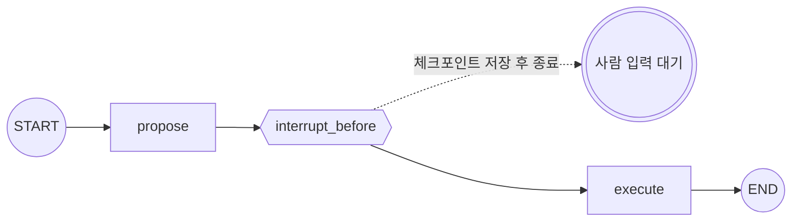

**LangGraph에서 사람 입력을 기다리는 건 "프로세스를 멈춰 세우는" 일이 아니다.** `interrupt`는 현재 state를 체크포인트에 *저장하고 그래프를 빠져나간다.* 사람 입력은 나중에 — 같은 `thread_id`로 다시 진입하면 저장된 지점부터 이어 돈다.

> **LangGraph 시리즈**
> 1. [첫 그래프 — LCEL로 안 풀리는 것만 그래프로](/ko/blog/langgraph-first-graph/)
> 2. [State 설계 — 스키마와 머지 규칙](/ko/blog/langgraph-state-design/)
> 3. [Send — edge로 못 그리는 동적 fan-out](/ko/blog/langgraph-send/)
> 4. **인터럽트 — 그래프를 멈추는 게 아니다** ← 현재 글

> 버전: `langgraph >= 0.2, < 0.3` 기준. 동적 `interrupt()` / `Command`는 0.2 라인 후반에 들어왔으니 마이너 버전을 확인하고 쓴다.

## 문제: 중간에 사람이 끼어야 한다

워크플로 중간에 사람 승인이 필요한 상황은 흔하다. "이 처방 추천을 임상의가 확인한 *뒤에* 실행" 같은 경우. 어떻게 멈추고 기다릴까?

순진한 발상부터 보자.

```python
def execute(state):
    answer = input("진행할까요? (y/n): ")   # 여기서 블로킹
    ...
```

이건 **프로세스가 그동안 살아 있어야** 동작한다. 웹 요청 안이라면? 요청은 응답을 돌려주고 끝나야 한다. 몇 분, 몇 시간 뒤의 사람 입력을 `input()`으로 붙잡고 있을 수 없다. 게다가 그 사이 서버가 죽으면 진행 중이던 state는 전부 메모리와 함께 사라진다.

LangGraph는 이 문제를 다르게 푼다. **멈추는 게 아니라, 저장하고 빠져나온다.**

## interrupt = 체크포인트 저장 + 종료

핵심 모델은 이거다.

1. interrupt 지점에서 LangGraph는 현재 state를 **체크포인트에 저장**한다.
2. 그리고 그래프에서 **빠져나온다(yield).** `invoke`가 *반환*된다 — 블로킹이 아니다.
3. 나중에 사람 입력이 생기면, **같은 `thread_id`로 다시 `invoke`** 한다. LangGraph가 체크포인트를 읽어 그 지점부터 이어 돈다.

그래서 전제 조건이 둘이다 — **checkpointer**(저장할 곳)와 **`thread_id`**(어느 세션의 체크포인트인지). 여기선 개발용 `MemorySaver`로 개념만 본다.

## 방식 1: 정적 interrupt_before / interrupt_after

가장 간단한 형태는 compile 옵션이다. "이 노드 *직전에* 항상 멈춰라."

```python
# langgraph>=0.2,<0.3
from typing import TypedDict
from langgraph.graph import StateGraph, START, END
from langgraph.checkpoint.memory import MemorySaver


class State(TypedDict):
    draft: str
    approved: bool


def propose(state: State) -> dict:
    return {"draft": "처방 추천: 아목시실린 500mg ..."}

def execute(state: State) -> dict:
    return {"approved": True}


graph = StateGraph(State)
graph.add_node("propose", propose)
graph.add_node("execute", execute)
graph.add_edge(START, "propose")
graph.add_edge("propose", "execute")
graph.add_edge("execute", END)

app = graph.compile(
    checkpointer=MemorySaver(),
    interrupt_before=["execute"],     # execute 직전에 멈춘다
)

config = {"configurable": {"thread_id": "case-123"}}
app.invoke({"draft": "", "approved": False}, config)
# → propose 까지 돌고, execute 직전에 멈춰서 반환된다
```



여기서 `invoke`는 **블로킹하지 않는다.** `propose`를 실행하고 `execute` 직전 상태를 체크포인트에 저장한 뒤, 그대로 *반환된다*. 사람을 기다리며 멈춰 있는 게 아니라 — 상태를 저장하고 호출이 끝나는 것이다.

### 상태를 확인하고, 고치고, 재개한다

```python
state = app.get_state(config)
print(state.next)              # ('execute',) — 다음에 돌 노드
print(state.values["draft"])   # "처방 추천: 아목시실린 500mg ..."

# 사람이 검토하면서 draft를 고칠 수도 있다
app.update_state(config, {"draft": "처방 추천(수정): 아목시실린 250mg ..."})

# 재개: 입력 자리에 None을 넘긴다
app.invoke(None, config)       # execute 부터 이어 돈다
```

`app.invoke(None, config)` — 입력이 `None`이면 *"새 입력 없음, 체크포인트에서 계속하라"* 는 뜻이다. `thread_id`가 같아야 같은 세션의 체크포인트를 집어든다.

두 번째 `invoke`는 첫 번째와 **완전히 별개의 호출**이다. 다른 함수에서, 다른 요청에서, 심지어 다른 서버 프로세스에서 불러도 — `thread_id`만 같고 checkpointer가 같은 저장소를 가리키면 그래프는 저장된 지점에서 부활한다. 첫 `invoke`가 끝난 뒤 프로세스가 죽어도 상관없다는 뜻이다.

## 방식 2: 동적 interrupt()

노드 *안에서* 조건부로 멈추고 싶을 때는 `interrupt()`를 쓴다.

```python
from langgraph.types import interrupt, Command

def human_review(state: State) -> dict:
    decision = interrupt({"draft": state["draft"]})   # 여기서 멈추고 payload를 밖으로 넘긴다
    return {"approved": decision == "yes"}

# 재개: 사람 답을 Command(resume=...) 로 주입한다
app.invoke(Command(resume="yes"), config)
```

`interrupt({...})`는 인자로 받은 payload를 밖으로 던지면서 그래프를 빠져나간다(체크포인트 저장은 동일). 재개할 때 `Command(resume="yes")`를 넘기면, **그 값이 `interrupt()`의 반환값**으로 들어온다 — 위 코드에서 `decision`이 `"yes"`가 된다.

호출자 입장에서 한 왕복을 끝까지 따라가 보면 이렇다.

```python
config = {"configurable": {"thread_id": "case-123"}}

# 1차 호출 — human_review 안 interrupt()에서 멈춘다
result = app.invoke({"draft": "처방 추천: 아목시실린 500mg", "approved": False}, config)

# interrupt()에 넘긴 payload가 __interrupt__ 키로 호출자에게 올라온다
print(result["__interrupt__"])
# (Interrupt(value={'draft': '처방 추천: 아목시실린 500mg'}, resumable=True, ...),)

draft = result["__interrupt__"][0].value["draft"]
# → 이 draft를 사람에게 보여주고 답을 받는다 (웹이면 여기서 응답을 돌려주고 끝)

# 2차 호출 — 받은 답을 resume 값으로 주입한다
final = app.invoke(Command(resume="yes"), config)
print(final["approved"])   # True  ← interrupt()가 "yes"를 반환 → decision == "yes"
```

**payload는 밖으로(`__interrupt__`), 사람 답은 안으로(`Command(resume=...)`).** 이 두 방향이 동적 interrupt의 전부다.

정적 방식과 달리 `if`로 *런타임에* 멈출지 말지를 정할 수 있다. "신뢰도가 낮을 때만 사람에게 확인" 같은 로직이 자연스럽다.

### 동적 interrupt의 함정: 노드가 처음부터 다시 돈다

`interrupt()`로 멈췄다가 재개하면, **그 노드는 처음부터 다시 실행된다.** `interrupt()` 호출 *앞*에 있던 코드가 두 번 돈다는 뜻이다. 부작용(외부 API 호출, DB 쓰기)을 interrupt 앞에 두면 두 번 실행된다.

```python
def human_review(state: State) -> dict:
    charge_credit_card(state)          # ❌ 재개 시 두 번 호출된다
    decision = interrupt({...})
    return {"approved": decision == "yes"}
```

규칙: **부작용이 있는 코드는 `interrupt()` 앞에 두지 않는다.** 외부 API 호출이나 DB 쓰기 같은 작업은 사람이 결정한 *뒤*, 즉 `interrupt()` 다음 줄로 미룬다.

### 병렬로 멈출 때: `__interrupt__`는 원래 여러 개

`Send` fan-out(3편)으로 노드 여러 개가 병렬로 도는데 그중 둘 이상이 `interrupt()`를 부르면, 그 한 번의 `invoke`가 **interrupt를 여러 개 한꺼번에** 들고 나온다. `result["__interrupt__"]`가 튜플인 이유가 이거다 — 위 예제에서 `[0]`을 붙인 건 멈춘 노드가 하나뿐이라 원소가 1개였기 때문이고, 자료구조 자체는 늘 복수다.

```python
# 문서 3개를 병렬 노드로 펼쳤고 각 노드가 interrupt() 한 경우
for itr in result["__interrupt__"]:
    show_to_human(itr.value)        # 멈춘 노드 수만큼 올라온다
```

그럼 **같이 돌던, 안 멈춘 형제 노드는?** 끝까지 실행되고, 그 결과는 버려지지 않고 "pending write"로 체크포인트에 보관된다. 그래서 재개할 때 그 노드는 **다시 돌지 않는다** — 바로 위 함정("노드가 처음부터 다시 돈다")은 *멈춘 노드에만* 적용되지, 같이 돌던 노드까지 두 번 도는 게 아니다.

다만 그 superstep 자체는 **멈춘 노드가 전부 풀릴 때까지** 닫히지 않는다. 끝난 노드들의 write까지 한데 묶여 *다음* 체크포인트로 커밋되는 건 그 단계가 닫힐 때다. (그래서 멈춰 있는 동안 `get_state().values`를 보면 이미 끝난 형제 노드의 결과는 거기 반영돼 있다 — 아직 다음 체크포인트로 커밋만 안 됐을 뿐이다.)

## 재개할 때 `invoke`에 뭘 넘기나

여기까지 두 번째 `invoke`를 두 가지 모습으로 봤다 — `invoke(None, config)`와 `invoke(Command(resume=...), config)`. 처음 보면 헷갈리니 한 번에 정리한다.

먼저 큰 그림. **멈춘 그래프를 다시 굴리는 건 결국 "같은 `thread_id`로 `invoke`를 한 번 더 부르는 일"이다.** `thread_id`가 같으면 LangGraph는 "아, 이 세션은 아까 거기서 멈춰 있었지" 하고 저장된 체크포인트를 집어 든다. 그래서 별도의 "resume()" 같은 함수가 없다 — *그냥 `invoke`를 다시 부른다.* 대신 첫 번째 인자(입력 자리)에 뭘 넣느냐로 동작이 갈린다. 세 가지를 구분하면 끝난다.

**① `None` — "새 입력 없다. 멈춘 데서 그냥 이어 가라."**

```python
app.invoke(None, config)
```

정적 `interrupt_before/after`로 멈춘 걸 재개할 때 쓴다. 입력 자리에 `None`을 넣는 건 *"줄 새 입력은 없고, 저장된 데서 계속만 하라"* 는 신호다. LangGraph는 체크포인트를 읽어 *다음에 돌 노드*(`get_state(config).next`가 가리키는 그 노드)부터 이어 돈다. 새 입력이 없으니 state는 멈췄을 때 그대로다 — 중간에 `update_state`로 고쳤다면 그 고친 값으로.

**② `Command(resume=값)` — "이 값을 `interrupt()`의 반환값으로 꽂고 이어 가라."**

```python
app.invoke(Command(resume="yes"), config)
```

동적 `interrupt()`로 멈춘 걸 재개할 때 쓴다. 넘긴 값이 멈춰 있던 `interrupt(...)` 호출의 *반환값*이 되어 노드 안으로 들어온다. `None`이 "그냥 계속"이라면, 이건 "사람의 답을 그래프 안으로 들고 들어가는" 통로다. 그래서 사람 입력이 노드 로직에 영향을 줘야 하면(승인이면 실행, 거절이면 중단 같은 분기) `None`이 아니라 `Command`다.

> **`Command`는 `resume` 말고도 필드가 더 있다.** `update`(state를 같이 수정 — `update_state`와 같은 일), `goto`(다음에 갈 노드 지정), `graph`(어느 그래프로 보낼지). 재개 입력으로 쓸 땐 `resume`이 주역이고, 답을 주면서 state도 고치려면 `Command(resume="yes", update={"reviewer": "dr_kim"})`처럼 합칠 수 있다. `goto`/`graph`는 interrupt 재개가 아니라 흐름 라우팅용이라 결이 다르다 — 노드 *리턴값*으로 분기를 직접 몰 때 쓴다.

**③ 평범한 입력 dict — 이건 "재개"가 아니라 "새 실행"이다.**

```python
app.invoke({"draft": "...전혀 새로운 입력..."}, config)
```

여기서 가장 많이 헷갈린다. `None`도 `Command`도 아닌 *진짜 입력값*을 넘기면, 그건 "멈춘 데서 이어 가라"가 아니라 **새 실행을 시작하라**는 뜻이 된다. 그래프는 `START`부터 다시 돈다 — 단, `thread_id`가 같으니 이전 state를 버리지 않고 *그 위에 누적*해서. 챗봇이 같은 세션으로 대화를 이어갈 때 매 턴 새 메시지를 이렇게 넘긴다. 지난 state와 어떻게 합쳐지는지는 2편의 reducer 규칙 그대로다 — `messages`처럼 reducer가 달린 키는 누적(append)되고, 나머지는 넘긴 키만 덮어쓰며 안 넘긴 키는 그대로 유지된다. **멈춘 지점에서 이어 가려던 거라면 이건 틀린 호출이다** — 의도와 달리 처음부터 다시 돈다.

한 줄 요약: **이어 가려면 `None`(정적) 또는 `Command(resume=...)`(동적), 새로 시작하려면 입력 dict.** 같은 `invoke`에 무엇을 넘기느냐가 "재개냐 새 턴이냐"를 가른다.

## 두 방식 비교

| | 정적 `interrupt_before/after` | 동적 `interrupt()` |
|---|---|---|
| 어디에 쓰나 | `compile()` 옵션 | 노드 코드 안 |
| 조건부 멈춤 | 노드 단위(항상) | `if`로 런타임 결정 |
| 입력 주입 | `update_state()` | `Command(resume=...)` |
| 노드 재실행 | 안 함 | **처음부터 다시** |
| 적합 | "이 단계 전엔 늘 검토" | "이럴 때만 사람에게" |

## "멈춤 = 체크포인트"라는 모델로 보면

이 모델로 보면 나머지가 정리된다.

- **"멈췄다"는 건 한 번의 `invoke`가 끝났다는 것**이다. 대기 중인 프로세스 같은 건 없다.
- **재개는 새 `invoke`다.** `thread_id`가 세션 식별자 역할을 한다.
- 그래서 이 패턴이 **웹 서버에 자연스럽다.** 요청 1: `invoke` → interrupt payload 반환 → 사용자에게 draft를 보여준다. (프로세스는 응답하고 끝난다.) 요청 2(사람이 승인 후): `invoke(None or Command, config)` → 마저 돈다. 두 요청 사이에 살아 있어야 하는 건 *프로세스*가 아니라 *체크포인트*다.

## 주의할 점

- **checkpointer 없이는 interrupt가 의미 없다.** 저장할 데가 없으니 재개할 지점도 없다. `interrupt_before`만 주고 checkpointer를 빼면 동작이 깨진다.
- **`MemorySaver`는 프로세스가 죽으면 같이 죽는다.** 진짜 재시작 가능성(서버 재배포, 크래시 후 복구)을 원하면 `SqliteSaver` / `PostgresSaver`로 가야 한다.
- **`update_state`도 reducer를 거친다.** [2편](/ko/blog/langgraph-state-design/)에서 본 그 머지 규칙이 여기서도 적용된다. `messages`처럼 reducer가 달린 키를 `update_state`로 건드리면 덮어쓰기가 아니라 *append*된다. 덮어쓸 생각이었다면 값이 엉뚱하게 쌓인다.
- **동적 interrupt 앞 부작용 재실행** — 위에서 본 그 함정. 노드 재진입을 항상 염두에 둔다.

## 마무리

human-in-the-loop은 제어 흐름 도구처럼 보이지만, 그 밑에 깔린 건 **persistence**다. interrupt가 동작하는 이유는 그래프가 매 노드 사이에 state를 체크포인트에 저장하고, 필요하면 거기서부터 다시 시작할 수 있기 때문이다 — "멈춤"은 그 저장-종료-재진입 사이클의 다른 이름일 뿐이다.
