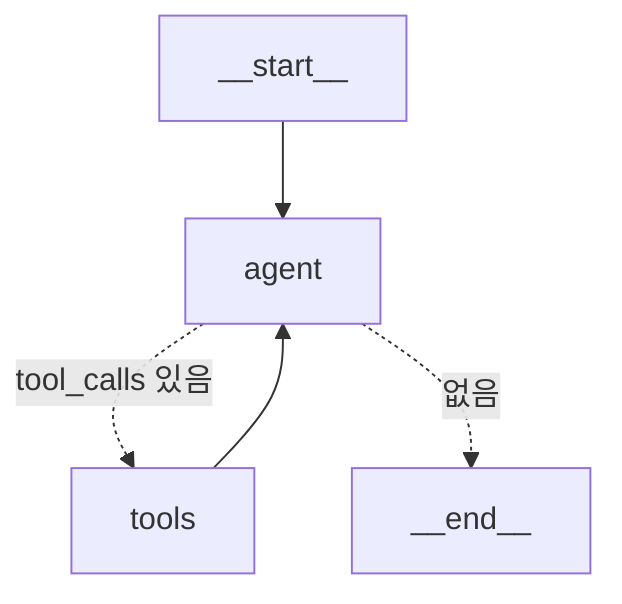

**여기까지 여섯 편을 노드와 엣지로 그래프를 직접 짰다.** 그런데 막상 agent는 `create_react_agent(model, tools)` 한 줄이면 돈다. 그 한 줄 안에 **우리가 1~6편에서 공부한 게 모두 들어있다.** prebuilt는 새로운 무언가가 아니라 익숙한 그래프를 포장한 것뿐이고, 포장을 뜯어보면 "어디까지 prebuilt로 충분하고 어디서 직접 내려가야 하나"의 경계선이 보인다.

> **LangGraph 시리즈**
> 1. [첫 그래프 — LCEL로 안 풀리는 것만 그래프로](/ko/blog/langgraph-first-graph/)
> 2. [State 설계 — 스키마와 머지 규칙](/ko/blog/langgraph-state-design/)
> 2.5. [MessagesState는 특별한 state가 아니다](/ko/blog/langgraph-messages-state/)
> 3. [Send — edge로 못 그리는 동적 fan-out](/ko/blog/langgraph-send/)
> 4. [인터럽트 — 그래프를 멈추는 게 아니다](/ko/blog/langgraph-human-in-the-loop/)
> 5. [체크포인트는 멈출 때만 찍히는 게 아니다](/ko/blog/langgraph-checkpointer/)
> 6. [checkpointer는 스레드를 넘지 못한다](/ko/blog/langgraph-long-term-memory/)
> 7. **create_react_agent는 마법이 아니다** ← 현재 글
> 8. [멀티 에이전트는 에이전트끼리 대화하지 않는다](/ko/blog/langgraph-multi-agent/)
> 8.5. [subgraph는 state를 공유할 수도, 격리할 수도 있다](/ko/blog/langgraph-subgraph-state/)

> 버전: `langgraph >= 0.2, < 0.3` 기준. `create_react_agent`는 `langgraph.prebuilt`에 있고, 이 영역은 버전마다 인자 이름이 자주 바뀐다 — 시스템 프롬프트 주입 인자만 해도 `messages_modifier` → `state_modifier` → `prompt`로 바뀌어 왔다. 시그니처는 본인 환경에서 확인하고 쓴다.

## 한 줄짜리 agent를 그래프로 펼쳐보면

ReAct agent는 사실 새로운 개념이 아니다. **모델을 부르고 → 모델이 도구를 호출하면 실행하고 → 결과를 다시 모델에게 주고 → 모델이 그만 부를 때까지 반복**하는 루프다. 이거, 1편에서 사이클을 얘기하고 3편에서 조건부 분기를 얘기할 때 이미 다 나온 모양이다.

먼저 한 줄로 만든다.

```python
from langgraph.prebuilt import create_react_agent
from langchain_anthropic import ChatAnthropic

def lookup_allergy(patient_id: str) -> str:
    """환자의 알러지 기록을 조회한다."""
    return "페니실린 알러지 있음"

model = ChatAnthropic(model="claude-haiku-4-5-20251001")
agent = create_react_agent(model, tools=[lookup_allergy])
```

그리고 곧바로 까본다. `agent`는 `compile()`된 평범한 그래프라서 1편에서 쓰던 그대로 그릴 수 있다.

```python
print(agent.get_graph().draw_mermaid())
```



노드는 딱 둘이다. `agent`(모델 호출)와 `tools`(`ToolNode`). 그리고 `agent`에서 나가는 점선은 **조건부 엣지**다 — 모델이 도구를 호출했으면 `tools`로, 아니면 `__end__`로. `tools`는 끝나면 무조건 `agent`로 돌아온다. **이게 사이클이다.** 3편에서 "사이클 + 조건부 분기 + `recursion_limit`"으로 얘기한 그 구조가 통째로 들어있다. 다른 점은 단 하나, 이번엔 내가 안 그렸을 뿐이다.

손으로 짜면 이렇게 된다.

```python
from langgraph.graph import StateGraph, START, END, MessagesState
from langgraph.prebuilt import ToolNode, tools_condition

def call_model(state: MessagesState) -> dict:
    return {"messages": [model.bind_tools(tools).invoke(state["messages"])]}

g = StateGraph(MessagesState)
g.add_node("agent", call_model)
g.add_node("tools", ToolNode(tools))
g.add_edge(START, "agent")
g.add_conditional_edges("agent", tools_condition)  # tool_calls 있으면 "tools", 없으면 END
g.add_edge("tools", "agent")
app = g.compile()
```

`create_react_agent`가 내부에서 만드는 그래프가 사실상 이거다. `tools_condition`은 LangGraph가 기본 제공하는 라우터 함수로, **마지막 메시지에 `tool_calls`가 붙어 있으면 `"tools"`를, 없으면 `END`를 리턴**한다. 우리가 3편에서 직접 짠 분기 함수와 형태가 같다.

## ToolNode는 reducer 위에서 돈다

전제 하나만 짚고 간다 — 아래 코드의 `last.tool_calls`가 갑자기 튀어나오면 안 되니까. **`messages`는 문자열 리스트가 아니라 메시지 *객체*(`HumanMessage`/`AIMessage`/`ToolMessage`) 리스트고, 모델이 도구를 부르기로 한 결정은 `AIMessage.tool_calls`에 담긴다.** 그래서 `state["messages"][-1].tool_calls`를 꺼낼 수 있다. 이 메시지 채널과 `add_messages`·`MessagesState`의 정체는 [2.5편](/ko/blog/langgraph-messages-state/)에서 따로 깔아뒀으니, 여기선 결과만 쓴다.

`ToolNode`가 마법처럼 보여도, 하는 일은 단순하다.

1. state의 **마지막 `AIMessage`에서 `tool_calls`를 꺼낸다**
2. 이름이 맞는 파이썬 함수를 찾아 인자를 풀어 호출한다
3. 결과를 **`ToolMessage`로 감싸 `tool_call_id`를 붙여** state에 다시 넣는다

말로만 들으면 추상적이니, `ToolNode` 대신 직접 노드 함수로 짜보면 정확히 이 형태가 된다.

```python
from langchain_core.messages import ToolMessage

tools_by_name = {t.name: t for t in tools}

def my_tool_node(state: MessagesState) -> dict:
    last = state["messages"][-1]          # 1. 마지막 AIMessage
    results = []
    for call in last.tool_calls:          #    거기 붙은 tool_calls를 순회
        tool = tools_by_name[call["name"]]   # 2. 이름으로 함수를 찾고
        output = tool.invoke(call["args"])   #    인자를 풀어 호출
        results.append(                       # 3. 결과를 ToolMessage로 감싸고
            ToolMessage(
                content=str(output),
                tool_call_id=call["id"],      #    어느 호출에 대한 답인지 id로 묶는다
            )
        )
    return {"messages": results}          # 리스트로 반환 → reducer가 append
```

`ToolNode(tools)`가 내부에서 하는 일이 사실상 이거다. 실제 구현은 도구를 병렬로 돌리고, 예외를 잡고, 동기/비동기를 둘 다 처리하는 등 살이 더 붙어 있지만 — **뼈대는 "마지막 메시지의 tool_calls를 꺼내 함수를 부르고 ToolMessage로 되돌린다"**가 전부다. 결국 우리가 2편부터 짜던 평범한 노드 함수와 다르지 않다.

여기서 2편이 다시 등장한다. `MessagesState`의 `messages`는 `Annotated[list, add_messages]` reducer가 걸린 키다. `ToolNode`는 메시지를 *덮어쓰는* 게 아니라 **append**하고, `add_messages`가 그 머지를 처리한다. 즉 ToolNode는 새로운 메커니즘이 아니라, **2편의 reducer 위에서 도는 노드**일 뿐이다. tool call 하나당 ToolMessage 하나가 reducer를 통해 대화에 쌓인다.

### ToolNode가 요구하는 건 "messages"라는 이름이 아니다

그럼 state 키 이름이 꼭 `"messages"`여야 하냐 — 아니다. 직접 구현 코드를 다시 보면 ToolNode가 진짜로 요구하는 건 **(a) 메시지 객체들의 리스트인 채널과, (b) 거기 걸린 append reducer** 두 가지뿐이다. 이름은 상관없다. `MessagesState`를 쓰면 그게 `"messages"`로 맞아떨어질 뿐이고, 키 이름은 `messages_key`로 바꿀 수 있다.

```python
from typing import Annotated, TypedDict
from langgraph.graph.message import add_messages

class State(TypedDict):
    conversation: Annotated[list, add_messages]   # append reducer 필수
    patient_id: str                                # 도메인 키는 같이 둬도 됨

# ToolNode에게 "messages 말고 conversation을 봐라"라고 알려준다
tool_node = ToolNode(tools, messages_key="conversation")
#   → state["conversation"][-1]에서 tool_calls를 꺼내고
#   → {"conversation": [ToolMessage(...)]} 형태로 반환한다
```

주의는 reducer 쪽이다. 그 키에 `add_messages`(또는 동등한 append reducer)가 안 걸려 있고 그냥 `list`면, ToolNode가 반환한 ToolMessage가 **이전 대화를 통째로 덮어써** 버린다. 그래서 핵심은 "`messages`라는 이름"이 아니라 **"append reducer가 걸린 메시지 채널"**이다 — 6편식 커스텀 state에 메시지 외 도메인 키(`patient_id` 등)를 섞어 쓸 때도, 메시지 채널 하나만 이 조건을 만족하면 ToolNode를 그대로 꽂을 수 있다.

> `create_react_agent` 자체도 마찬가지다. 기본 state는 `messages` 중심이지만, 커스텀 `state_schema`를 넘기면 그 안의 메시지 채널 위에서 동일하게 돈다 — prebuilt라고 `messages`라는 이름에 묶여 있는 게 아니다.

도구가 던지는 예외도 ToolNode가 메시지 경계 안에서 처리한다.

```python
ToolNode(tools, handle_tool_errors=True)  # 기본값 True
```

`handle_tool_errors`가 켜져 있으면, 도구 함수가 예외를 던져도 그래프가 죽지 않는다 — 대신 에러 내용을 담은 `ToolMessage`가 만들어져 모델에게 되돌아간다. 모델은 "그 도구가 실패했구나"를 *대화 안에서* 보고 다른 시도를 한다. 이게 ReAct 루프가 도구 실패에 어느 정도 견디는 이유다.

> 다만 이건 양날이다. 클리니컬 도메인에서 조회 도구가 실패했을 때 "모델이 알아서 추론으로 때우는" 게 제일 위험한 시나리오다. 진짜로 멈춰야 하는 실패라면 `handle_tool_errors`를 끄거나 도구 안에서 분기를 명시하는 쪽이 안전하다 — prebuilt의 친절한 기본값이 도메인에선 독이 될 수 있다는 첫 신호다.

## checkpointer는 인자 하나로 그대로 얹힌다

4편과 5편에서 깔아둔 persistence도 prebuilt 위에 그대로 올라간다.

```python
from langgraph.checkpoint.memory import MemorySaver

agent = create_react_agent(model, tools, checkpointer=MemorySaver())

cfg = {"configurable": {"thread_id": "patient-42"}}
agent.invoke({"messages": [("user", "저 페니실린 알러지 있어요")]}, cfg)
agent.invoke({"messages": [("user", "두통약 추천해줘")]}, cfg)
#   같은 thread_id라 두 번째 호출이 첫 대화를 이어받는다.
```

`checkpointer=` 인자 하나만 넘기면, 5편에서 본 "매 superstep마다 체크포인트가 찍힌다"가 prebuilt agent에도 그대로 적용된다. thread, 재개, time-travel이 직접 짠 그래프와 똑같이 동작하고, 6편의 `Store`도 `store=` 인자로 같은 방식으로 붙는다. **prebuilt는 우리가 쓰던 persistence layer를 바꾸지 않는다. 그 위에 agent↔tools 루프만 얹을 뿐이다.**

여기까지가 핵심이다. `create_react_agent`는 노드/엣지/reducer/checkpointer를 새로 발명한 게 아니라, 우리가 여섯 편 동안 만진 그 부품들을 **가장 흔한 한 가지 모양(agent↔tools 루프)으로 미리 조립해 둔 것**이다.

## prebuilt로 충분한 곳, 직접 짜야 하는 곳

prebuilt가 새 메커니즘이 아니라 *조립품*이라는 걸 알면, 직접 그래프로 내려갈지 말지의 판단 기준은 하나로 좁혀진다: **내가 원하는 그래프가 agent↔tools 루프 그 자체인가, 아니면 그 루프 앞뒤에 뭔가 더 필요한가.**

**prebuilt로 충분한 곳:**

- 모델이 도구를 골라 쓰다 끝나면 답하는 표준 ReAct 흐름이면 된다
- 도구 호출 순서를 모델 판단에 맡겨도 될 때
- 승인 게이트도 `interrupt_before=["tools"]`면 prebuilt 안에서 붙는다 — "도구 실행 전 사람 확인"은 4편 interrupt가 그대로 동작한다

**직접 그래프로 내려가야 하는 곳:**

- **루프 앞뒤에 고정된 단계가 있을 때** — 예: 입력 검증 → agent → 출력 스키마 강제 → 로깅. 이건 agent↔tools 루프가 아니라 *그 루프를 한 노드로 품은 더 큰 그래프*다.
- **state가 메시지 리스트로 안 끝날 때** — `create_react_agent`의 기본 state는 `messages` 중심이다. 도메인 객체(환자 컨텍스트, 누적 점수, 단계 플래그)를 1급 state 키로 굴리려면 2편처럼 직접 스키마를 짜는 게 맞다.
- **분기가 모델 판단이 아니라 정책일 때** — "이 도구는 권한 확인 후에만", "이 조건이면 사람에게 위탁"처럼 *결정론적 라우팅*이 필요하면 조건부 엣지를 직접 그린다. `tools_condition` 하나로는 안 된다.
- **여러 모델을 라우팅할 때** — 질문 난이도/비용에 따라 모델을 갈아끼우는 건 agent 노드 하나로 안 되고, 모델 선택 노드가 따로 필요하다. (뒤에서 다룰 멀티 프로바이더 라우팅으로 이어지는 지점이다.)

경계선을 한 문장으로: **prebuilt는 "도구 루프"를 공짜로 주지만, "도구 루프를 둘러싼 워크플로"는 안 준다.** 후자가 필요해지는 순간이 직접 그래프로 내려갈 때다.

## 정리

`create_react_agent`는 마법이 아니다. `.get_graph()`로 펼치면 1·3편의 사이클과 조건부 분기, 2편의 reducer, 4·5편의 checkpointer가 그대로 보인다. **그래서 prebuilt는 바닥을 이해한 다음에 쓰면 디버깅이 된다** — 루프가 안 멈추면 `recursion_limit`을, 도구 결과가 안 들어오면 ToolMessage와 reducer를, 대화가 안 이어지면 `thread_id`를 본다. 바닥을 모르고 한 줄로 시작하면 그 한 줄이 블랙박스가 되지만, 우리는 그 안을 이미 다 만져봤다.

[다음 8편](/ko/blog/langgraph-multi-agent/)에선 이 agent를 *여러 개* 엮는다. agent 하나가 노드라면, 여러 agent를 어떻게 한 그래프로 묶고(Supervisor / Swarm), handoff할 때 state를 어떻게 넘기느냐 — 6편의 long-term memory가 여기서 다시 엮인다.
