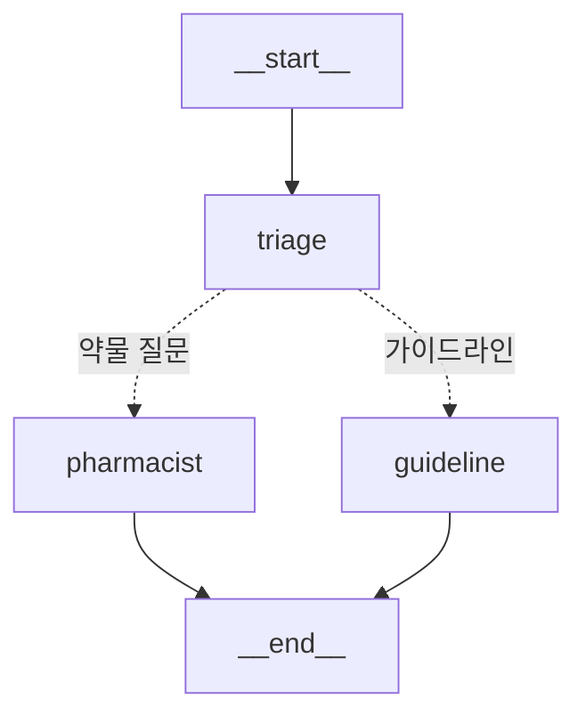
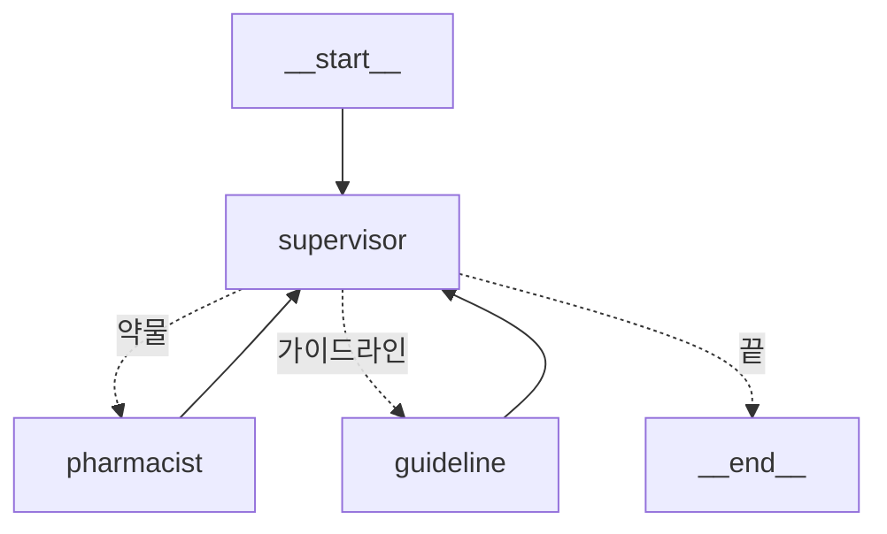
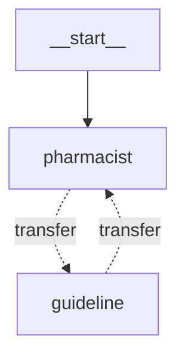

**7편에서 agent 하나를 노드로 봤다.** 그럼 agent 여러 개를 엮으면 뭐가 되나. 여기서 흔한 상상은 "독립적인 agent들이 메시지를 주고받는 분산 시스템"이다 — 액터 모델처럼, 각자 돌면서 서로에게 요청을 쏘는 그림. **LangGraph는 그렇게 안 한다.** 그래프는 여전히 하나고, agent는 그 안의 노드이며, 노드들은 서로 통신하는 게 아니라 **제어권을 넘기고 같은 state를 공유**한다. 그리고 그 "넘김"의 도구는 새로 외울 게 아니라 `Command` 하나뿐이다.

> **LangGraph 시리즈**
> 1. [첫 그래프 — LCEL로 안 풀리는 것만 그래프로](/ko/blog/langgraph-first-graph/)
> 2. [State 설계 — 스키마와 머지 규칙](/ko/blog/langgraph-state-design/)
> 2.5. [MessagesState는 특별한 state가 아니다](/ko/blog/langgraph-messages-state/)
> 3. [Send — edge로 못 그리는 동적 fan-out](/ko/blog/langgraph-send/)
> 4. [인터럽트 — 그래프를 멈추는 게 아니다](/ko/blog/langgraph-human-in-the-loop/)
> 5. [체크포인트는 멈출 때만 찍히는 게 아니다](/ko/blog/langgraph-checkpointer/)
> 6. [checkpointer는 스레드를 넘지 못한다](/ko/blog/langgraph-long-term-memory/)
> 7. [create_react_agent는 마법이 아니다](/ko/blog/langgraph-react-agent/)
> 8. **멀티 에이전트는 에이전트끼리 대화하지 않는다** ← 현재 글
> 8.5. [subgraph는 state를 공유할 수도, 격리할 수도 있다](/ko/blog/langgraph-subgraph-state/)

> 버전: `langgraph >= 0.2, < 0.3` 기준. `Command`는 `langgraph.types`에 있고 0.2 중반에 들어왔다. 핸드오프 도구에 state/tool_call_id를 주입하는 `InjectedState`(`langgraph.prebuilt`)·`InjectedToolCallId`(`langchain_core.tools`) 패턴은 0.2.x 기준이다 — 1.0 계열은 `ToolRuntime`으로 바뀌었으니 본인 환경에서 시그니처를 확인하고 쓴다. `langgraph-supervisor`·`langgraph-swarm`은 본체와 별도 패키지다.

## 그래프는 여전히 하나다

먼저 흔한 오해부터 짚자. 멀티 에이전트라고 하면 "agent A가 agent B를 함수처럼 불러서 답을 받아온다"를 떠올리기 쉽다. 하지만 LangGraph는 그런 *호출* 구조가 아니다 — agent 둘을 엮으면, 둘은 **하나의 그래프 안 두 노드**가 될 뿐이다.



`pharmacist`도 `guideline`도 각각 7편에서 본 agent↔tools 루프다 — 즉 **하나의 노드 안에 또 하나의 그래프(subgraph)가 들어있는** 구조다. 바깥 그래프 입장에서는 그냥 노드 하나다. 그래서 멀티 에이전트는 "그래프가 여러 개 생기는 것"이 아니라 **"노드가 또 다른 그래프인 그래프"**다. 1편에서 "compile한 그래프는 runnable"이라고 했던 게 여기서 빛을 발한다 — 컴파일된 agent를 그대로 `add_node`에 꽂을 수 있다.

위 그림을 코드로 그대로 조립하면 이렇게 된다. 새 API는 하나도 없다 — 1편의 `StateGraph`, 3편의 조건부 분기, 7편의 `create_react_agent`가 전부다.

```python
from langgraph.graph import StateGraph, START, END, MessagesState
from langgraph.prebuilt import create_react_agent

# 7편의 그 agent 둘 — 각각 compile된 그래프이자 곧 runnable이다
pharmacist = create_react_agent(model, tools=[lookup_drug])
guideline  = create_react_agent(model, tools=[search_guideline])

def triage(state: MessagesState) -> dict:
    return {}                       # 질문을 보기만 하고 state는 안 건드린다

def route(state: MessagesState) -> str:
    last = state["messages"][-1].content
    return "pharmacist" if "약" in last else "guideline"   # 어디로 보낼지만 정한다

parent = StateGraph(MessagesState)
parent.add_node("triage", triage)
parent.add_node("pharmacist", pharmacist)   # ← compile된 agent를 노드로 그대로 꽂는다
parent.add_node("guideline", guideline)
parent.add_edge(START, "triage")
parent.add_conditional_edges("triage", route)   # 3편의 그 정적 분기
parent.add_edge("pharmacist", END)
parent.add_edge("guideline", END)
app = parent.compile()
```

핵심은 `add_node("pharmacist", pharmacist)` 한 줄이다 — **agent(compile된 그래프)가 바깥 그래프의 노드로 그대로 들어간다.** 그리고 안팎이 `MessagesState`를 공유하므로, `triage`가 받은 대화를 `pharmacist`가 그대로 이어받는다. 이게 멀티 에이전트의 토대 전부다.

여기까지 오면 남는 질문은 둘뿐이다. (1) 한 노드가 **다음에 누구로 갈지 어떻게 정하나**, (2) 넘어갈 때 **state를 어떻게 넘기나**. 위 코드의 `triage`는 (1)을 *바깥에서 미리 그려둔 정적 분기*로 풀었다 — 3편 방식이다. 하지만 agent가 일을 하다 *스스로* "이건 약사한테 넘겨야겠다"고 판단하게 하려면 정적 엣지로는 안 되고, **노드가 실행 중에 직접 목적지를 고르는** 도구가 필요하다. 그게 다음 절의 `Command`다.

## handoff의 정체는 Command 하나다

3편에서 분기를 두 가지로 봤다. **조건부 엣지**(`add_conditional_edges`)는 그래프를 *컴파일할 때* 토폴로지가 고정되고, **Send**는 한 노드에서 여러 갈래로 *fan-out*했다. handoff는 이 둘과 또 다른 방식이다 — **노드(또는 그 안의 도구)가 실행 *중에* 다음 목적지를 직접 고르면서, 그 자리에서 state까지 같이 갱신**한다. 이걸 한 객체로 표현한 게 `Command`다.

```python
from typing import Annotated
from langchain_core.tools import tool, InjectedToolCallId
from langchain_core.messages import ToolMessage
from langgraph.types import Command

@tool
def transfer_to_pharmacist(
    tool_call_id: Annotated[str, InjectedToolCallId],
) -> Command:
    """약물 관련 질문이면 약사 에이전트에게 넘긴다."""
    return Command(
        goto="pharmacist",          # (1) 다음에 돌 노드를 런타임에 지정
        update={                    # (2) 넘어가면서 함께 갱신할 state
            "messages": [ToolMessage("약사에게 위탁", tool_call_id=tool_call_id)],
        },
        graph=Command.PARENT,       # (3) 이 노드 이름은 부모 그래프 기준으로 찾아라
    )
```

`Command`에 넘기는 인자는 사실상 세 개다.

| 인자 | 역할 | 비유 |
| --- | --- | --- |
| `goto` | 다음에 실행할 노드 이름(또는 `Send`/리스트) | "다음은 너" |
| `update` | 넘어가면서 머지할 state — 노드가 `dict`를 반환할 때와 동일하게 reducer를 탄다 | "이거 들고 가" |
| `graph` | `goto`의 이름을 어느 그래프에서 찾을지 — 생략 시 현재 그래프, `Command.PARENT`면 부모 그래프 | "어느 지도에서 찾을지" |

`Command`가 하는 일은 딱 두 줄이다 — **`goto`로 제어 흐름을, `update`로 state 머지를 한 번에** 처리한다. 노드가 `dict`를 반환하면 state만 갱신되고 다음 목적지는 엣지가 정했지만, `Command`를 반환하면 **그 노드가 직접 "다음은 너야"라고 말하면서 갱신분을 들려 보낸다.** handoff는 이 이상도 이하도 아니다.

그럼 이 도구는 누가 부르나? 특별한 등록 절차는 없다 — **핸드오프 도구도 그냥 agent의 `tools` 목록에 일반 도구처럼 넣는다.**

```python
guideline = create_react_agent(
    model,
    tools=[search_guideline, transfer_to_pharmacist],  # ← 일반 도구 옆에 그대로
)
```

7편에서 봤듯 `create_react_agent`가 내부에서 `model.bind_tools(tools)`를 해주므로, 나머지는 이렇게 흘러간다.

- **호출**: 모델은 `transfer_to_pharmacist`를 일반 도구와 똑같이 보고, 약물 질문이 오면 *다른 도구 부르듯* tool call로 부른다.
- **실행**: `ToolNode`가 실행하는데 딱 하나 다르다 — 보통 도구는 반환값을 `ToolMessage`로 감싸지만, **`Command`를 반환하면 감싸지 않고 제어 흐름(`goto`)+state(`update`)으로 해석**한다. 그래서 도구가 `ToolMessage`를 *직접* `update`에 넣어 짝을 맞춘 것. 정리하면 **handoff = "반환 타입이 `Command`인 평범한 도구"**다.
- **`graph=Command.PARENT`**: 도구는 `pharmacist` agent *안*(subgraph)에서 불리지만 가야 할 노드는 *바깥*(parent)에 있다 → "이 `goto`는 부모 그래프에서 찾아라". 빼먹으면 노드를 못 찾아 터진다 — 멀티 에이전트 handoff의 제일 흔한 첫 에러.
- **공유 채널 (2편)**: `update`의 `messages`는 `add_messages`로 append될 뿐. 둘은 **같은 `messages` 채널을 공유**하고, handoff는 "여기서 넘어갔다"는 `ToolMessage`만 남긴다. 메시지를 *주고받는* 게 아니라 공유 state를 *물려받는* 것 — 이게 "대화하지 않는다"의 진짜 의미다.
- **실행은 그냥 superstep 전환 (5편)**: `Command(goto="X")`도 한 superstep에서 다음으로 넘어가는 것뿐, 정적 엣지와 실행상 똑같다("다음이 누구냐"만 런타임에 정한 차이). checkpointer를 붙였다면 handoff 지점에도 체크포인트가 남아, 넘어간 직후 state(swarm `active_agent` 등)가 그 경계에서 저장된다.

## Supervisor와 Swarm은 토폴로지 차이일 뿐이다

handoff 메커니즘이 하나라면, 멀티 에이전트 "구조"라고 부르는 것들은 결국 **누가 누구에게 넘길 수 있느냐**의 배선 차이다. 둘만 보면 된다.

**Supervisor** — 중앙에 router 노드 하나를 두고, 모든 handoff가 그를 경유한다.



`supervisor`는 사실 3편에서 직접 짠 router 그 자체다 — 현재 대화를 보고 "다음은 약사" / "다음은 가이드라인" / "이제 끝"을 고르는 노드. agent들은 일을 마치면 *항상 supervisor로 복귀*하고, 다음 분배를 그가 다시 결정한다. agent끼리는 서로를 모른다. 장점은 명확함이다 — 모든 라우팅 결정이 한 곳에 있고 트레이스에 다 찍힌다. 대가는 매 hop마다 supervisor의 LLM 호출이 한 번씩 더 든다는 것.

**Swarm** — supervisor를 없애고, agent끼리 직접 넘긴다.



각 agent가 `transfer_to_*` 핸드오프 도구를 들고 있어서, 중간 노드 없이 곧장 상대에게 제어권을 넘긴다. 호출 수가 적고 빠르다. 대신 문제가 하나 생긴다 — **다음 사용자 입력이 들어오면 누가 받아야 하나?** 마지막에 활성이던 agent다. 그래서 swarm은 state에 `active_agent` 같은 키를 두고 "지금 누가 잡고 있는지"를 기록하며, 이 값이 **턴을 넘어 유지되려면 5편의 checkpointer가 필수**가 된다. checkpointer 없는 swarm은 매 입력마다 처음 agent로 리셋된다 — swarm의 멀티턴은 checkpointer 위에서만 성립한다(6편).

두 구조 모두 프리빌트가 있다 — `langgraph-supervisor`의 `create_supervisor`, `langgraph-swarm`의 `create_swarm`/`create_handoff_tool`. 하지만 7편과 똑같다 — **새 메커니즘이 아니라 위에서 손으로 짠 `Command` handoff와 router 노드를 포장한 것뿐이다.**

## handoff에서 무엇을 넘기고, 무엇을 넘기면 안 되나

(2)번 질문 — state를 어떻게 넘기나 — 이 실무에서 더 자주 발목을 잡는다. 핸드오프 도구의 `update`에 **무엇을 담느냐**가 다음 agent가 보는 컨텍스트를 정하기 때문이다.

먼저 "넘긴다"는 말부터 정확히 하자. 앞 절에서 봤듯 우리 예제의 두 agent는 **같은 `messages` 채널을 공유**한다. 그래서 엄밀히는 handoff가 뭔가를 *건네는* 게 아니라, 넘기는 agent가 채널에 쌓아둔 걸 다음 agent가 **그대로 읽는** 것이다 — 기본 동작이 "다음 agent가 그때까지의 전체 히스토리를 본다"가 되는 이유다. 말로만 하면 추상적이니, swarm에서 약사 → 가이드라인으로 넘어갈 때 공유 `messages` 채널에 뭐가 쌓이는지 보자.

```python
[
    HumanMessage("두통약 추천해줘. 나 임신 중이야"),

    # ── 여기부터 pharmacist agent가 일한다 ──
    AIMessage(tool_calls=[{"name": "lookup_drug", "args": {...}, "id": "call_1"}]),
    ToolMessage("아세트아미노펜: 임신 중 비교적 안전", tool_call_id="call_1"),

    # pharmacist가 "복약 가이드라인은 내 담당이 아니다" → handoff 도구를 부른다
    AIMessage(tool_calls=[{"name": "transfer_to_guideline", "args": {}, "id": "call_2"}]),
    ToolMessage("가이드라인 agent에게 위탁", tool_call_id="call_2"),   # ← (A) 전환을 알리는 ToolMessage

    # ── 여기부터 guideline agent가 이어받는다 ──
    AIMessage(tool_calls=[{"name": "search_guideline", "args": {...}, "id": "call_3"}]),
    # ...
]
```

**(A)가 핸드오프가 남기는 그 `ToolMessage`다.** 왜 꼭 있어야 하나 — 바로 위 `transfer_to_guideline`이 `id="call_2"`인 *tool call*이기 때문이다. 모델이 도구를 불렀으면 그 `tool_call_id`에 답하는 `ToolMessage`가 반드시 따라붙어야 한다 (2.5편의 메시지 짝 규약). 이게 없으면 "call_2를 불렀는데 답이 없는" 깨진 히스토리가 되어 다음 모델 호출이 터진다. 그래서 핸드오프 도구는 *제어권을 넘기는 김에* 이 `ToolMessage`를 하나 만들어 짝을 맞춰준다.

그리고 함정도 이 리스트에 그대로 보인다. guideline agent가 이어받는 순간, **그가 보는 컨텍스트에는 `call_1`(`lookup_drug`)의 결과 — 자기가 부르지도 않은 약사의 도구 호출 — 이 그대로 들어있다.** 지금은 메시지 두어 줄이라 별것 아니어 보이지만, agent가 늘고 각자 도구를 여러 번 부르면 채널은 남의 도구 호출 찌꺼기로 불어나고, 토큰은 늘고, 모델은 "내가 안 부른 도구 결과"를 보고 헷갈린다. 이게 풀 히스토리 기본값의 대가다.

그래서 다음 agent가 *덜* 보게 만들어야 한다. 여기서 흔한 함정 하나 — **채널을 공유하는 한, 핸드오프 `update`에 요약을 *추가*하는 것만으로는 안 된다.** append는 더하기일 뿐이라 `call_1` 같은 raw 메시지가 채널에 그대로 남아 다음 agent가 여전히 본다. 다음 agent가 보는 걸 *실제로* 줄이는 방법은 셋이다.

- **격리한다 — 채널을 아예 안 나눠 쓴다.** 오염이 *공유* 때문이라면, compile된 agent를 그대로 노드로 꽂는 대신 **함수 노드로 감싸** 입력·출력을 직접 매핑한다.

  ```python
  def call_guideline(state: ParentState) -> dict:
      summary = "임신 중, 아세트아미노펜 안전 확인됨. 복용 가이드 필요"
      result = guideline.invoke({"messages": [HumanMessage(summary)]})  # 격리된 입력만 본다
      return {"answer": result["messages"][-1].content}                # 올릴 것만 반환
  ```

  이러면 guideline은 parent의 raw 히스토리(`call_1` 등)를 아예 못 보고, 우리가 넣어준 요약만 본다. **여기서 비로소 "요약만 넘긴다"가 문자 그대로 성립한다.** (compile된 agent를 그냥 꽂는 *공유* 방식과 함수로 감싸는 *격리* 방식의 차이 — 무엇이 자동 전파되고 무엇이 안 되는지 — 는 [8.5편](/ko/blog/langgraph-subgraph-state/)에서 따로 깊게 판다.)
- **공유를 유지하되 지운다 (prune).** 채널은 공유하되, 넘기기 전에 `RemoveMessage`로 raw 도구 메시지를 채널에서 빼낸다. `add_messages`가 id 기반 *삭제*도 처리하므로(2.5편의 그 reducer), 요약을 더하는 동시에 찌꺼기를 지울 수 있다.
- **대화에 안 실어야 할 건 Store로 뺀다.** 6편의 `Store`가 정확히 이 자리다. 여러 agent가 공유해야 하지만 *대화 기록일 필요는 없는* 것 — 사용자 컨텍스트, 누적 점수, 권한 플래그 — 은 `messages`로 핸드오프하지 말고 Store에 두고 각 agent가 노드에서 읽는다. handoff 페이로드는 가볍게, 공유 사실은 Store에. 6편의 short-term(이 대화) vs long-term(이 사용자) 구분이 멀티 에이전트에서 "대화로 넘길 것 vs 옆 채널로 공유할 것"으로 되살아난다.

> 이건 보안 문제이기도 하다. 앞단 agent가 본 민감 정보(자격증명, 개인정보, 내부 권한 플래그 등)를 무비판적으로 풀 히스토리째 모든 하위 agent에 흘리는 건 최소 권한 원칙에 정면으로 어긋난다. handoff `update`는 *기본값에 맡길 게 아니라 명시적으로 추려야 하는* 경계다 — 7편의 `handle_tool_errors`처럼, 프리빌트의 친절한 기본값이 민감한 도메인에선 그대로 위험이 된다.

## 그래서 언제 멀티 에이전트로 가나

마지막으로 경계선. 멀티 에이전트는 멋져 보이지만, **대부분의 경우 답은 "아직 아니다"**다. 7편의 단일 agent + 도구 여러 개로 풀리는 문제를 멀티 에이전트로 짜면, hop마다 LLM 호출이 늘어 비용·지연이 곱으로 커지고, 라우팅이 모델 판단에 또 한 겹 의존하면서 디버깅이 어려워진다.

멀티 에이전트가 값을 하는 건 이럴 때다:

- **도구·프롬프트 집합이 도메인별로 확연히 갈릴 때** — 약물 상담과 가이드라인 검색이 쓰는 도구·시스템 프롬프트가 완전히 다르면, 한 agent에 도구 20개를 욱여넣는 것보다 나눠서 router로 보내는 게 모델 정확도에 낫다.
- **각 agent를 따로 평가·교체하고 싶을 때** — 경계가 갈려 있어야 한 agent만 프롬프트를 갈거나 모델을 바꿔도 나머지가 안 흔들린다.

그리고 둘 중 무엇이냐는 단순하다. **라우팅 결정을 한 곳에서 보고 통제해야 하면 Supervisor**(감사·승인 게이트가 중요한 규제 도메인의 기본값), **호출 수를 줄이고 agent끼리 자유롭게 주고받는 게 자연스러우면 Swarm.** 망설여지면 Supervisor로 시작하라 — 모든 결정이 한 노드에 찍혀서 디버깅이 압도적으로 쉽다.

## 정리

멀티 에이전트는 에이전트끼리 대화하는 분산 시스템이 아니다. **그래프는 하나고, agent는 노드고, handoff는 `Command(goto, update)` 하나로 "다음은 너 + 이 state를 들고 가"를 표현하는 것**이 전부다. Supervisor와 Swarm은 그 handoff를 누가 누구에게 할 수 있게 배선했느냐의 차이일 뿐, 새 메커니즘이 아니다. 그래서 이번에도 새로 외운 건 `Command`와 `graph=Command.PARENT` 정도고, 나머지는 2편 reducer·3편 라우팅·5편 checkpointer·6편 Store가 자리만 바꿔 다시 등장했다.

여덟 편을 관통한 한 줄로 시리즈를 닫는다 — **LangGraph에서 새로워 보이는 모든 것은, 결국 노드·엣지·state·checkpointer라는 같은 부품의 다른 조립이다.** prebuilt agent도, 멀티 에이전트도, 바닥을 알면 펼쳐서 디버깅할 수 있다.
