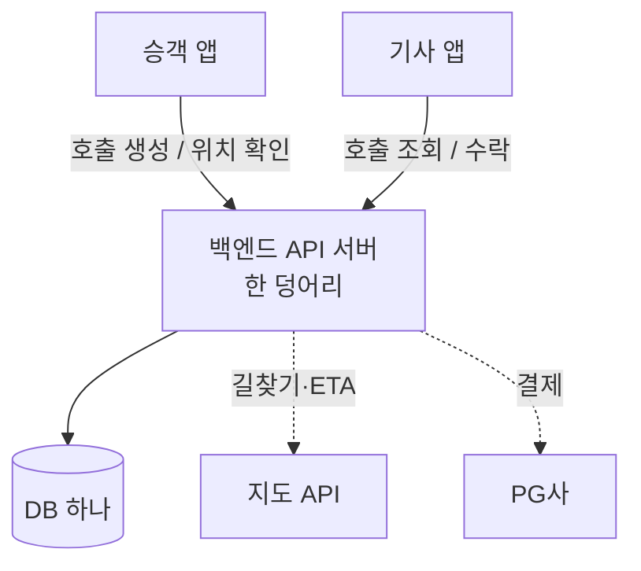

**우버 같은 배차 시스템은 어떻게 구현했을까.** "실시간으로 움직이는 차 수백만 대" 같은 말을 들으면 처음부터 거창한 분산 시스템을 떠올리게 된다. 그런데 시작부터 그랬을 리는 없다. 어떤 서비스든 첫 버전은 보통 서버 하나, DB 하나에서 출발한다. 이 시리즈는 그 단순한 그림에서 시작해서, 트래픽이 늘 때마다 삐걱대는 곳을 하나씩 손보는 순서로 가본다. 1편에서는 일단 배차 서비스 전체를 최대한 단순하게 그려본다.

> 특정 회사의 실제 구현이 아니라, 공개된 통념을 바탕으로 "이렇게 만들지 않았을까"를 추론하는 설계 연습이다. 이 시리즈에서 "배차"는 시스템이 최적 기사를 골라 한 명에게 꽂아주는 *자동 배차*가 아니라, 하나의 호출을 여러 기사에게 띄워놓고 먼저 수락한 기사가 가져가는 **선착순 모델**(카카오T 일반호출류)을 가정한다.

## 무엇을 만드는 건가

만들 대상은 단순하다. 승객이 앱으로 택시를 부르면, 근처 기사가 그 호출을 받아 태우러 온다. 요금 계산과 결제가 붙고 운행 중엔 승객이 차 위치를 보지만, 골격은 "부른다 → 누군가 받는다 → 데려다준다"다.

그래서 첫 버전이 풀 문제는 생각보다 좁다. 실시간 지도, 수요 예측, 동적 요금 같은 건 지금 단계의 고민이 아니다. 호출 하나가 만들어져 한 기사에게 연결되고 운행이 끝나는 흐름, 그거 하나만 돌면 된다.

## 등장 인물부터

이런 서비스에 최소한 뭐가 필요할까. 크게 잡아도 넷이다.

| 컴포넌트 | 역할 |
|---|---|
| 승객 앱 | 호출 생성, 배차된 기사·차 위치 확인 |
| 기사 앱 | 주변 호출 조회·수락, 운행 상태 갱신 |
| 백엔드 API 서버 | 호출·배차·운행의 모든 로직. **1편에선 한 덩어리(모놀리스)** |
| DB | 사용자·기사·호출·운행을 저장. **1편에선 하나면 충분** |

지도(길찾기·ETA)와 결제는 직접 만들 일이 아니다. 지도사 API와 PG사에 맡긴다. 초기엔 핵심이 아닌 건 가져다 쓰는 편이 낫다.

## 호출 한 건이 흐르는 길

호출 하나가 생겼다 사라지기까지를 따라가면 대략 이렇다.

```
1. 승객이 출발지·목적지로 호출 생성   → calls INSERT (status = 요청됨)
2. 기사 앱이 주변 대기 호출을 본다     → calls SELECT (status = 요청됨)
3. 기사가 수락                        → calls UPDATE (driver_id, status = 배차됨)
4. 픽업 → 운행 시작                   → status = 운행중
5. 목적지 도착 → 종료                 → status = 완료, 요금 확정·결제
```

`status` 컬럼 하나가 요청됨 → 배차됨 → 운행중 → 완료로 바뀌는 게 이 시스템의 뼈대다. 호출은 이 상태를 가진 행 하나고, 배차도 운행도 결국 그 행을 갱신하는 일이다.

2번이 좀 걸린다. 기사 앱은 주변에 새 호출이 떴는지 어떻게 알까? 제일 단순하게는 몇 초마다 서버에 "내 주변에 호출 있어?"를 물어보는 폴링이다. 우아하진 않지만 기사가 몇 명 안 되는 초기엔 이걸로 돈다. 트래픽이 늘면 여기가 제일 먼저 아파지는데, 그건 다음 편 얘기다.

## 가장 단순한 아키텍처

그래서 1편의 그림에는 박스가 몇 개 없다.



[메신저 글](/ko/blog/messenger-architecture/)에서 "CRUD 앱이면 `Client → API → DB` 세 박스로 끝났을 것"이라고 썼는데, 배차도 출발점은 비슷하다. 화려한 구석이 하나도 없지만 1편에선 그래도 된다. 지금 목표는 우아한 구조가 아니라, 호출이 배차되고 운행이 끝나는 걸 일단 한 바퀴 돌리는 거다.

## 이 그림은 어디서 삐걱댈까

이 단순한 그림은 트래픽이 늘면 한 군데씩 무너진다. 어디가 먼저 무너질지 적어두면 그게 앞으로 다룰 목록이 된다.

| 트래픽이 늘면 | 단순 그림의 문제 | 다음 편 주제 |
|---|---|---|
| 기사들이 폴링으로 호출을 조회 | 대부분 "새 호출 없음" 빈 응답 + 수락까지 지연 | 실시간 푸시 / 연결 계층 |
| 두 기사가 같은 호출을 동시에 수락 | **이중 배차** (한 승객에 택시 두 대) | 선착순 단일 승자 동시성 |
| "가까운 기사·호출"을 찾아야 함 | 매번 전체 스캔 = 느림 | 공간 인덱싱 (geohash 등) |
| 기사 위치를 실시간으로 표시 | 고빈도 위치 쓰기가 DB를 압박 | 위치 추적 파이프라인 |
| 호출·운행·결제가 한 DB에 | 읽기/쓰기 병목 | 캐시 · 읽기 복제 · 샤딩 |

아마 우버도 이 표를 처음부터 다 갖추고 시작하진 않았을 것이다. 폴링이 버거워질 때쯤 푸시를 얹고, 이중 배차가 실제로 터진 뒤에야 동시성을 손보고, DB가 정말 힘들어진 다음에 샤딩으로 갔을 것이다. 단순한 그림에서 필요할 때마다 한 조각씩 떼어 키운 결과가 지금 모습에 가깝지 않을까.
