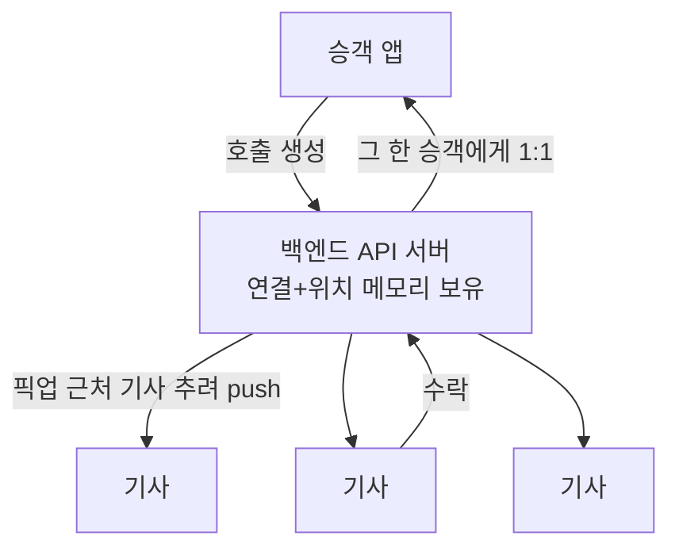

[1편](/ko/blog/taxi-dispatch-overview/) 끝에서 단순 그림이 폴링하는 데서 제일 먼저 문제가 된다고 했다. 기사 앱이 몇 초마다 "내 주변에 호출 있어?"를 서버에 묻는 방식이다. 그런데 응답 대부분은 "새 호출 없음"인 빈 응답이고, 호출이 떠도 승객은 어떤 기사라도 그걸 보기까지 최악의 경우 폴링 주기(N초)만큼 기다려야 하고, 대기 기사가 늘수록 서버로 들어오는 헛된 요청만 그만큼 많아진다.

그래서 방향을 뒤집어 보려고 한다. 기사가 묻는 대신, 서버가 새 호출을 먼저 들이민다. **폴링 말고 푸시.**

> 특정 회사의 실제 구현이 아니라, 공개된 통념을 바탕으로 "이렇게 만들지 않았을까"를 추론하는 설계 연습이다. 이 시리즈에서 "배차"는 *자동 배차*가 아니라, 하나의 호출을 여러 기사에게 띄워놓고 먼저 수락한 기사가 가져가는 **선착순 모델**(카카오T 일반호출류)을 가정한다.

## 폴링 말고 푸시

서버가 먼저 보내려면 연결이 열려 있어야 하는데, REST 요청-응답으로는 그럴 수 없다. 그래서 살아있는 연결을 들고 있는 연결 계층이 생긴다. WebSocket, 세션 레지스트리, heartbeat·재접속, 노드 분산 — 연결을 관리하는 흔한 것들이다. 다만 다 처음부터 필요한 건 아니라서, 세션 레지스트리와 노드 분산은 한 서버로 연결이 안 들어갈 만큼 커진 다음에 붙는다. 여기서 새로 다룰 건 아니다.

'푸시'라고 하면 FCM·APNs를 떠올리기 쉬운데, 그건 다른 거다. FCM·APNs는 앱이 꺼져 있거나 백그라운드일 때 기기를 깨워 알림을 띄우는 용도다 — 구글·애플 인프라를 거치는 best-effort 채널이라 지연이 들쭉날쭉하고, 서버→기기 한 방향이다. '근처에 호출 떴어' 같은 알림엔 맞지만, 화면을 보고 있는 기사에게 호출을 띄우고 1~2초 안에 수락을 받아내는 라이브 루프엔 못 쓴다. 그래서 라이브 채널은 따로 지속 연결로 들고, FCM·APNs는 백그라운드 기사를 깨우는 보완으로 둔다.

배차라서 다른 건 딱 하나, 누구에게 보내는지를 모른다는 것이다.

## 폴링, SSE, WebSocket — 무엇을 고르나

서버가 client에게 무언가를 내려보내는 길은 세 가지다. 방향과 연결 유지 방식으로 갈린다.

| 방식          | 방향                 | 지연      | 서버 비용·연결             | 양방향?                               | 이 시스템 적합도                              |
| ------------- | -------------------- | --------- | -------------------------- | ------------------------------------- | --------------------------------------------- |
| 폴링          | client→server 반복   | 폴링 주기 | 빈 요청 다수               | ❌                                    | 빈 응답 폭탄, 지연 = 폴링 주기                |
| SSE           | server→client 단방향 | 낮음      | 연결 1개 유지, 텍스트 전용 | ❌(한 연결로는; 업스트림은 별도 HTTP) | 새 호출 내려보내기만이면 충분                 |
| **WebSocket** | 양방향 지속 연결     | 낮음      | 연결당 상태 보유           | ✅                                    | 수락·위치를 같은 연결로 올려보낼 수 있어 선택 |

SSE는 하나의 긴 HTTP 응답으로 `text/event-stream`을 흘려보내는 표준 server→client 채널이다. 다만 텍스트 전용이라 바이너리는 base64로 약 33% 부풀려야 하고, 서버로 무언가 보내려면(기사 수락 등) 별도의 평범한 HTTP 요청이 필요하다.

새 호출을 내려보내는 것만 보면 SSE로도 된다. 푸시에 WebSocket이 필수는 아니다. 다만 기사의 수락은(그리고 나중엔 기사 위치도) 반대로 서버에 올려보내야 하는데, WebSocket이면 같은 연결로 양쪽을 다 한다. SSE는 내려보내기만 되니 올려보내려면 채널을 하나 더 둬야 한다. 전송을 둘로 나누지 않으려고 WebSocket을 사용한다 (실제로 우버의 초기 푸시 플랫폼 RAMEN도 SSE 단방향으로 시작했다가, 수락·ack용 채널을 따로 둬야 하는 문제로 결국 양방향 스트리밍으로 옮겨갔다.)

## 사람한테가 아니라 '근처'한테

받을 사람이 정해진 푸시는 수신자를 안다. user 1이 user 2에게 보내면 세션 레지스트리에서 `user_id → 연결`을 찾아 그 한 연결로 내려보낸다(1:1). 새 호출 푸시는 받을 기사를 모른다. user_id를 모르니 사람으로 라우팅할 수가 없다 — 받을 대상은 "픽업 근처에 있는 모든 기사"다.

그래서 받을 사람 대신 받을 장소를 키로 잡는다. user_id로 한 명을 콕 집는 게 아니라, 픽업 근처에 있는 기사들을 찾아 그들에게 호출을 뿌린다(1:N). 받을 사람을 못 짚으니 받을 장소로 좁히는 것이다.

이건 기존 방식을 갈아엎는 게 아니다. user_id로 한 사람에게 보내는 1:1 길은 그대로 있고(수락된 뒤 그 승객에게 보낼 때 쓴다), 거기에 '근처에 뿌리기'를 한 길 더 얹는 것뿐이다.

|           | 받을 사람을 아는 푸시     | 배차(새 호출) 푸시                                                     |
| --------- | ------------------------- | ---------------------------------------------------------------------- |
| 수신자    | 안다 (user_id)            | 모른다 (픽업 근처 누구든)                                              |
| 라우팅 키 | user_id → 연결            | 픽업 위치 → 근처 기사들                                                |
| 패턴      | 1:1 직통                  | 1:N 브로드캐스트                                                       |
| 중복·순서 | 수신자별 seq로 정렬·dedup | 같은 호출이 여러 기사에 → dedup은 기사별·호출별, 기사 간 순서는 무의미 |

## 가장 단순하게 — 메모리에서 근처 기사 찾기

가장 단순한 구현은 이렇다. 서버가 연결된 기사들을 현재 위치와 함께 메모리에 들고 있다가, 호출이 들어오면 픽업 근처 기사를 추려 그 연결로 바로 push한다. 매 호출마다 전체를 훑어도 기사가 수백~수천이면 거리 계산 몇천 번이라 부담 없다. 셀도, 구독도, 별도 인덱스도 필요 없다.

'근처'를 정확하고 효율적으로 가르는 일 — 기사가 많아져 매번 전체 스캔이 버거울 때 필요한 공간 인덱스(geohash·quadtree 등) — 은 따로 다룰 주제다. 여기선 픽업과 기사 사이 거리를 그냥 재서 가까운 쪽을 고른다.

근처에 받을 기사가 아무도 없으면 호출은 누가 수락할 때까지 열린 채 남는다. push는 한 번 흘리고 마는 게 아니라, 호출을 '열림'으로 남겨둬서 잠시 뒤 그 근처에 들어온 기사도 주변을 조회해 집어갈 수 있게 한다.

## 두 방향의 푸시

새 호출만 보면 깔끔하지만, 푸시는 두 방향으로 흐른다.

방향 1은 새 호출이 근처 기사들에게 가는 것이다(1:N, 받을 기사 모름). 방향 2는 어느 기사가 수락한 다음이다 — 배차와 그 뒤 운행 이벤트는 정해진 그 한 승객에게 간다(1:1, user_id를 안다). 받을 사람이 정해졌으니 앞에서 본 1:1 푸시 그대로, user_id로 그 연결을 찾아 보내면 되는 쉬운 방향이다. 즉 '장소로 보내기'는 새 호출에만 해당하고, 수락한 뒤로는 다시 사람(user_id)으로 보낸다.

승객은 수락 후 기사의 실시간 위치도 본다. 그 고빈도 위치 스트림 자체는 이 글에서 다루지 않고, 여기선 그게 어느 연결로 가는가 — 그 한 승객의 연결 — 만 정한다. status로 보면 요청됨 구간이 방향 1, 배차됨으로 뒤집히는 순간이 승객에게 가는 방향 2의 첫 푸시이고, 그 뒤 운행중 → 완료가 방향 2로 흐른다.

## 이게 만능은 아니다

푸시로 뒤집는다고 공짜로 좋아지는 건 아니다. 들고 가는 대가가 있다.

- **지속 연결은 공짜가 아니다.** 연결을 계속 열어두면 그 수만큼 메모리를 점유하고, 죽은 연결을 걸러내거나 배포 때 몰리는 재접속을 받아내는 손도 든다. 요청은 받아 처리하면 끝나지만 연결은 계속 들고 있어야 해서, 스케일 부담의 종류가 다르다.
- **푸시가 폴링을 없애진 않는다.** 모바일은 끊기니, 재접속할 때 그 사이 놓친 호출을 한 번 당겨와야 한다 — 1편의 폴링 쿼리를 상시가 아니라 그때 한 번만 돌리는 셈이다. 그러니 폴백으로는 폴링이 여전히 꼭 필요하다.
- **푸시가 race를 악화시킨다.** 폴링은 기사마다 주기가 어긋나 수락을 우연히 시간차로 흩어줬는데, 푸시는 근처 모두에게 거의 동시에 도착해 그 시간차를 없앤다 — 같은 순간 수락이 몰려 이중 배차(1편 표 둘째 행)가 더 잘 터진다. 푸시는 지연만 풀었고, 동시성은 그대로다.
- **같은 호출이 두 번, 또는 이미 남이 잡은 호출이 보일 수 있다.** 푸시는 빠뜨릴까 봐 재시도하다 보니 같은 알림이 두 번 가기도 하고(at-least-once), 이미 다른 기사가 수락한 호출을 뒤늦게 보기도 한다. 그래서 앱은 지금 보이는 호출이 중복이거나 이미 끝난 것일 수 있다고 보고 걸러줘야 한다. 둘이 동시에 수락했을 때 한 명만 승자로 가리는 건 따로 풀어야 하고, 여기선 이런 호출이 보일 수 있다는 데까지만 짚는다.

## 한 대로 안 되면 — 셀과 브로커

노드가 하나일 때는 앞의 방식 그대로다. 연결을 전부 한 서버 메모리에 들고, 호출마다 근처 기사를 스캔해 push한다. 작은 도시 하나면 이걸로 충분하다.

기사가 너무 많아지면 매 호출 전체 스캔이 부담스러워진다. 그때 지역을 미리 격자(셀)로 나눠두고, 기사는 자기가 있는 셀을 구독하고 서버는 픽업 셀(과 이웃 셀)에만 호출을 흘린다 — 전체를 훑는 대신 픽업 셀 구독자만 건드린다. '근처'를 정확하고 효율적으로 나누는 공간 인덱스(geohash·quadtree)가 그래서 필요해진다.

연결 서버가 여러 대가 되면 또 다른 문제다. 한 픽업 셀의 기사들이 여러 서버에 흩어져 붙어 있어서, 호출을 만든 서버가 그들의 연결을 다 들고 있지 않다. 그래서 셀을 채널 삼아 pub/sub 브로커로 노드 간에 전달한다 — 호출을 픽업 셀 채널에 publish하면 그 셀 구독자를 가진 서버들로 퍼지고, 각 서버가 자기 연결에 내려보낸다. 푸시를 한 번 놓쳐도 호출은 그 지역에 열린 채 남아 있어 나중에 폴링으로도 가져올 수 있으니, 전달을 꼭 보장하지 않는 가벼운 pub/sub(예: Redis Pub/Sub)이면 충분하다.

이건 연결을 노드 간에 어떻게 나르느냐 얘기지, 호출 데이터를 어떻게 쪼개 저장하느냐(샤딩)와는 별개다.

## 전체 그림

두 방향을 한 장에 접으면 이렇게 된다. 새 호출은 픽업 근처 기사들에게 1:N으로, 수락 이후는 그 한 승객에게 1:1로 흐른다.

이제 근처 기사 모두가 같은 순간 같은 호출을 받으니, 이중 배차가 더 자주 일어난다.
